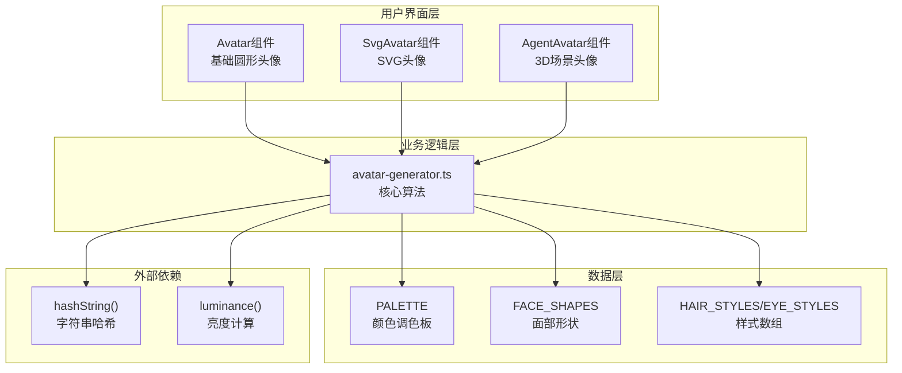
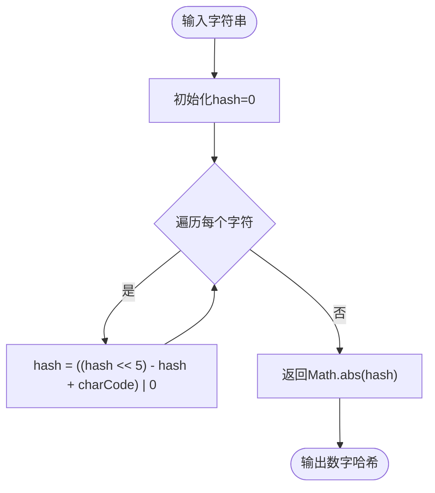
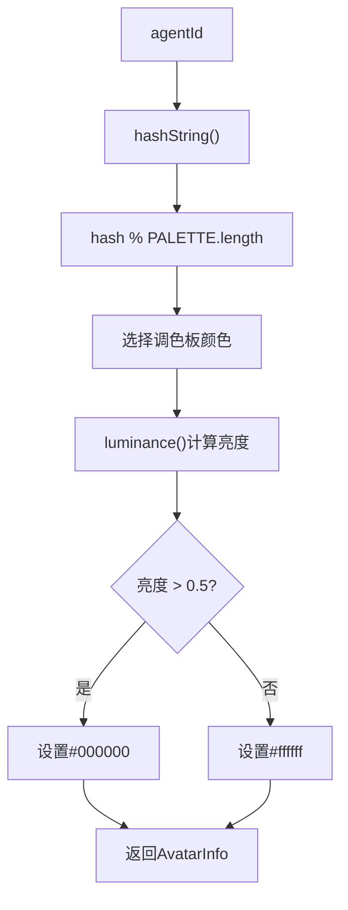
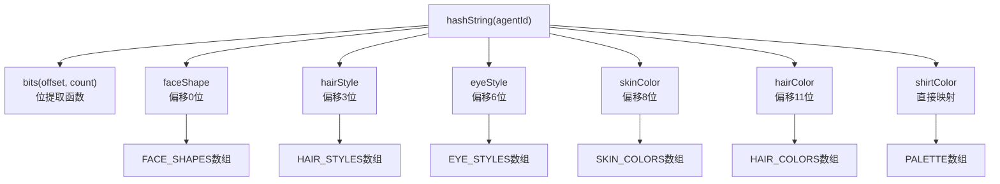
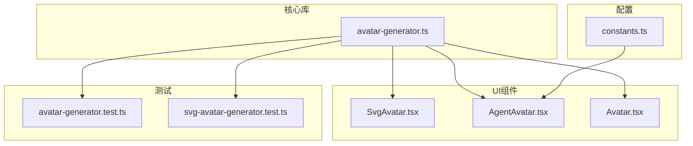

# SVG头像生成器

<cite>
**本文档引用的文件**
- [avatar-generator.ts](file://src/lib/avatar-generator.ts)
- [SvgAvatar.tsx](file://src/components/shared/SvgAvatar.tsx)
- [AgentAvatar.tsx](file://src/components/office-2d/AgentAvatar.tsx)
- [Avatar.tsx](file://src/components/shared/Avatar.tsx)
- [constants.ts](file://src/lib/constants.ts)
- [avatar-generator.test.ts](file://src/lib/__tests__/avatar-generator.test.ts)
- [svg-avatar-generator.test.ts](file://src/lib/__tests__/svg-avatar-generator.test.ts)
</cite>

## 目录
1. [简介](#简介)
2. [项目结构](#项目结构)
3. [核心组件](#核心组件)
4. [架构概览](#架构概览)
5. [详细组件分析](#详细组件分析)
6. [依赖关系分析](#依赖关系分析)
7. [性能考虑](#性能考虑)
8. [故障排除指南](#故障排除指南)
9. [结论](#结论)
10. [附录](#附录)

## 简介

SVG头像生成器是一个基于agentId的确定性头像生成系统，专为OpenClaw Office办公环境设计。该系统提供了两种主要的头像生成方式：基于字符串哈希的颜色生成器和完整的SVG头像生成器。系统确保每个agentId都能生成一致的视觉标识，同时支持多种视觉属性的随机化，以创造丰富的视觉体验。

## 项目结构

SVG头像生成器位于项目的`src/lib`目录下，主要包含以下文件：

```mermaid
graph TB
subgraph "头像生成器核心"
AG["avatar-generator.ts<br/>核心算法实现"]
end
subgraph "React组件"
SA["SvgAvatar.tsx<br/>SVG头像组件"]
AA["AgentAvatar.tsx<br/>3D场景头像"]
AV["Avatar.tsx<br/>基础头像组件"]
end
subgraph "配置文件"
C["constants.ts<br/>常量定义"]
T1["avatar-generator.test.ts<br/>单元测试"]
T2["svg-avatar-generator.test.ts<br/>SVG测试"]
end
AG --> SA
AG --> AA
AG --> AV
C --> AA
T1 --> AG
T2 --> AG
```



**图表来源**
- [avatar-generator.ts:1-88](file://src/lib/avatar-generator.ts#L1-L88)
- [SvgAvatar.tsx:1-126](file://src/components/shared/SvgAvatar.tsx#L1-L126)
- [AgentAvatar.tsx:1-493](file://src/components/office-2d/AgentAvatar.tsx#L1-L493)

**章节来源**
- [avatar-generator.ts:1-88](file://src/lib/avatar-generator.ts#L1-L88)
- [constants.ts:124-130](file://src/lib/constants.ts#L124-L130)

## 核心组件

### 主要接口定义

系统定义了两个核心接口来描述头像数据：

#### AvatarInfo接口
用于基础头像生成，包含背景色、文本色和初始字符：
- `backgroundColor`: 字符串，十六进制颜色值
- `textColor`: 字符串，十六进制颜色值
- `initial`: 字符串，显示的首字母

#### SvgAvatarData接口
用于SVG头像生成，包含完整的面部属性：
- `faceShape`: 面部形状枚举
- `hairStyle`: 发型样式枚举  
- `eyeStyle`: 眼睛样式枚举
- `skinColor`: 皮肤颜色
- `hairColor`: 发色
- `shirtColor`: 衬衫颜色

**章节来源**
- [avatar-generator.ts:32-47](file://src/lib/avatar-generator.ts#L32-L47)
- [avatar-generator.ts:67-74](file://src/lib/avatar-generator.ts#L67-L74)

### 主要函数

#### generateAvatar(agentId, agentName?)
- **功能**: 生成基础头像信息
- **参数**: 
  - `agentId`: 必需，代理标识符
  - `agentName?`: 可选，代理名称
- **返回**: AvatarInfo对象

#### generateAvatar3dColor(agentId)
- **功能**: 生成3D材质颜色
- **参数**: `agentId`: 代理标识符
- **返回**: 十六进制颜色字符串

#### generateSvgAvatar(agentId)
- **功能**: 生成完整的SVG头像数据
- **参数**: `agentId`: 代理标识符
- **返回**: SvgAvatarData对象

**章节来源**
- [avatar-generator.ts:38-47](file://src/lib/avatar-generator.ts#L38-L47)
- [avatar-generator.ts:50-53](file://src/lib/avatar-generator.ts#L50-L53)
- [avatar-generator.ts:76-88](file://src/lib/avatar-generator.ts#L76-L88)

## 架构概览

系统采用分层架构设计，从底层的确定性算法到上层的React组件：



**图表来源**
- [avatar-generator.ts:16-30](file://src/lib/avatar-generator.ts#L16-L30)
- [avatar-generator.ts:76-88](file://src/lib/avatar-generator.ts#L76-L88)

## 详细组件分析

### 字符串哈希函数实现

系统使用改进的djb2算法实现字符串哈希，确保确定性和均匀分布：



**图表来源**
- [avatar-generator.ts:16-23](file://src/lib/avatar-generator.ts#L16-L23)

#### 哈希算法特点
- 使用位移操作优化乘法运算
- 应用按位或操作确保32位整数
- 返回绝对值避免负数问题
- 时间复杂度：O(n)，空间复杂度：O(1)

**章节来源**
- [avatar-generator.ts:16-23](file://src/lib/avatar-generator.ts#L16-L23)

### 颜色方案选择逻辑

系统实现了两套颜色生成策略：

#### 基础颜色生成


**图表来源**
- [avatar-generator.ts:38-47](file://src/lib/avatar-generator.ts#L38-L47)
- [avatar-generator.ts:25-30](file://src/lib/avatar-generator.ts#L25-L30)

#### 3D材质颜色生成
- 直接使用相同哈希映射到调色板
- 与SVG头像的衬衫颜色保持一致
- 确保2D和3D视图的一致性

**章节来源**
- [avatar-generator.ts:38-47](file://src/lib/avatar-generator.ts#L38-L47)
- [avatar-generator.ts:50-53](file://src/lib/avatar-generator.ts#L50-L53)

### 亮度计算算法

系统使用标准的相对亮度公式计算颜色亮度：

#### 亮度计算公式
- `Y = 0.299 × R + 0.587 × G + 0.114 × B`
- 其中 R, G, B 为归一化的RGB值 (0-1)

#### 文本对比度策略
- 亮度 > 0.5：使用黑色 (#000000) 文本
- 亮度 ≤ 0.5：使用白色 (#ffffff) 文本

**章节来源**
- [avatar-generator.ts:25-30](file://src/lib/avatar-generator.ts#L25-L30)

### 头像属性生成机制

SVG头像生成器实现了复杂的位操作来分配属性：



**图表来源**
- [avatar-generator.ts:76-88](file://src/lib/avatar-generator.ts#L76-L88)
- [avatar-generator.ts:78](file://src/lib/avatar-generator.ts#L78)

#### 属性分配规则
- **面部形状**: 使用偏移0位，从3种形状中选择
- **发型样式**: 使用偏移3位，从5种样式中选择  
- **眼睛样式**: 使用偏移6位，从3种样式中选择
- **皮肤颜色**: 使用偏移8位，从6种颜色中选择
- **发色**: 使用偏移11位，从4种颜色中选择
- **衬衫颜色**: 直接使用哈希映射到12种颜色

**章节来源**
- [avatar-generator.ts:76-88](file://src/lib/avatar-generator.ts#L76-L88)

### 颜色系统详解

#### 调色板配置
系统包含12种预定义的颜色，覆盖暖色调到冷色调的完整范围：

| 颜色类别 | 颜色值 | 描述 |
|---------|--------|------|
| 红色系 | #ef4444 | 珊瑚红 |
| 橙色系 | #f97316 | 橙子橙 |
| 黄色系 | #f59e0b | 玉米黄 |
| 绿色系 | #84cc16 | 草绿色 |
| 绿色系 | #22c55e | 石灰绿 |
| 青色系 | #14b8a6 | 青绿色 |
| 青色系 | #06b6d4 | 蓝绿色 |
| 蓝色系 | #3b82f6 | 天蓝色 |
| 紫色系 | #6366f1 | 深紫色 |
| 紫色系 | #8b5cf6 | 紫罗兰 |
| 紫色系 | #a855f7 | 梅花紫 |
| 粉色系 | #ec4899 | 桃粉色 |

#### 文本颜色对比度
系统自动计算背景色亮度，确保文本的可读性：
- 高亮度背景：使用黑色文本
- 低亮度背景：使用白色文本

#### 3D材质颜色生成
- 与2D头像使用相同的颜色映射
- 确保视觉一致性
- 支持Three.js等3D渲染引擎

**章节来源**
- [avatar-generator.ts:1-14](file://src/lib/avatar-generator.ts#L1-L14)
- [avatar-generator.ts:25-30](file://src/lib/avatar-generator.ts#L25-L30)

## 依赖关系分析

### 组件依赖图



**图表来源**
- [SvgAvatar.tsx:1](file://src/components/shared/SvgAvatar.tsx#L1)
- [AgentAvatar.tsx:4](file://src/components/office-2d/AgentAvatar.tsx#L4)
- [Avatar.tsx:1](file://src/components/shared/Avatar.tsx#L1)

### 外部依赖

系统具有最小的外部依赖：
- 仅依赖React运行时
- 无第三方UI库依赖
- 自包含的数学和图形计算

**章节来源**
- [SvgAvatar.tsx:1-2](file://src/components/shared/SvgAvatar.tsx#L1-L2)
- [AgentAvatar.tsx:1-6](file://src/components/office-2d/AgentAvatar.tsx#L1-L6)

## 性能考虑

### 时间复杂度分析

| 函数 | 时间复杂度 | 空间复杂度 | 说明 |
|------|------------|------------|------|
| hashString | O(n) | O(1) | n为字符串长度 |
| luminance | O(1) | O(1) | 固定3次运算 |
| generateAvatar | O(n) | O(1) | 主要受哈希影响 |
| generateSvgAvatar | O(n) | O(1) | 所有操作都是常数时间 |

### 内存使用

- 每个头像生成使用常量内存
- 数组存储开销很小（最多约100字节）
- 无递归调用，避免栈溢出风险

### 缓存策略

- 结果完全由输入决定，天然具备缓存友好性
- 可在应用层实现结果缓存以减少重复计算
- 对于大量头像渲染场景特别有利

## 故障排除指南

### 常见问题及解决方案

#### 头像颜色不一致
**症状**: 同一agentId生成不同颜色
**原因**: 可能使用了不同的agentName参数
**解决**: 确保始终使用agentId作为唯一标识

#### 文本颜色难以辨识
**症状**: 白色文本在浅色背景下不可见
**原因**: 亮度计算错误或颜色值格式不正确
**解决**: 验证颜色值格式为#RRGGBB格式

#### SVG头像属性异常
**症状**: 某些属性总是相同
**原因**: 哈希值分布不均匀或位偏移错误
**解决**: 检查hashString实现和bits函数

**章节来源**
- [avatar-generator.test.ts:1-37](file://src/lib/__tests__/avatar-generator.test.ts#L1-L37)
- [svg-avatar-generator.test.ts:1-38](file://src/lib/__tests__/svg-avatar-generator.test.ts#L1-L38)

### 测试验证

系统包含完整的单元测试，验证以下关键行为：

- 确定性生成：相同输入始终产生相同输出
- 颜色有效性：所有颜色都是有效的十六进制格式
- 分布均匀性：多个agentId产生多样化的属性组合
- 一致性：SVG衬衫颜色与3D颜色保持一致

**章节来源**
- [avatar-generator.test.ts:4-37](file://src/lib/__tests__/avatar-generator.test.ts#L4-L37)
- [svg-avatar-generator.test.ts:4-38](file://src/lib/__tests__/svg-avatar-generator.test.ts#L4-L38)

## 结论

SVG头像生成器是一个设计精良的确定性头像系统，具有以下优势：

1. **确定性**: 每个agentId始终生成相同的视觉标识
2. **一致性**: 2D和3D视图使用相同的颜色映射
3. **可扩展性**: 易于添加新的属性类型和样式
4. **性能**: 常数时间复杂度，适合大规模部署
5. **可维护性**: 清晰的模块化设计和完整测试覆盖

该系统为OpenClaw Office提供了可靠的视觉标识解决方案，既保证了用户体验的一致性，又为未来的功能扩展奠定了坚实基础。

## 附录

### API参考

#### AvatarInfo接口
- `backgroundColor: string` - 背景色
- `textColor: string` - 文本色  
- `initial: string` - 初始字符

#### SvgAvatarData接口
- `faceShape: FaceShape` - 面部形状
- `hairStyle: HairStyle` - 发型样式
- `eyeStyle: EyeStyle` - 眼睛样式
- `skinColor: string` - 皮肤颜色
- `hairColor: string` - 发色
- `shirtColor: string` - 衬衫颜色

#### 函数签名

**generateAvatar(agentId: string, agentName?: string): AvatarInfo**
**generateAvatar3dColor(agentId: string): string**  
**generateSvgAvatar(agentId: string): SvgAvatarData**

### 使用示例

#### 基础头像
```typescript
const avatarInfo = generateAvatar('agent-123', 'Alice');
// { backgroundColor: '#f97316', textColor: '#000000', initial: 'A' }
```

#### SVG头像
```typescript
const svgAvatar = generateSvgAvatar('agent-123');
// { faceShape: 'round', hairStyle: 'spiky', eyeStyle: 'dot', ... }
```

#### 3D材质颜色
```typescript
const color3d = generateAvatar3dColor('agent-123');
// '#f97316'
```