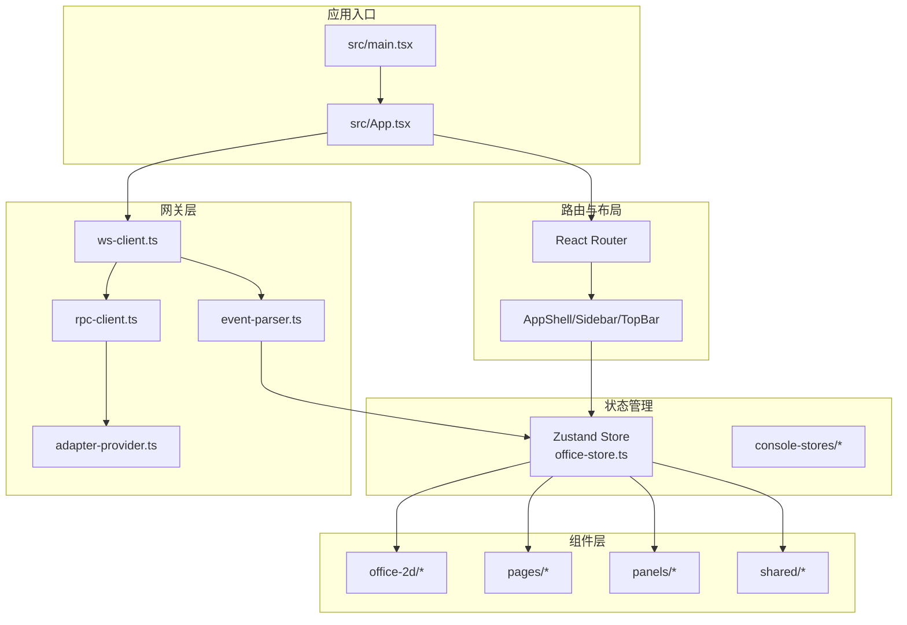
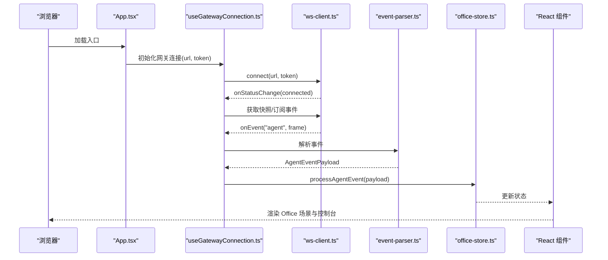
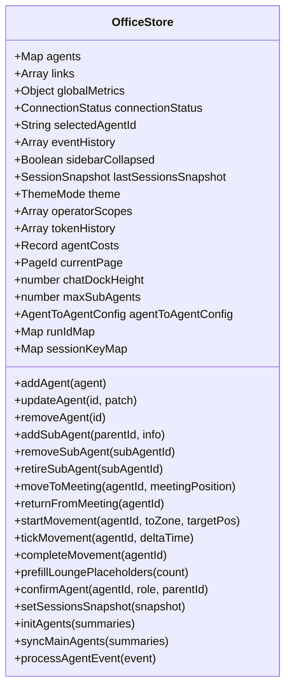
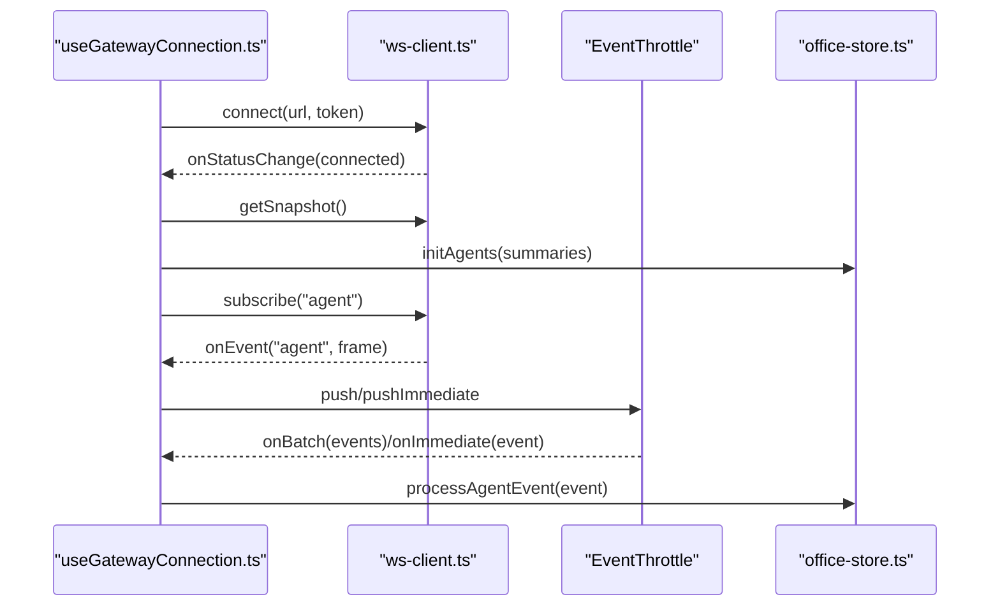
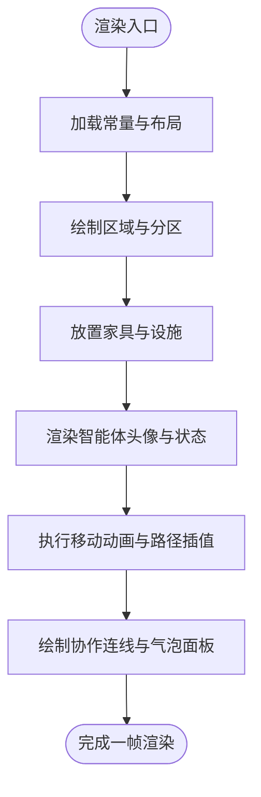
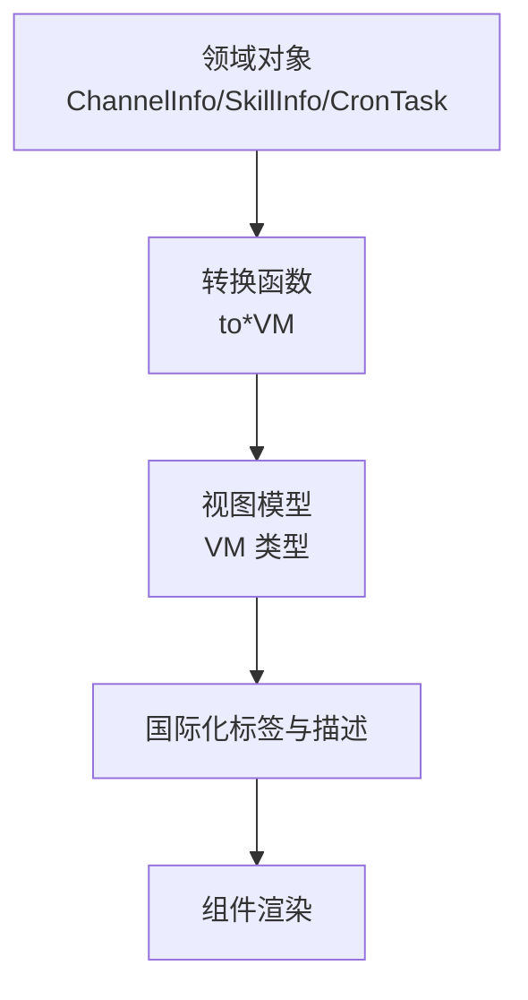
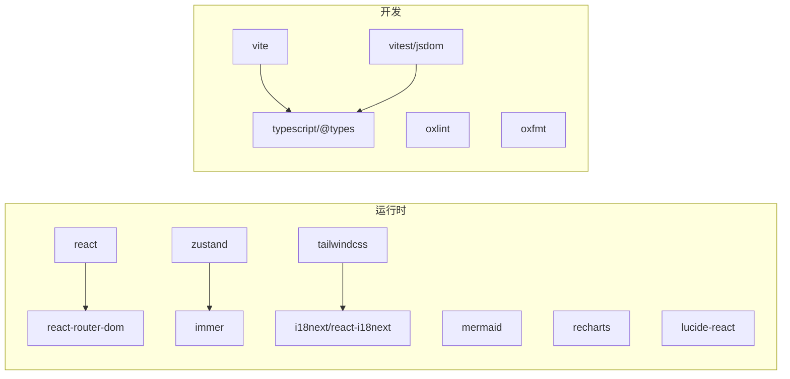

# 开发者指南

<cite>
**本文档引用的文件**
- [package.json](file://package.json)
- [README.md](file://README.md)
- [vite.config.ts](file://vite.config.ts)
- [src/main.tsx](file://src/main.tsx)
- [src/App.tsx](file://src/App.tsx)
- [src/store/office-store.ts](file://src/store/office-store.ts)
- [src/hooks/useGatewayConnection.ts](file://src/hooks/useGatewayConnection.ts)
- [src/gateway/ws-client.ts](file://src/gateway/ws-client.ts)
- [src/lib/constants.ts](file://src/lib/constants.ts)
- [tsconfig.json](file://tsconfig.json)
- [src/components/layout/AppShell.tsx](file://src/components/layout/AppShell.tsx)
- [src/lib/view-models.ts](file://src/lib/view-models.ts)
- [vitest.config.ts](file://vitest.config.ts)
</cite>

## 目录
1. [简介](#简介)
2. [项目结构](#项目结构)
3. [核心组件](#核心组件)
4. [架构总览](#架构总览)
5. [详细组件分析](#详细组件分析)
6. [依赖分析](#依赖分析)
7. [性能考虑](#性能考虑)
8. [故障排除指南](#故障排除指南)
9. [结论](#结论)
10. [附录](#附录)

## 简介
OpenClaw Office 是 OpenClaw 多智能体系统的可视化监控与管理前端。它通过等距投影的虚拟办公室场景，实时展示智能体的工作状态、协作链路、工具调用与资源消耗，并提供完整的控制台管理界面与 Chat 对话工作区。项目采用 React 19 + Vite 6 + Zustand 5 + Immer + Tailwind CSS 4 + React Router 7 + Mermaid + Recharts + i18next 技术栈，支持 Mock 模式与真实 Gateway 连接，具备响应式布局与国际化能力。

## 项目结构
项目采用按功能域划分的目录组织方式，主要模块包括：
- src/components：UI 组件库，按页面与功能域细分（chat、console、dashboard、layout、office-2d、overlays、pages、panels、shared）
- src/gateway：网关适配层，封装 WebSocket 客户端、RPC 客户端、事件解析与适配器
- src/hooks：自定义 Hook，封装网关连接、轮询、响应式布局等
- src/i18n：国际化资源与初始化
- src/lib：通用工具库（常量、位置分配、事件节流、消息工具、视图模型转换等）
- src/store：状态管理，使用 Zustand + Immer，包含办公空间、控制台、日志、服务等多套 Store
- src/styles：全局样式
- tests：测试配置与组件测试
- 配置文件：package.json、tsconfig.json、vite.config.ts、vitest.config.ts

图表来源
- [src/main.tsx:1-15](file://src/main.tsx#L1-L15)
- [src/App.tsx:1-124](file://src/App.tsx#L1-L124)
- [src/store/office-store.ts:1-800](file://src/store/office-store.ts#L1-L800)
- [src/gateway/ws-client.ts:1-304](file://src/gateway/ws-client.ts#L1-L304)

章节来源
- [README.md:63-76](file://README.md#L63-L76)
- [package.json:49-82](file://package.json#L49-L82)

## 核心组件
- 应用入口与路由
  - 入口文件创建根节点并挂载 HashRouter 与 App；App 负责解析网关地址、注入主题与页面追踪、初始化聊天工作区与路由。
- 状态管理
  - 使用 Zustand + Immer 管理全局状态，包含智能体、链接、指标、会话快照、主题、聊天停靠高度、最大并发子智能体数等；提供事件历史、移动动画、会议调度、指标计算等方法。
- 网关连接
  - 通过 WebSocket 客户端与 RPC 客户端建立连接，支持重连、鉴权、快照同步、事件节流与批量处理；根据 Mock 模式选择不同适配器。
- 办公室 2D 渲染
  - 基于 SVG 的等距投影场景，包含区域划分、家具布置、智能体头像与移动动画、协作连线与气泡面板。
- 国际化与样式
  - i18next + react-i18next 提供中英双语支持；Tailwind CSS 提供原子化样式与暗色主题支持。

章节来源
- [src/main.tsx:1-15](file://src/main.tsx#L1-L15)
- [src/App.tsx:76-124](file://src/App.tsx#L76-L124)
- [src/store/office-store.ts:217-244](file://src/store/office-store.ts#L217-L244)
- [src/hooks/useGatewayConnection.ts:23-151](file://src/hooks/useGatewayConnection.ts#L23-L151)
- [src/gateway/ws-client.ts:22-304](file://src/gateway/ws-client.ts#L22-L304)
- [src/lib/constants.ts:1-141](file://src/lib/constants.ts#L1-L141)

## 架构总览
应用通过 WebSocket 与 OpenClaw Gateway 交互，数据流如下：
- Gateway 广播实时事件（agent、presence、health、heartbeat）与响应 RPC 请求
- 前端使用 ws-client.ts 建立连接并处理认证、重连与事件分发
- event-parser.ts 解析事件并映射到 Zustand Store
- Store 更新后驱动 React 组件渲染，Office 场景实时反映智能体状态

图表来源
- [src/App.tsx:89-89](file://src/App.tsx#L89-L89)
- [src/hooks/useGatewayConnection.ts:36-135](file://src/hooks/useGatewayConnection.ts#L36-L135)
- [src/gateway/ws-client.ts:104-130](file://src/gateway/ws-client.ts#L104-L130)
- [src/store/office-store.ts:762-800](file://src/store/office-store.ts#L762-L800)

## 详细组件分析

### 状态管理组件分析
Zustand Store 通过 Immer 中间件实现不可变更新，集中管理智能体生命周期、移动动画、会议调度、指标计算与事件历史。关键能力包括：
- 智能体确认与子智能体管理：支持未确认智能体占位、子智能体激活与退休、会话键映射
- 移动动画：路径规划、插值计算、到达目标区域后的状态更新
- 会议管理：聚合并返回、手动会议触发、定时器清理
- 指标计算：全局指标、Token 历史、成本统计
- 事件历史：限制长度、持久化与回放

图表来源
- [src/store/office-store.ts:217-760](file://src/store/office-store.ts#L217-L760)

章节来源
- [src/store/office-store.ts:217-800](file://src/store/office-store.ts#L217-L800)

### 网关连接组件分析
useGatewayConnection 负责：
- 根据是否 Mock 模式选择适配器与事件源
- 初始化 WebSocket 与 RPC 客户端，注册事件处理器与状态变更回调
- 事件节流：即时事件与批次事件分别处理，降低渲染压力
- 连接成功后：获取快照、初始化智能体、同步主智能体列表、应用安全配置、拉取网关配置（最大并发子智能体数、A2A 工具开关）

图表来源
- [src/hooks/useGatewayConnection.ts:23-151](file://src/hooks/useGatewayConnection.ts#L23-L151)
- [src/gateway/ws-client.ts:104-181](file://src/gateway/ws-client.ts#L104-L181)

章节来源
- [src/hooks/useGatewayConnection.ts:23-238](file://src/hooks/useGatewayConnection.ts#L23-L238)
- [src/gateway/ws-client.ts:22-304](file://src/gateway/ws-client.ts#L22-L304)

### 办公室 2D 渲染组件分析
- 常量与布局：OFFICE、ZONES、CORRIDOR、颜色与家具尺寸常量统一管理
- 场景绘制：FloorPlan、DeskUnit、AgentAvatar、ConnectionLine、ZoneLabel
- 动画与交互：移动动画、状态指示、协作连线、气泡面板、侧边面板

图表来源
- [src/lib/constants.ts:1-141](file://src/lib/constants.ts#L1-L141)

章节来源
- [src/lib/constants.ts:1-141](file://src/lib/constants.ts#L1-L141)

### 视图模型转换分析
view-models.ts 将网关返回的领域对象转换为 UI 所需的视图模型，便于组件消费与国际化显示，涵盖：
- 仪表盘摘要：通道连接数、错误数、技能启用数、提供商用量
- 渠道卡片：类型图标、状态标签与颜色、配置/运行状态
- 技能卡片：启用状态、缺失依赖、安装选项、配置检查
- 定时任务卡片：计划表达式格式化、下次/上次运行时间、状态标签

图表来源
- [src/lib/view-models.ts:1-200](file://src/lib/view-models.ts#L1-L200)

章节来源
- [src/lib/view-models.ts:1-200](file://src/lib/view-models.ts#L1-L200)

## 依赖分析
- 运行时依赖
  - React 19、ReactDOM、React Router 7：应用框架与路由
  - Zustand 5 + Immer：轻量状态管理与不可变更新
  - Tailwind CSS 4：原子化样式与暗色主题
  - i18next + react-i18next：国际化
  - Mermaid、Recharts：可视化与图表
  - lucide-react：图标
- 开发依赖
  - Vite 6、@vitejs/plugin-react：构建与热重载
  - TypeScript、@types/react：类型安全
  - Vitest + jsdom：测试环境
  - Oxlint + Oxfmt：代码质量与格式化

图表来源
- [package.json:49-82](file://package.json#L49-L82)

章节来源
- [package.json:49-82](file://package.json#L49-L82)
- [tsconfig.json:1-29](file://tsconfig.json#L1-L29)

## 性能考虑
- 事件节流与批处理：通过事件节流中间件减少高频事件对渲染的影响，降低 Store 更新频率
- 移动动画优化：路径规划与插值计算在 Store 内部完成，避免重复计算；到达目标区域后才触发状态变更
- 会话同步策略：sessions.list 仅用于初始同步与低频一致性校验，避免高频全量扫描
- 资源缓存：聊天缓存按天分片存储，限制文件数量，提升读写效率
- 构建与打包：Vite 6 提供快速冷启动与热重载；TypeScript 严格模式与 noEmit 确保类型安全

章节来源
- [src/hooks/useGatewayConnection.ts:88-96](file://src/hooks/useGatewayConnection.ts#L88-L96)
- [vite.config.ts:161-274](file://vite.config.ts#L161-L274)
- [README.md:286-291](file://README.md#L286-L291)

## 故障排除指南
- 网关连接失败
  - 检查环境变量 VITE_GATEWAY_URL/VITE_GATEWAY_TOKEN 是否正确；确认 Gateway 服务运行与端口可达
  - 查看控制台输出的连接状态变化与错误信息
- Mock 模式无法渲染
  - 确认 VITE_MOCK=true 已生效；检查 Mock 适配器初始化与事件广播
- 事件丢失或延迟
  - 检查事件节流配置与批处理策略；关注连接状态与重连机制
- 性能问题
  - 减少不必要的 Store 更新；避免在渲染阶段进行重型计算；利用常量与缓存
- 测试与调试
  - 使用 Vitest + jsdom 进行组件测试；通过浏览器控制台访问 __requestMeeting/__dismissMeeting 调试会议 API

章节来源
- [src/hooks/useGatewayConnection.ts:98-111](file://src/hooks/useGatewayConnection.ts#L98-L111)
- [src/gateway/ws-client.ts:270-288](file://src/gateway/ws-client.ts#L270-L288)
- [vitest.config.ts:1-20](file://vitest.config.ts#L1-L20)

## 结论
本指南从代码规范、最佳实践、项目结构、开发工作流、调试技巧、故障排除与贡献指南七个维度，系统梳理了 OpenClaw Office 的技术实现与开发要点。建议新开发者优先掌握 Zustand 状态管理范式、网关连接与事件处理流程、Office 场景渲染与动画机制，并结合测试与性能优化策略，快速上手项目开发。

## 附录

### 代码规范与最佳实践
- TypeScript 编码规范
  - 严格类型检查：开启 noUnusedLocals/noUnusedParameters/noFallthroughCasesInSwitch
  - 路径别名：通过 baseUrl 与 paths 统一模块导入路径
  - 禁止编译输出：noEmit，仅用于类型检查
- React 组件设计原则
  - 单一职责：每个组件聚焦单一功能，避免过度耦合
  - Hooks 抽象：将副作用与业务逻辑抽离至自定义 Hook
  - 不可变更新：使用 Immer 中间件简化状态更新
- 状态管理最佳实践
  - Store 分层：按功能域拆分 Store，避免单体 Store
  - 事件驱动：以事件为中心的数据流，集中处理与分发
  - 动画与指标：在 Store 内部完成计算，组件只负责渲染

章节来源
- [tsconfig.json:2-24](file://tsconfig.json#L2-L24)
- [src/store/office-store.ts:217-244](file://src/store/office-store.ts#L217-L244)
- [src/hooks/useGatewayConnection.ts:23-151](file://src/hooks/useGatewayConnection.ts#L23-L151)

### 开发工作流
- 分支管理：遵循 Conventional Commits 规范
- 提交规范：使用约定式提交，清晰描述变更类型与范围
- 代码审查：PR 描述清晰、变更范围明确、包含测试与截图（如有）
- 测试：组件测试覆盖率与集成测试并重，使用 Vitest + jsdom

章节来源
- [README.md:302-310](file://README.md#L302-L310)
- [vitest.config.ts:13-18](file://vitest.config.ts#L13-L18)

### 调试技巧
- 开发工具：Vite 热重载、React DevTools、浏览器网络面板
- 断点调试：在 ws-client.ts 与 event-parser.ts 设置断点，观察事件流转
- 性能分析：使用浏览器性能面板分析渲染与事件处理瓶颈
- 会议调试：通过浏览器控制台调用 __requestMeeting/__dismissMeeting

章节来源
- [src/App.tsx:91-100](file://src/App.tsx#L91-L100)
- [src/gateway/ws-client.ts:132-147](file://src/gateway/ws-client.ts#L132-L147)

### 故障排除清单
- 网关连接
  - 确认 VITE_GATEWAY_URL 与 VITE_GATEWAY_TOKEN
  - 检查 WebSocket 重连与错误状态
- Mock 模式
  - 确认 VITE_MOCK=true
  - 检查 Mock 适配器事件广播
- 性能
  - 事件节流与批处理生效
  - Store 更新最小化

章节来源
- [src/hooks/useGatewayConnection.ts:98-111](file://src/hooks/useGatewayConnection.ts#L98-L111)
- [vite.config.ts:342-382](file://vite.config.ts#L342-L382)

### 贡献指南
- Fork 仓库并创建特性分支
- 提交符合 Conventional Commits 的变更
- 开启 Pull Request，等待代码审查与 CI 通过

章节来源
- [README.md:302-310](file://README.md#L302-L310)

### 开发环境配置与 IDE 设置
- Node.js 22+ 与 pnpm
- VS Code 推荐扩展：ESLint、Prettier、TypeScript Importer、Tailwind CSS IntelliSense
- 调试配置：Vite 开发服务器端口 5180；Mock 模式通过 VITE_MOCK=true 启用
- 环境变量：.env.local 中配置 VITE_GATEWAY_URL/VITE_GATEWAY_TOKEN/VITE_MOCK

章节来源
- [README.md:79-85](file://README.md#L79-L85)
- [README.md:237-245](file://README.md#L237-L245)
- [vite.config.ts:342-382](file://vite.config.ts#L342-L382)