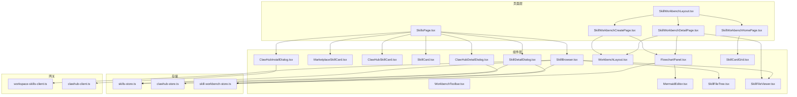
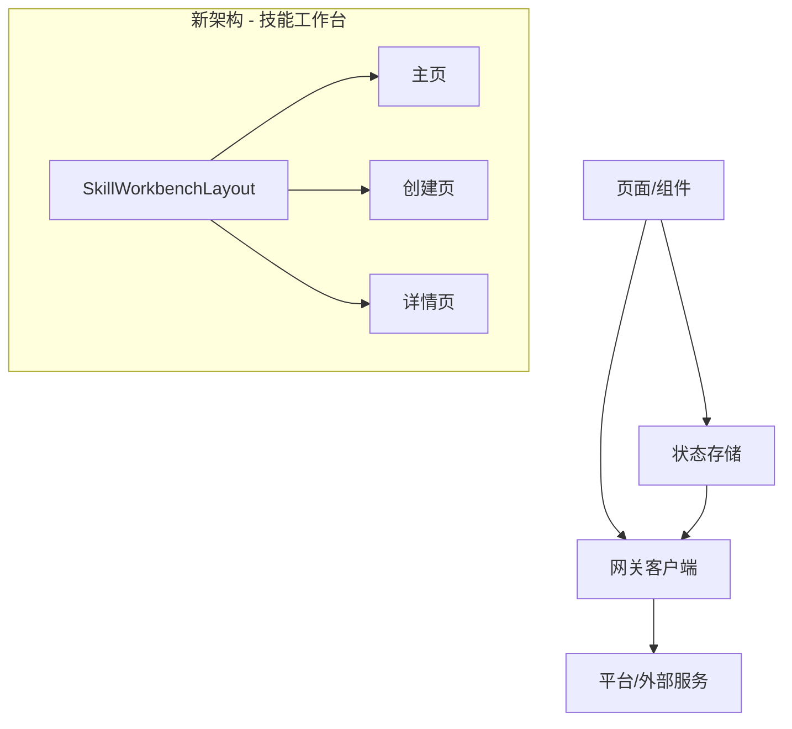
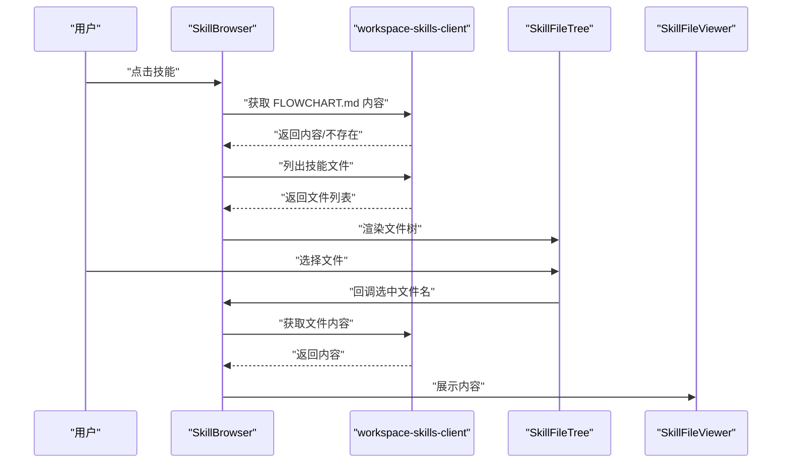
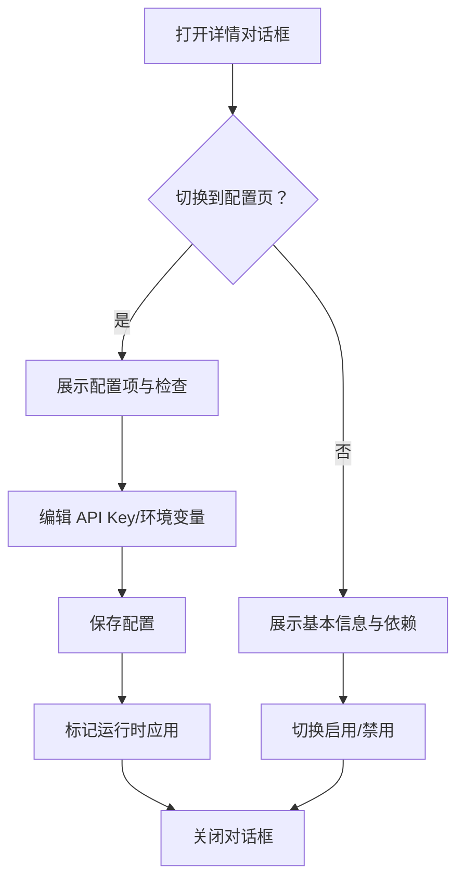
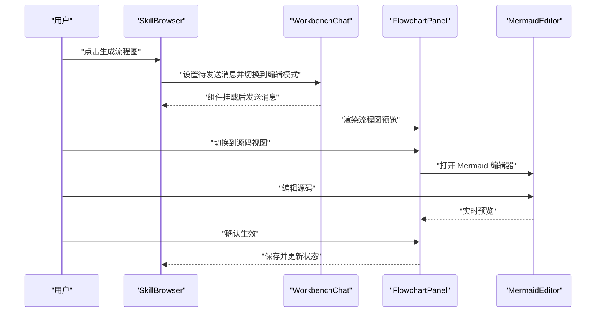
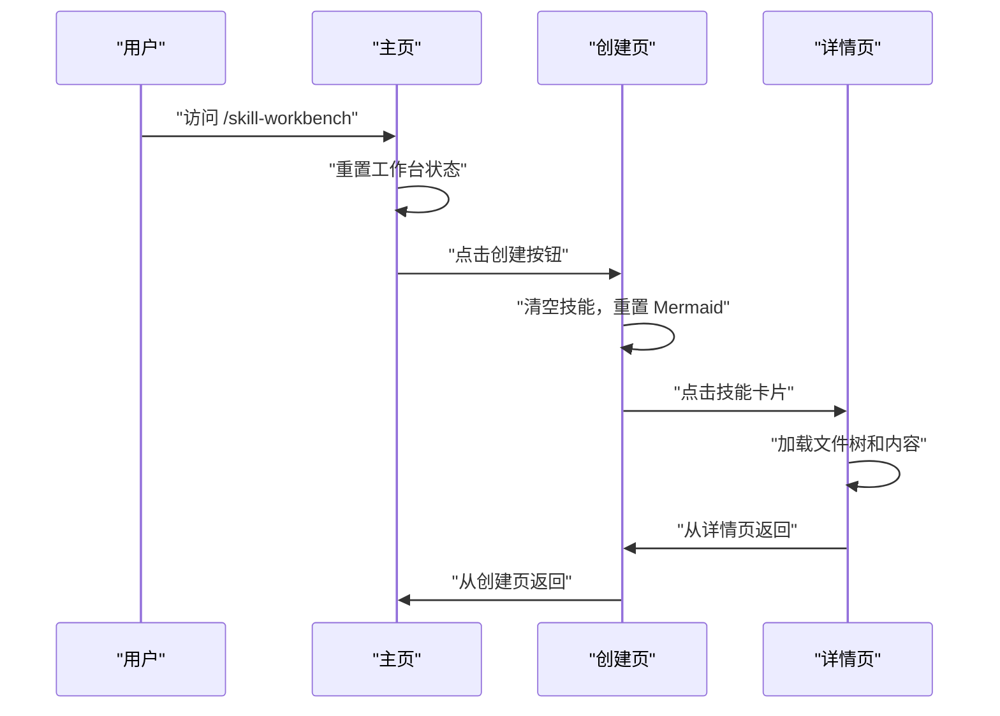
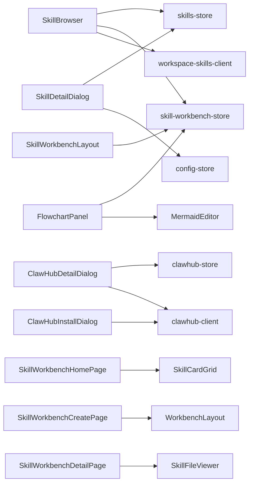

# 技能管理

<cite>
**本文引用的文件**
- [SkillBrowser.tsx](file://src/components/console/skills/SkillBrowser.tsx)
- [MarketplaceSkillCard.tsx](file://src/components/console/skills/MarketplaceSkillCard.tsx)
- [ClawHubSkillCard.tsx](file://src/components/console/skills/ClawHubSkillCard.tsx)
- [SkillCard.tsx](file://src/components/console/skills/SkillCard.tsx)
- [SkillDetailDialog.tsx](file://src/components/console/skills/SkillDetailDialog.tsx)
- [ClawHubDetailDialog.tsx](file://src/components/console/skills/ClawHubDetailDialog.tsx)
- [ClawHubInstallDialog.tsx](file://src/components/console/skills/ClawHubInstallDialog.tsx)
- [WorkbenchLayout.tsx](file://src/components/console/skills/WorkbenchLayout.tsx)
- [WorkbenchToolbar.tsx](file://src/components/console/skills/WorkbenchToolbar.tsx)
- [FlowchartPanel.tsx](file://src/components/console/skills/FlowchartPanel.tsx)
- [MermaidEditor.tsx](file://src/components/console/skills/MermaidEditor.tsx)
- [SkillFileTree.tsx](file://src/components/console/skills/SkillFileTree.tsx)
- [SkillFileViewer.tsx](file://src/components/console/skills/SkillFileViewer.tsx)
- [workspace-skills-client.ts](file://src/gateway/workspace-skills-client.ts)
- [clawhub-client.ts](file://src/gateway/clawhub-client.ts)
- [skills-store.ts](file://src/store/console-stores/skills-store.ts)
- [clawhub-store.ts](file://src/store/console-stores/clawhub-store.ts)
- [skill-workbench-store.ts](file://src/store/console-stores/skill-workbench-store.ts)
- [SkillsPage.tsx](file://src/pages/SkillsPage.tsx)
- [SkillWorkbenchPage.tsx](file://src/pages/SkillWorkbenchPage.tsx)
- [SkillWorkbenchLayout.tsx](file://src/components/pages/SkillWorkbenchLayout.tsx)
- [SkillWorkbenchHomePage.tsx](file://src/components/pages/SkillWorkbenchHomePage.tsx)
- [SkillWorkbenchCreatePage.tsx](file://src/components/pages/SkillWorkbenchCreatePage.tsx)
- [SkillWorkbenchDetailPage.tsx](file://src/components/pages/SkillWorkbenchDetailPage.tsx)
- [SkillCardGrid.tsx](file://src/components/console/skills/SkillCardGrid.tsx)
- [console.json](file://src/i18n/locales/zh/console.json)
</cite>

## 更新摘要
**所做更改**
- 更新了技能工作台系统的架构重组，从单页面架构迁移到三页嵌套路由结构
- 新增主页、创建页、详情页等组件的详细说明
- 移除了旧的工具栏系统，更新了新的导航结构
- 更新了国际化支持，新增了技能工作台相关的多语言键值
- 重构了技能工作台的路由和状态管理机制

## 目录
1. [简介](#简介)
2. [项目结构](#项目结构)
3. [核心组件](#核心组件)
4. [架构总览](#架构总览)
5. [组件详解](#组件详解)
6. [依赖关系分析](#依赖关系分析)
7. [性能考量](#性能考量)
8. [故障排查指南](#故障排查指南)
9. [结论](#结论)
10. [附录](#附录)

## 简介
本文件面向"技能管理"功能域，系统化梳理技能浏览器、技能卡片、技能详情对话框、ClawHub 集成与安装对话框、以及技能工作台（编辑器布局、工具栏、聊天界面、流程图面板、Mermaid 编辑器、文件树与文件查看器）的实现与协作机制。文档同时覆盖技能安装、卸载、更新的生命周期管理与开发调试工具链支持，帮助开发者与使用者高效理解与使用技能生态。

**更新** 本次更新反映了技能工作台系统的重大架构重组：从单页面架构迁移到三页嵌套路由结构，移除旧的工具栏系统，新增主页、创建页、详情页等组件，更新国际化支持。

## 项目结构
技能管理相关代码主要位于以下位置：
- 页面层：src/components/pages 下的技能工作台页面组件
- 组件层：src/components/console/skills 下的各类技能相关 UI 组件
- 网关层：src/gateway 下的 workspace-skills-client 与 clawhub-client，负责与后端或外部服务交互
- 存储层：src/store/console-stores 下的 skills-store、clawhub-store、skill-workbench-store，负责状态管理
- 国际化：src/i18n/locales 下的 console.json 多语言配置文件

**图表来源**
- [SkillWorkbenchLayout.tsx](file://src/components/pages/SkillWorkbenchLayout.tsx)
- [SkillWorkbenchHomePage.tsx](file://src/components/pages/SkillWorkbenchHomePage.tsx)
- [SkillWorkbenchCreatePage.tsx](file://src/components/pages/SkillWorkbenchCreatePage.tsx)
- [SkillWorkbenchDetailPage.tsx](file://src/components/pages/SkillWorkbenchDetailPage.tsx)
- [SkillsPage.tsx](file://src/pages/SkillsPage.tsx)
- [SkillBrowser.tsx](file://src/components/console/skills/SkillBrowser.tsx)
- [SkillCardGrid.tsx](file://src/components/console/skills/SkillCardGrid.tsx)

**章节来源**
- [SkillWorkbenchLayout.tsx](file://src/components/pages/SkillWorkbenchLayout.tsx)
- [SkillWorkbenchHomePage.tsx](file://src/components/pages/SkillWorkbenchHomePage.tsx)
- [SkillWorkbenchCreatePage.tsx](file://src/components/pages/SkillWorkbenchCreatePage.tsx)
- [SkillWorkbenchDetailPage.tsx](file://src/components/pages/SkillWorkbenchDetailPage.tsx)

## 核心组件
- 技能浏览器：提供技能列表、搜索过滤、文件树与文件查看器、编辑与自动生成流程图能力
- 技能卡片：展示技能信息、安装状态、版本与操作按钮
- 技能详情对话框：展示技能详细信息、描述、作者、版本、依赖关系与配置
- ClawHub 集成：技能市场浏览、搜索结果与列表项卡片、详情与安装对话框
- 技能工作台：编辑器布局、工具栏、聊天界面、流程图面板、Mermaid 编辑器、文件树与文件查看器协同
- **新增** 技能工作台页面系统：主页、创建页、详情页的三页嵌套路由结构

**更新** 新增了技能工作台页面系统的详细说明，包括主页、创建页、详情页的职责分工和路由结构。

**章节来源**
- [SkillBrowser.tsx](file://src/components/console/skills/SkillBrowser.tsx)
- [MarketplaceSkillCard.tsx](file://src/components/console/skills/MarketplaceSkillCard.tsx)
- [ClawHubSkillCard.tsx](file://src/components/console/skills/ClawHubSkillCard.tsx)
- [SkillCard.tsx](file://src/components/console/skills/SkillCard.tsx)
- [SkillDetailDialog.tsx](file://src/components/console/skills/SkillDetailDialog.tsx)
- [ClawHubDetailDialog.tsx](file://src/components/console/skills/ClawHubDetailDialog.tsx)
- [ClawHubInstallDialog.tsx](file://src/components/console/skills/ClawHubInstallDialog.tsx)
- [WorkbenchLayout.tsx](file://src/components/console/skills/WorkbenchLayout.tsx)
- [WorkbenchToolbar.tsx](file://src/components/console/skills/WorkbenchToolbar.tsx)
- [FlowchartPanel.tsx](file://src/components/console/skills/FlowchartPanel.tsx)
- [SkillWorkbenchLayout.tsx](file://src/components/pages/SkillWorkbenchLayout.tsx)
- [SkillWorkbenchHomePage.tsx](file://src/components/pages/SkillWorkbenchHomePage.tsx)
- [SkillWorkbenchCreatePage.tsx](file://src/components/pages/SkillWorkbenchCreatePage.tsx)
- [SkillWorkbenchDetailPage.tsx](file://src/components/pages/SkillWorkbenchDetailPage.tsx)

## 架构总览
技能管理采用"页面承载 + 组件分层 + 状态与网关解耦"的架构：
- 页面层负责路由与布局承载
- 组件层负责 UI 表达与用户交互
- 存储层统一管理技能、ClawHub、工作台状态
- 网关层封装与平台/外部服务的通信

**更新** 新的架构采用了三页嵌套路由结构，通过 SkillWorkbenchLayout 统一包装所有技能工作台路由，确保聊天会话的正确恢复。

**图表来源**
- [SkillWorkbenchLayout.tsx](file://src/components/pages/SkillWorkbenchLayout.tsx)
- [SkillWorkbenchHomePage.tsx](file://src/components/pages/SkillWorkbenchHomePage.tsx)
- [SkillWorkbenchCreatePage.tsx](file://src/components/pages/SkillWorkbenchCreatePage.tsx)
- [SkillWorkbenchDetailPage.tsx](file://src/components/pages/SkillWorkbenchDetailPage.tsx)

## 组件详解

### 技能浏览器：技能市场浏览、ClawHub 集成、搜索过滤、分类筛选
- 技能列表与搜索
  - 基于 skills-store 中的技能集合进行过滤，支持按名称、描述、slug 搜索
  - 支持区分工作区技能与外部来源技能
- 文件树与文件查看
  - 选中技能后拉取文件列表，渲染 SkillFileTree
  - 选择文件后通过 workspace-skills-client 获取内容并在 SkillFileViewer 展示
- 流程图集成
  - 自动识别 FLOWCHART.md 并解析 Mermaid 源码，驱动 FlowchartPanel 预览与编辑
  - 提供"生成流程图"能力，通过 WorkbenchChat 触发消息并自动切换到编辑模式
- 交互行为
  - 列表项高亮当前选中技能
  - 编辑按钮进入工作台编辑模式
  - 无流程图时提供一键生成入口

**图表来源**
- [SkillBrowser.tsx](file://src/components/console/skills/SkillBrowser.tsx)
- [SkillFileTree.tsx](file://src/components/console/skills/SkillFileTree.tsx)
- [SkillFileViewer.tsx](file://src/components/console/skills/SkillFileViewer.tsx)
- [workspace-skills-client.ts](file://src/gateway/workspace-skills-client.ts)

**章节来源**
- [SkillBrowser.tsx](file://src/components/console/skills/SkillBrowser.tsx)

### 技能卡片组件：技能信息展示、安装状态、版本信息、操作按钮
- Marketplace 技能卡片
  - 展示图标、名称、描述、来源标签、版本、作者、主页链接
  - 安装按钮根据 isInstalling 与 installOptions 控制可用性
  - 已安装显示绿色已安装徽章
- 内置/市场技能卡片
  - 展示核心/内置/市场来源标识，版本号，缺失依赖提示
  - 开关控制启用/禁用；核心且受保护时禁用开关
  - 可触发安装或打开配置对话框
- ClawHub 技能卡片
  - 展示摘要、版本、更新时间、评分、下载量、星数
  - 已安装显示绿色徽章，未安装显示安装按钮

**章节来源**
- [MarketplaceSkillCard.tsx](file://src/components/console/skills/MarketplaceSkillCard.tsx)
- [SkillCard.tsx](file://src/components/console/skills/SkillCard.tsx)
- [ClawHubSkillCard.tsx](file://src/components/console/skills/ClawHubSkillCard.tsx)

### 技能详情对话框：技能详细信息展示、描述、作者、版本、依赖关系
- 信息页
  - 展示描述、来源、版本、作者、主环境变量、主页链接
  - 依赖项（二进制/环境）以勾选/叉号标识是否满足
- 配置页
  - 支持设置 API Key（可显隐）
  - 动态增删改环境变量键值对
  - 显示配置检查项（如文件存在性等）
  - 保存后标记运行时应用
- 启用/禁用切换（核心技能可能受保护）

**图表来源**
- [SkillDetailDialog.tsx](file://src/components/console/skills/SkillDetailDialog.tsx)

**章节来源**
- [SkillDetailDialog.tsx](file://src/components/console/skills/SkillDetailDialog.tsx)

### ClawHub 安装对话框：技能安装流程、依赖检查、安装进度、安装选项配置
- 安全提示
  - 弹出安全警告，提醒用户谨慎安装
- 安装命令
  - 展示标准安装命令，支持一键复制
- 用户确认
  - 用户确认"已完成安装"，触发后续刷新或状态变更
- 与 ClawHub 详情联动
  - 详情页提供"在 ClawHub 上查看"与"安装"按钮

**章节来源**
- [ClawHubInstallDialog.tsx](file://src/components/console/skills/ClawHubInstallDialog.tsx)
- [ClawHubDetailDialog.tsx](file://src/components/console/skills/ClawHubDetailDialog.tsx)

### 技能工作台：编辑器布局、工具栏、聊天界面、流程图面板、Mermaid 编辑器、文件树和文件查看器
- 布局与拖拽
  - WorkbenchLayout 提供左右分区与拖拽调整比例
- 工具栏
  - WorkbenchToolbar 支持浏览/编辑模式切换，显示当前技能名与状态
- 流程图面板
  - FlowchartPanel 支持预览/源码双视图，缩放与平移，确认 Mermaid 生效
  - MermaidEditor 用于直接编辑源码
- 文件树与文件查看器
  - 与 SkillBrowser 协同，展示技能内文件并支持查看/编辑
- 聊天界面
  - 通过"生成流程图"触发 WorkbenchChat，自动发送消息并挂载聊天组件

**图表来源**
- [SkillBrowser.tsx](file://src/components/console/skills/SkillBrowser.tsx)
- [FlowchartPanel.tsx](file://src/components/console/skills/FlowchartPanel.tsx)
- [MermaidEditor.tsx](file://src/components/console/skills/MermaidEditor.tsx)

**章节来源**
- [WorkbenchLayout.tsx](file://src/components/console/skills/WorkbenchLayout.tsx)
- [WorkbenchToolbar.tsx](file://src/components/console/skills/WorkbenchToolbar.tsx)
- [FlowchartPanel.tsx](file://src/components/console/skills/FlowchartPanel.tsx)
- [SkillBrowser.tsx](file://src/components/console/skills/SkillBrowser.tsx)

### **新增** 技能工作台页面系统：主页、创建页、详情页
- **主页（SkillWorkbenchHomePage）**
  - 展示技能卡片网格，支持搜索和创建新技能
  - 进入时重置工作台状态，确保中性状态
  - 集成 SkillCardGrid 组件，提供技能列表浏览
- **创建页（SkillWorkbenchCreatePage）**
  - 提供全新的技能创建工作流
  - 进入时清空当前技能，重置 Mermaid 源码
  - 设置模式为"create"，启动聊天会话
  - 左侧 WorkbenchChat 提供创建建议，右侧 FlowchartPanel 展示流程图
- **详情页（SkillWorkbenchDetailPage）**
  - 展示技能详细信息和文件树
  - 支持文件查看和编辑，集成聊天侧边栏
  - 提供技能编辑、复制 slug、生成流程图等功能
  - 自动同步聊天流状态后的文件变更

**更新** 新增了技能工作台页面系统的详细说明，包括三个页面的职责分工、状态管理和交互流程。

**图表来源**
- [SkillWorkbenchHomePage.tsx](file://src/components/pages/SkillWorkbenchHomePage.tsx)
- [SkillWorkbenchCreatePage.tsx](file://src/components/pages/SkillWorkbenchCreatePage.tsx)
- [SkillWorkbenchDetailPage.tsx](file://src/components/pages/SkillWorkbenchDetailPage.tsx)

**章节来源**
- [SkillWorkbenchHomePage.tsx](file://src/components/pages/SkillWorkbenchHomePage.tsx)
- [SkillWorkbenchCreatePage.tsx](file://src/components/pages/SkillWorkbenchCreatePage.tsx)
- [SkillWorkbenchDetailPage.tsx](file://src/components/pages/SkillWorkbenchDetailPage.tsx)

### **新增** 技能工作台布局系统：统一状态管理和聊天会话恢复
- **SkillWorkbenchLayout**
  - 作为所有技能工作台路由的包装组件
  - 负责在用户完全离开工作台时恢复原始聊天会话
  - 确保每个页面级别的效果都能正确调用 enterWorkbench() 和 leaveWorkbench()
- **状态管理**
  - 通过 skill-workbench-store 统一管理工作台模式、当前技能、Mermaid 源码
  - 支持 browse（浏览）、create（创建）、edit（编辑）三种模式
  - 自动清理工作台状态，避免内存泄漏

**更新** 新增了技能工作台布局系统的详细说明，包括状态管理和聊天会话恢复机制。

**章节来源**
- [SkillWorkbenchLayout.tsx](file://src/components/pages/SkillWorkbenchLayout.tsx)
- [skill-workbench-store.ts](file://src/store/console-stores/skill-workbench-store.ts)

## 依赖关系分析
- 组件与存储
  - SkillBrowser 依赖 skills-store 与 skill-workbench-store，调用 workspace-skills-client
  - SkillDetailDialog 依赖 skills-store 与 config-store，通过适配器更新技能配置
  - ClawHubDetailDialog/ClawHubInstallDialog 依赖 clawhub-store 与 clawhub-client
  - **新增** 技能工作台页面依赖 skill-workbench-store 进行状态管理
- 组件与网关
  - workspace-skills-client 提供技能文件读写与列表查询
  - clawhub-client 提供技能详情与搜索能力
- 组件间协作
  - SkillBrowser 与 FlowchartPanel、MermaidEditor 通过 skill-workbench-store 共享状态
  - 技能卡片与详情对话框共同驱动技能启用/禁用与配置更新
  - **新增** 技能工作台页面通过路由系统协同工作

**图表来源**
- [SkillBrowser.tsx](file://src/components/console/skills/SkillBrowser.tsx)
- [SkillDetailDialog.tsx](file://src/components/console/skills/SkillDetailDialog.tsx)
- [ClawHubDetailDialog.tsx](file://src/components/console/skills/ClawHubDetailDialog.tsx)
- [ClawHubInstallDialog.tsx](file://src/components/console/skills/ClawHubInstallDialog.tsx)
- [FlowchartPanel.tsx](file://src/components/console/skills/FlowchartPanel.tsx)
- [MermaidEditor.tsx](file://src/components/console/skills/MermaidEditor.tsx)
- [SkillWorkbenchLayout.tsx](file://src/components/pages/SkillWorkbenchLayout.tsx)
- [SkillWorkbenchHomePage.tsx](file://src/components/pages/SkillWorkbenchHomePage.tsx)
- [SkillWorkbenchCreatePage.tsx](file://src/components/pages/SkillWorkbenchCreatePage.tsx)
- [SkillWorkbenchDetailPage.tsx](file://src/components/pages/SkillWorkbenchDetailPage.tsx)
- [SkillCardGrid.tsx](file://src/components/console/skills/SkillCardGrid.tsx)

**章节来源**
- [skills-store.ts](file://src/store/console-stores/skills-store.ts)
- [clawhub-store.ts](file://src/store/console-stores/clawhub-store.ts)
- [skill-workbench-store.ts](file://src/store/console-stores/skill-workbench-store.ts)
- [workspace-skills-client.ts](file://src/gateway/workspace-skills-client.ts)
- [clawhub-client.ts](file://src/gateway/clawhub-client.ts)

## 性能考量
- 渲染优化
  - 使用 memo 包裹重型组件（如 SkillBrowser、WorkbenchLayout、WorkbenchToolbar），减少重渲染
  - **新增** 技能工作台页面采用懒加载和状态缓存，提升页面切换性能
- 数据加载
  - 文件列表与内容加载采用异步，配合加载状态避免重复请求
  - **新增** 技能工作台页面实现智能缓存，避免重复加载相同技能数据
- 图表渲染
  - FlowchartPanel 支持缩放与平移，避免大图一次性渲染导致卡顿
  - **新增** Mermaid 编辑器支持增量渲染，仅重新渲染变更部分
- 状态同步
  - 通过集中式 store 管理跨组件共享状态，降低 props drilling 与重复计算
  - **新增** 技能工作台布局确保状态在页面切换时正确恢复

**更新** 新增了技能工作台页面系统的性能考量，包括懒加载、状态缓存和智能渲染等优化措施。

## 故障排查指南
- 技能未显示或搜索无结果
  - 检查 skills-store 是否成功拉取技能列表
  - 确认搜索关键词大小写不敏感匹配逻辑正常
- 文件树为空或文件内容加载失败
  - 核查 workspace-skills-client 的文件列表与内容接口返回
  - 检查文件名大小写与斜杠规范化处理
- 流程图未生成或无法预览
  - 确认 FLOWCHART.md 存在且包含合法 Mermaid 源码
  - 检查 skill-workbench-store 的 mermaidSource 与 flowchartDocument 同步
- 安装/卸载/更新异常
  - 查看 ClawHub 安装对话框与 ClawHub 详情对话框状态
  - 确认 clawhub-client 与平台适配器的调用链路
- 配置保存无效
  - 确认 SkillDetailDialog 的保存流程已触发适配器更新与运行时应用标记
- **新增** 技能工作台页面问题
  - 检查路由配置是否正确指向 SkillWorkbenchLayout
  - 确认 skill-workbench-store 的状态重置逻辑正常执行
  - 验证聊天会话恢复机制是否正确工作

**更新** 新增了技能工作台页面系统的故障排查指南，包括路由配置、状态管理和聊天会话恢复等问题的诊断方法。

**章节来源**
- [SkillBrowser.tsx](file://src/components/console/skills/SkillBrowser.tsx)
- [SkillDetailDialog.tsx](file://src/components/console/skills/SkillDetailDialog.tsx)
- [ClawHubInstallDialog.tsx](file://src/components/console/skills/ClawHubInstallDialog.tsx)
- [ClawHubDetailDialog.tsx](file://src/components/console/skills/ClawHubDetailDialog.tsx)
- [SkillWorkbenchLayout.tsx](file://src/components/pages/SkillWorkbenchLayout.tsx)
- [SkillWorkbenchHomePage.tsx](file://src/components/pages/SkillWorkbenchHomePage.tsx)
- [SkillWorkbenchCreatePage.tsx](file://src/components/pages/SkillWorkbenchCreatePage.tsx)
- [SkillWorkbenchDetailPage.tsx](file://src/components/pages/SkillWorkbenchDetailPage.tsx)

## 结论
技能管理模块通过清晰的组件分层与状态管理，实现了从技能浏览、安装、配置到工作台编辑与流程图可视化的完整闭环。其设计强调可扩展性与易用性，既满足日常运维需求，也为技能开发与调试提供了良好支撑。

**更新** 本次架构重组进一步提升了技能工作台系统的用户体验和开发效率，通过三页嵌套路由结构和统一的状态管理，为技能开发提供了更加流畅和直观的工作流程。

## 附录
- 技能生命周期建议
  - 安装：通过 Marketplace 或 ClawHub 安装，检查依赖与配置
  - 启用/禁用：根据业务需要动态启停技能
  - 更新：关注 ClawHub 版本与变更日志，按需升级
  - 卸载：清理配置与相关资源，确保系统干净
- 开发与调试工具链
  - 使用 FlowchartPanel 与 MermaidEditor 快速验证流程图
  - 通过 SkillDetailDialog 验证配置项与依赖检查
  - 在 SkillBrowser 中快速定位与查看技能文件
  - **新增** 利用技能工作台页面系统进行完整的技能开发流程测试
- **新增** 技能工作台页面系统使用建议
  - 主页用于技能浏览和快速访问
  - 创建页适合全新技能的开发和测试
  - 详情页用于技能维护和深度编辑
  - 合理利用聊天会话恢复机制，避免重复配置

**更新** 新增了技能工作台页面系统的使用建议和最佳实践，帮助用户更好地利用新的架构优势。