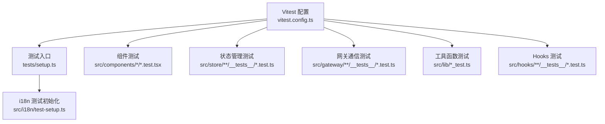
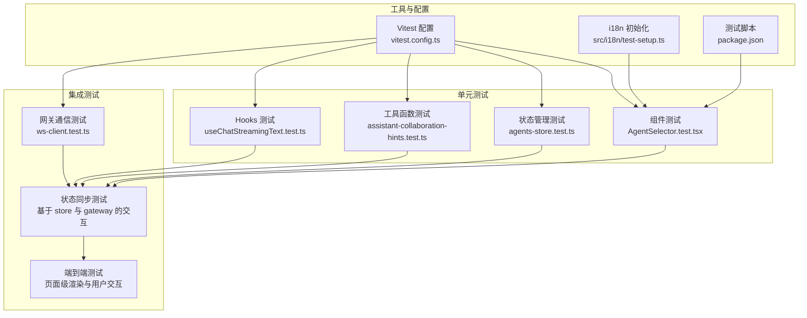
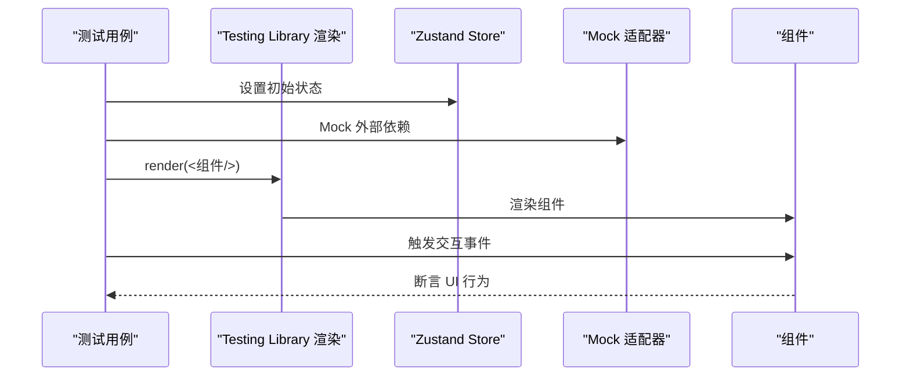
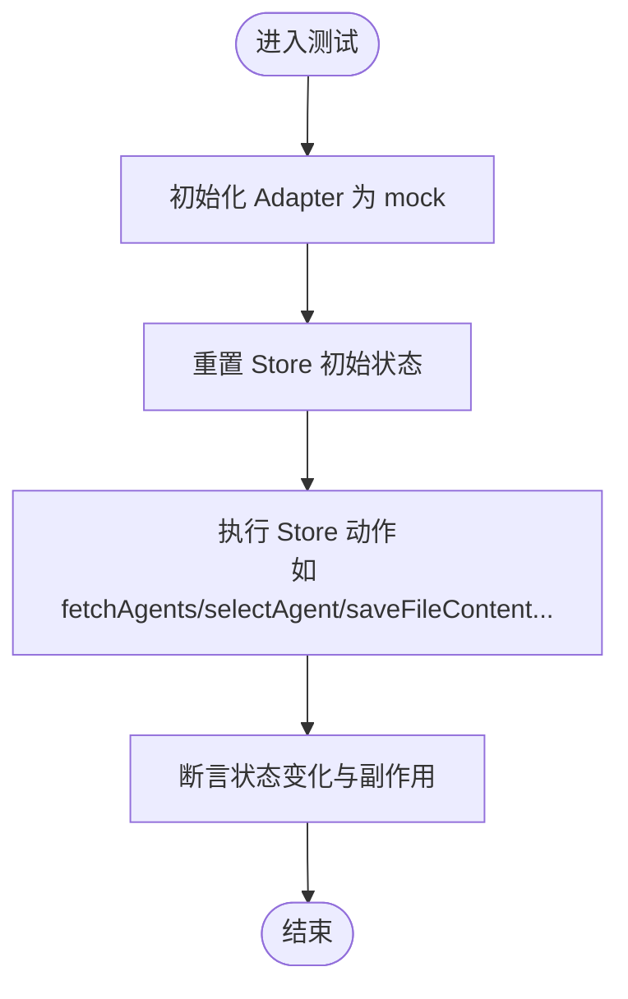
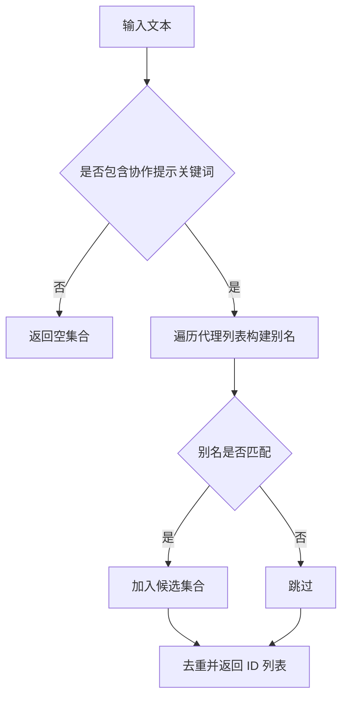
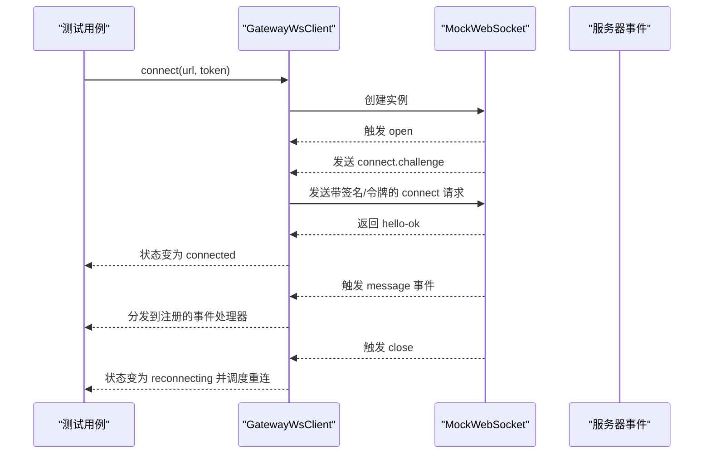
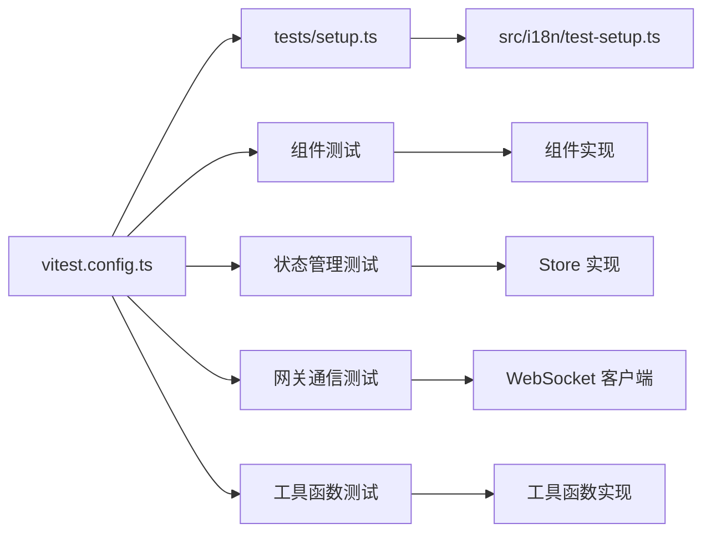

# 测试策略

<cite>
**本文引用的文件**
- [vitest.config.ts](file://vitest.config.ts)
- [package.json](file://package.json)
- [tests/setup.ts](file://tests/setup.ts)
- [src/i18n/test-setup.ts](file://src/i18n/test-setup.ts)
- [src/components/chat/AgentSelector.test.tsx](file://src/components/chat/AgentSelector.test.tsx)
- [src/store/__tests__/agents-store.test.ts](file://src/store/__tests__/agents-store.test.ts)
- [src/gateway/__tests__/ws-client.test.ts](file://src/gateway/__tests__/ws-client.test.ts)
- [src/hooks/__tests__/useChatStreamingText.test.ts](file://src/hooks/__tests__/useChatStreamingText.test.ts)
- [src/lib/assistant-collaboration-hints.test.ts](file://src/lib/assistant-collaboration-hints.test.ts)
- [src/store/console-stores/agents-store.ts](file://src/store/console-stores/agents-store.ts)
- [src/gateway/ws-client.ts](file://src/gateway/ws-client.ts)
- [src/hooks/useChatStreamingText.ts](file://src/hooks/useChatStreamingText.ts)
- [src/lib/assistant-collaboration-hints.ts](file://src/lib/assistant-collaboration-hints.ts)
</cite>

## 目录
1. [引言](#引言)
2. [项目结构](#项目结构)
3. [核心组件](#核心组件)
4. [架构总览](#架构总览)
5. [详细组件分析](#详细组件分析)
6. [依赖关系分析](#依赖关系分析)
7. [性能考量](#性能考量)
8. [故障排查指南](#故障排查指南)
9. [结论](#结论)
10. [附录](#附录)

## 引言
本文件系统化梳理 OpenClaw-Office 的测试策略与实现，覆盖单元测试架构（组件测试、状态管理测试、工具函数测试）、集成测试设计（网关通信测试、状态同步测试、端到端测试）、测试工具配置（Vitest 配置、测试环境设置、覆盖率报告）、测试最佳实践（用例编写、Mock 策略、异步测试处理），并针对特殊场景（WebSocket 连接测试、状态管理测试、组件渲染测试）提供可操作的示例与指南。

## 项目结构
测试相关文件主要分布在以下位置：
- Vitest 配置与脚本：根目录的配置与包脚本
- 全局测试设置：tests/setup.ts 与 i18n 测试初始化
- 组件测试：src/components 下各组件的 .test.tsx 文件
- 状态管理测试：src/store 及其子目录的 __tests__ 文件
- 网关与工具测试：src/gateway 与 src/lib 下的测试文件
- Hooks 测试：src/hooks 下的测试文件

图表来源
- [vitest.config.ts:1-20](file://vitest.config.ts#L1-L20)
- [tests/setup.ts:1-3](file://tests/setup.ts#L1-L3)
- [src/i18n/test-setup.ts:1-45](file://src/i18n/test-setup.ts#L1-L45)

章节来源
- [vitest.config.ts:1-20](file://vitest.config.ts#L1-L20)
- [package.json:35-47](file://package.json#L35-L47)
- [tests/setup.ts:1-3](file://tests/setup.ts#L1-L3)
- [src/i18n/test-setup.ts:1-45](file://src/i18n/test-setup.ts#L1-L45)

## 核心组件
- 测试运行器与环境
  - 使用 Vitest，DOM 环境为 jsdom，全局启用，别名 @ 指向 src
  - 通过 tests/setup.ts 注入 jest-dom 断言与 i18n 测试初始化
- 覆盖率与报告
  - 当前仓库未显式配置覆盖率输出；建议在 Vitest 配置中添加 coverage 字段以生成报告
- 测试脚本
  - 提供 run 与 watch 模式，便于本地开发与 CI 集成

章节来源
- [vitest.config.ts:7-19](file://vitest.config.ts#L7-L19)
- [tests/setup.ts:1-3](file://tests/setup.ts#L1-L3)
- [src/i18n/test-setup.ts:16-42](file://src/i18n/test-setup.ts#L16-L42)
- [package.json:45-46](file://package.json#L45-L46)

## 架构总览
测试架构围绕“单元测试 + 集成测试”的分层组织，结合 Mock 与真实适配器，确保组件、状态管理、工具函数与网关通信的稳定性与可维护性。

图表来源
- [src/components/chat/AgentSelector.test.tsx:1-77](file://src/components/chat/AgentSelector.test.tsx#L1-L77)
- [src/store/__tests__/agents-store.test.ts:1-152](file://src/store/__tests__/agents-store.test.ts#L1-L152)
- [src/gateway/__tests__/ws-client.test.ts:1-207](file://src/gateway/__tests__/ws-client.test.ts#L1-L207)
- [src/hooks/__tests__/useChatStreamingText.test.ts:1-93](file://src/hooks/__tests__/useChatStreamingText.test.ts#L1-L93)
- [src/lib/assistant-collaboration-hints.test.ts:1-95](file://src/lib/assistant-collaboration-hints.test.ts#L1-L95)
- [vitest.config.ts:7-19](file://vitest.config.ts#L7-L19)
- [src/i18n/test-setup.ts:16-42](file://src/i18n/test-setup.ts#L16-L42)
- [package.json:45-46](file://package.json#L45-L46)

## 详细组件分析

### 单元测试：组件测试
- 目标与范围
  - 验证组件渲染、交互行为与状态联动
  - 示例：AgentSelector 在不同适配器返回值下的 UI 行为
- 关键策略
  - 使用 Testing Library 渲染组件，配合 vitest 的 Mock 机制模拟外部依赖
  - 通过 Zustand store 的 setState 快速注入初始状态
- 示例路径
  - [AgentSelector 组件测试:1-77](file://src/components/chat/AgentSelector.test.tsx#L1-L77)

图表来源
- [src/components/chat/AgentSelector.test.tsx:46-75](file://src/components/chat/AgentSelector.test.tsx#L46-L75)

章节来源
- [src/components/chat/AgentSelector.test.tsx:1-77](file://src/components/chat/AgentSelector.test.tsx#L1-L77)

### 单元测试：状态管理测试
- 目标与范围
  - 验证 Zustand store 的动作与状态变更逻辑
  - 示例：Agents Store 的加载、选择、文件读写、模型更新、对话清理等
- 关键策略
  - 使用 adapter-provider 的 mock 初始化，隔离真实网关
  - 通过 store.getState()/setState 控制测试上下文
- 示例路径
  - [Agents Store 测试:1-152](file://src/store/__tests__/agents-store.test.ts#L1-L152)
  - [Agents Store 实现:141-641](file://src/store/console-stores/agents-store.ts#L141-L641)

图表来源
- [src/store/__tests__/agents-store.test.ts:6-28](file://src/store/__tests__/agents-store.test.ts#L6-L28)
- [src/store/console-stores/agents-store.ts:297-317](file://src/store/console-stores/agents-store.ts#L297-L317)

章节来源
- [src/store/__tests__/agents-store.test.ts:1-152](file://src/store/__tests__/agents-store.test.ts#L1-L152)
- [src/store/console-stores/agents-store.ts:141-641](file://src/store/console-stores/agents-store.ts#L141-L641)

### 单元测试：工具函数测试
- 目标与范围
  - 验证纯函数与业务辅助逻辑的正确性
  - 示例：从助手文本中检测协作提示、流式消息文本提取与思维标签剥离
- 关键策略
  - 输入边界与异常分支全覆盖
  - 对比预期输出，避免隐式依赖
- 示例路径
  - [助手协作提示检测测试:1-95](file://src/lib/assistant-collaboration-hints.test.ts#L1-L95)
  - [助手协作提示检测实现:26-48](file://src/lib/assistant-collaboration-hints.ts#L26-L48)
  - [流式文本解析测试:1-93](file://src/hooks/__tests__/useChatStreamingText.test.ts#L1-L93)
  - [流式文本解析实现:12-87](file://src/hooks/useChatStreamingText.ts#L12-L87)

图表来源
- [src/lib/assistant-collaboration-hints.test.ts:32-93](file://src/lib/assistant-collaboration-hints.test.ts#L32-L93)
- [src/lib/assistant-collaboration-hints.ts:26-48](file://src/lib/assistant-collaboration-hints.ts#L26-L48)

章节来源
- [src/lib/assistant-collaboration-hints.test.ts:1-95](file://src/lib/assistant-collaboration-hints.test.ts#L1-L95)
- [src/hooks/__tests__/useChatStreamingText.test.ts:1-93](file://src/hooks/__tests__/useChatStreamingText.test.ts#L1-L93)
- [src/hooks/useChatStreamingText.ts:12-87](file://src/hooks/useChatStreamingText.ts#L12-L87)

### 集成测试：网关通信测试
- 目标与范围
  - 验证 WebSocket 客户端的握手、鉴权、事件分发、重连与关闭流程
- 关键策略
  - 自定义 MockWebSocket 替代浏览器原生 WebSocket，精确控制生命周期与消息
  - 使用 vitest 的 fake timers 控制定时器，保证时序确定性
- 示例路径
  - [WebSocket 客户端测试:1-207](file://src/gateway/__tests__/ws-client.test.ts#L1-L207)
  - [WebSocket 客户端实现:22-303](file://src/gateway/ws-client.ts#L22-L303)

图表来源
- [src/gateway/__tests__/ws-client.test.ts:64-206](file://src/gateway/__tests__/ws-client.test.ts#L64-L206)
- [src/gateway/ws-client.ts:60-130](file://src/gateway/ws-client.ts#L60-L130)

章节来源
- [src/gateway/__tests__/ws-client.test.ts:1-207](file://src/gateway/__tests__/ws-client.test.ts#L1-L207)
- [src/gateway/ws-client.ts:22-303](file://src/gateway/ws-client.ts#L22-L303)

### 集成测试：状态同步测试
- 目标与范围
  - 验证 Store 动作与网关交互后的状态一致性与副作用（如生命周期状态、重启提示）
- 关键策略
  - 通过 adapter-provider 的 mock 初始化，确保每次测试使用一致的适配器
  - 断言 Store 内部状态与外部副作用（如 config-store 的生命周期状态）
- 示例路径
  - [Agents Store 测试中的生命周期断言:114-140](file://src/store/__tests__/agents-store.test.ts#L114-L140)

章节来源
- [src/store/__tests__/agents-store.test.ts:114-140](file://src/store/__tests__/agents-store.test.ts#L114-L140)
- [src/store/console-stores/agents-store.ts:403-449](file://src/store/console-stores/agents-store.ts#L403-L449)

### 集成测试：端到端测试
- 目标与范围
  - 验证页面级渲染、路由与用户交互的完整流程
- 关键策略
  - 基于现有组件测试与状态测试的组合，逐步扩展到页面级用例
  - 使用 Testing Library 的查询 API 验证 DOM 结构与交互反馈
- 示例路径
  - 页面级测试可参考现有组件测试模式进行扩展

章节来源
- [src/components/pages/ChatPage.test.tsx](file://src/components/pages/ChatPage.test.tsx)

## 依赖关系分析
- 测试配置对组件与状态的影响
  - Vitest 配置决定测试运行环境与别名解析
  - 全局 setup 注入 i18n 与 jest-dom，统一断言风格
- 组件测试对状态与网关的依赖
  - 组件测试通过 Mock 适配器与 Store 快照，降低对外部系统的耦合
- 状态管理测试对适配器的依赖
  - 通过 adapter-provider 的 mock 初始化，确保测试可重复性

图表来源
- [vitest.config.ts:7-19](file://vitest.config.ts#L7-L19)
- [tests/setup.ts:1-3](file://tests/setup.ts#L1-L3)
- [src/i18n/test-setup.ts:16-42](file://src/i18n/test-setup.ts#L16-L42)

章节来源
- [vitest.config.ts:7-19](file://vitest.config.ts#L7-L19)
- [tests/setup.ts:1-3](file://tests/setup.ts#L1-L3)
- [src/i18n/test-setup.ts:16-42](file://src/i18n/test-setup.ts#L16-L42)

## 性能考量
- 测试执行速度
  - 使用 jsdom 与内存中的 MockWebSocket，避免真实网络开销
  - 通过 fake timers 控制异步节奏，减少等待时间
- 并行与隔离
  - Vitest 默认支持并发测试，建议按模块拆分测试文件，避免共享状态导致的竞态
- 覆盖率与报告
  - 建议在 Vitest 配置中启用覆盖率统计，以便识别未覆盖的关键路径

## 故障排查指南
- i18n 相关问题
  - 若测试中出现语言资源缺失或断言失败，检查 i18n 测试初始化是否正确加载资源
- WebSocket 测试不稳定
  - 确保在 beforeEach 中重置 MockWebSocket 实例，并在 afterEach 中恢复真实定时器
- Store 状态污染
  - 每个测试用例前后重置 Store 初始状态，避免跨用例干扰
- 适配器未初始化
  - 在涉及网关交互的测试中，确保先调用 adapter-provider 的 mock 初始化

章节来源
- [src/i18n/test-setup.ts:16-42](file://src/i18n/test-setup.ts#L16-L42)
- [src/gateway/__tests__/ws-client.test.ts:68-85](file://src/gateway/__tests__/ws-client.test.ts#L68-L85)
- [src/store/__tests__/agents-store.test.ts:6-28](file://src/store/__tests__/agents-store.test.ts#L6-L28)

## 结论
本测试策略以 Vitest 为核心，结合 jsdom 环境与全局 setup，形成“单元测试优先、集成测试补充”的体系。通过 Mock 与真实适配器的组合，既保证了测试效率，又覆盖了关键的端到端行为。建议后续完善覆盖率配置与 CI 集成，持续提升测试质量与可维护性。

## 附录

### 测试工具配置与最佳实践
- Vitest 配置要点
  - 环境：jsdom
  - 别名：@ -> src
  - 全局断言：jest-dom
  - 脚本：run/watch
- 最佳实践
  - 用例命名清晰，聚焦单一行为
  - 使用 Mock 替代外部依赖，保持测试稳定
  - 异步测试使用 fake timers 与显式等待
  - 覆盖边界条件与错误分支

章节来源
- [vitest.config.ts:7-19](file://vitest.config.ts#L7-L19)
- [package.json:45-46](file://package.json#L45-L46)