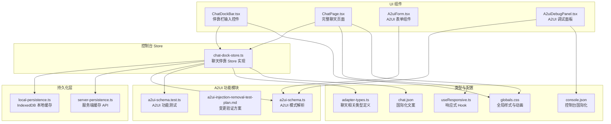
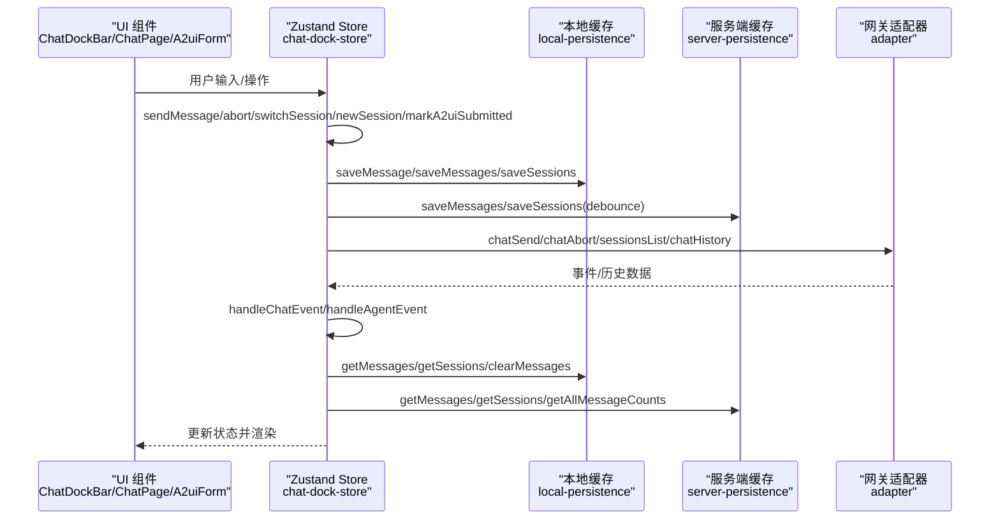
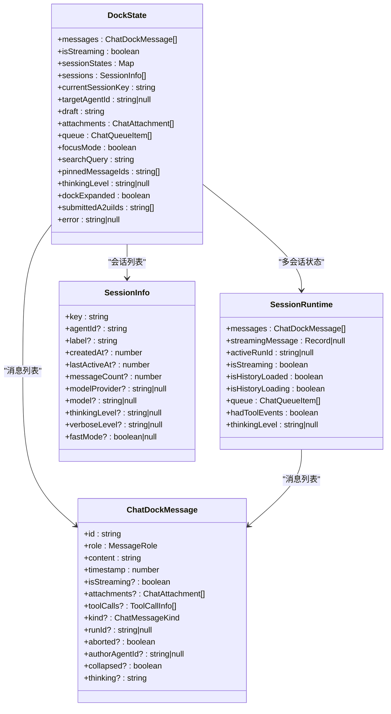
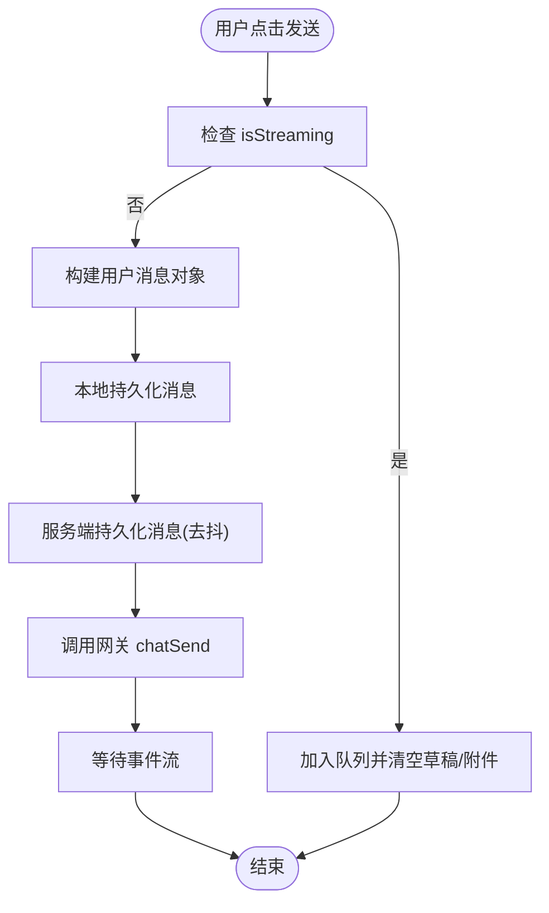
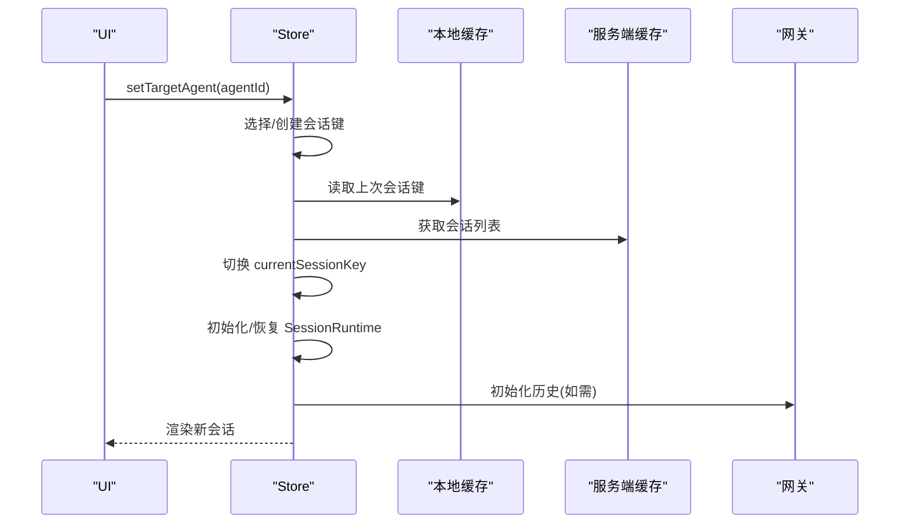
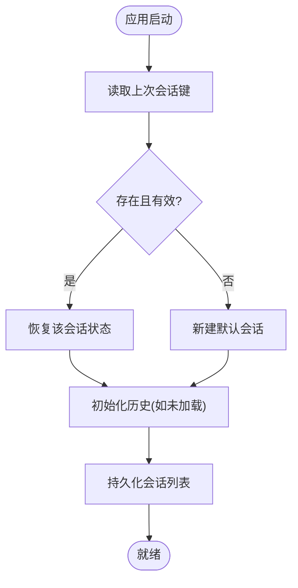
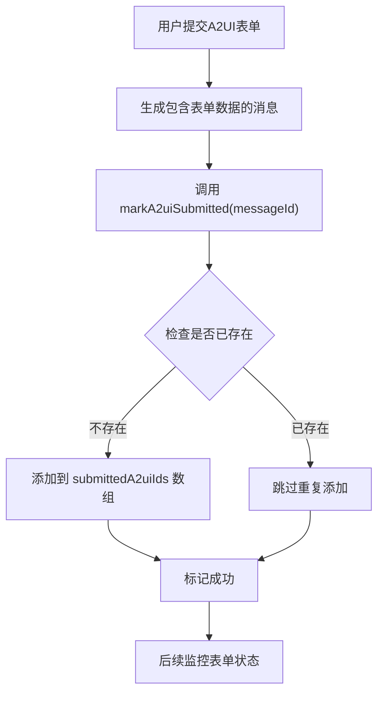
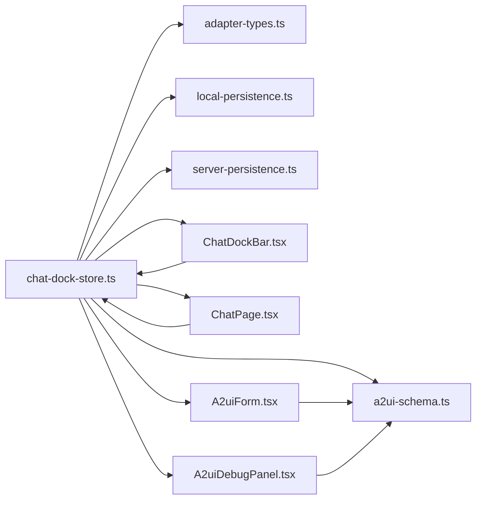

# 聊天停靠 Store

<cite>
**本文档引用的文件**
- [chat-dock-store.ts](file://src/store/console-stores/chat-dock-store.ts)
- [local-persistence.ts](file://src/lib/local-persistence.ts)
- [server-persistence.ts](file://src/lib/server-persistence.ts)
- [ChatDockBar.tsx](file://src/components/chat/ChatDockBar.tsx)
- [ChatPage.tsx](file://src/components/pages/ChatPage.tsx)
- [adapter-types.ts](file://src/gateway/adapter-types.ts)
- [globals.css](file://src/styles/globals.css)
- [useResponsive.ts](file://src/hooks/useResponsive.ts)
- [chat.json](file://src/i18n/locales/zh/chat.json)
- [a2ui-schema.ts](file://src/lib/a2ui-schema.ts)
- [A2uiForm.tsx](file://src/components/chat/A2uiForm.tsx)
- [A2uiDebugPanel.tsx](file://src/components/console/skills/A2uiDebugPanel.tsx)
- [a2ui-injection-removal-test-plan.md](file://docs/a2ui-injection-removal-test-plan.md)
</cite>

## 更新摘要
**变更内容**
- 移除了与已移除的chat-skill-a2ui模块相关的状态管理代码
- 清理了A2UI相关状态清理逻辑，包括submittedA2uiIds数组管理
- 优化了聊天停靠栏的状态管理，移除了重复的运行时注入逻辑
- 简化了A2UI表单提交监控功能，保留核心状态管理

## 目录
1. [简介](#简介)
2. [项目结构](#项目结构)
3. [核心组件](#核心组件)
4. [架构总览](#架构总览)
5. [详细组件分析](#详细组件分析)
6. [A2UI状态管理优化](#a2ui状态管理优化)
7. [依赖关系分析](#依赖关系分析)
8. [性能考虑](#性能考虑)
9. [故障排除指南](#故障排除指南)
10. [结论](#结论)
11. [附录](#附录)

## 简介
本文件为聊天停靠 Store 模块的详细技术文档，面向需要深入理解聊天窗口停靠状态管理、多窗口协调机制、布局状态持久化的开发者与产品人员。文档将系统性解析以下主题：
- 聊天停靠数据模型：DockState 接口定义、停靠位置枚举、窗口尺寸配置
- 停靠行为控制：拖拽操作处理、吸附效果实现、边界检测算法
- 多窗口管理：窗口切换、焦点管理、状态同步机制
- 布局恢复：浏览器刷新后的状态恢复、用户偏好的保存和加载
- A2UI状态管理：表单提交监控、状态清理机制、优化后的运行时处理
- 响应式布局适配、移动端优化、无障碍访问的支持实现
- 聊天界面定制化和用户体验优化的最佳实践指南

## 项目结构
聊天停靠 Store 位于控制台 Store 子模块中，采用 Zustand 状态管理库实现，结合本地 IndexedDB 缓存与服务端缓存，提供跨会话、跨设备的状态持久化能力。经过清理后，A2UI功能通过简化的状态管理集成到现有系统中。

**图表来源**
- [chat-dock-store.ts:1-1714](file://src/store/console-stores/chat-dock-store.ts#L1-1714)
- [a2ui-schema.ts:1-321](file://src/lib/a2ui-schema.ts#L1-321)
- [A2uiForm.tsx:1-393](file://src/components/chat/A2uiForm.tsx#L1-393)
- [A2uiDebugPanel.tsx:1-103](file://src/components/console/skills/A2uiDebugPanel.tsx#L1-103)

**章节来源**
- [chat-dock-store.ts:1-1714](file://src/store/console-stores/chat-dock-store.ts#L1-1714)
- [ChatDockBar.tsx:1-187](file://src/components/chat/ChatDockBar.tsx#L1-187)
- [ChatPage.tsx:1-553](file://src/components/pages/ChatPage.tsx#L1-553)

## 核心组件
本节聚焦聊天停靠 Store 的核心数据模型与关键方法，帮助读者快速把握状态结构与行为契约。

- 数据模型
  - DockState：聊天停靠状态的根状态，包含消息列表、流式状态、会话集合、目标 Agent、错误信息、草稿、附件、队列、专注模式、搜索查询、置顶消息 ID 列表、思考层级等字段。
  - SessionRuntime：单一会话的运行时状态，包含消息列表、流式消息、活跃 runId、是否正在流式、历史加载状态、队列、工具事件标记、思考层级等。
  - ChatDockMessage：消息实体，包含角色、内容、时间戳、是否流式、附件、工具调用、消息种类、runId、是否中断、作者 AgentId、折叠状态、思考内容等。
  - SessionInfo：会话元信息，包含键值、AgentId、标签、创建/最后活跃/更新时间、消息数量、模型/思考层级/冗长度/快速模式等。

- 关键方法
  - sendMessage(text, attachments?)：发送用户消息，支持队列排队与持久化。
  - abort()：中止当前流式响应。
  - toggleDock()/setDockExpanded(expanded)：控制停靠栏展开/收起。
  - switchSession(key)/newSession(agentId?)：切换或新建会话。
  - loadSessions()/loadHistory()/initializeHistory()：加载会话列表与历史消息，支持多级缓存策略。
  - setTargetAgent(agentId)：设置目标 Agent 并自动选择或创建会话。
  - handleChatEvent(event)/handleAgentEvent(event)：处理聊天与工具事件，驱动状态变更。
  - clearError()、initEventListeners(wsClient)：错误清理与事件监听初始化。
  - setDraft()/addAttachment()/removeAttachment()/clearAttachments()：输入草稿与附件管理。
  - clearMessages()、setFocusMode()/setSearchQuery()/togglePinMessage()/exportCurrentSession()：消息清理、专注模式、搜索、置顶与导出。
  - **更新** markA2uiSubmitted(messageId)：标记A2UI表单已提交，用于表单提交监控。

**章节来源**
- [chat-dock-store.ts:58-110](file://src/store/console-stores/chat-dock-store.ts#L58-110)
- [chat-dock-store.ts:1704-1710](file://src/store/console-stores/chat-dock-store.ts#L1704-1710)

## 架构总览
聊天停靠 Store 通过分层缓存与事件驱动的方式，实现稳定可靠的消息流与状态同步。经过清理后，架构更加简洁高效，移除了重复的A2UI运行时注入逻辑。

**图表来源**
- [chat-dock-store.ts:1107-1187](file://src/store/console-stores/chat-dock-store.ts#L1107-1187)
- [chat-dock-store.ts:1704-1710](file://src/store/console-stores/chat-dock-store.ts#L1704-1710)

**章节来源**
- [chat-dock-store.ts:1107-1187](file://src/store/console-stores/chat-dock-store.ts#L1107-1187)

## 详细组件分析

### 数据模型与状态结构
- DockState 字段概览
  - messages：当前会话消息数组
  - isStreaming/streamingMessage/activeRunId：流式状态与当前流式消息
  - sessionStates：Map<sessionKey, SessionRuntime>，支持多会话并行
  - sessions：会话列表，含消息计数、活跃时间等元信息
  - currentSessionKey/targetAgentId：当前会话键与目标 Agent
  - draft/attachments：输入草稿与附件
  - queue：消息发送队列（防抖/串行）
  - focusMode/searchQuery/pinnedMessageIds/thinkingLevel：专注模式、搜索、置顶、思考层级
  - dockExpanded：停靠栏展开状态
  - **更新** submittedA2uiIds：已提交的A2UI表单消息ID数组，用于表单提交监控
  - 错误状态 error 与 hadToolEvents、streamSegments 等辅助字段

- SessionRuntime 字段概览
  - messages/streamingMessage/activeRunId/isStreaming：与 DockState 同义但限定于单一会话
  - isHistoryLoaded/isHistoryLoading：历史加载状态
  - queue：会话级队列
  - hadToolEvents：工具事件标记
  - thinkingLevel：思考层级

- ChatDockMessage 字段概览
  - id/role/content/timestamp：基础字段
  - isStreaming/attachments/toolCalls/kind/runId/aborted/authorAgentId/collapsed/thinking：扩展字段

- SessionInfo 字段概览
  - key/agentId/label/createdAt/lastActiveAt/messageCount：基础元信息
  - modelProvider/model/thinkingLevel/verboseLevel/fastMode/contextTokens/totalTokens：会话配置与用量

**图表来源**
- [chat-dock-store.ts:58-110](file://src/store/console-stores/chat-dock-store.ts#L58-110)
- [chat-dock-store.ts:46-56](file://src/store/console-stores/chat-dock-store.ts#L46-56)
- [chat-dock-store.ts:30-44](file://src/store/console-stores/chat-dock-store.ts#L30-44)
- [chat-dock-store.ts:195-212](file://src/store/console-stores/chat-dock-store.ts#L195-212)

**章节来源**
- [chat-dock-store.ts:58-110](file://src/store/console-stores/chat-dock-store.ts#L58-110)
- [chat-dock-store.ts:46-56](file://src/store/console-stores/chat-dock-store.ts#L46-56)
- [chat-dock-store.ts:30-44](file://src/store/console-stores/chat-dock-store.ts#L30-44)
- [chat-dock-store.ts:195-212](file://src/store/console-stores/chat-dock-store.ts#L195-212)

### 停靠行为控制与布局状态管理
- 展开/收起控制
  - toggleDock()/setDockExpanded(expanded)：切换停靠栏展开状态，影响输入区域与附件按钮可见性。
- 输入与附件
  - setDraft()/addAttachment()/removeAttachment()/clearAttachments()：维护草稿与附件列表，并持久化到本地缓存。
- 队列与并发控制
  - sendMessage() 中对 isStreaming 的判断决定是否入队；dequeueAndProcessQueue() 负责按会话顺序出队并发送。
- 历史加载策略
  - initializeHistory() 采用三层缓存：服务端文件缓存 → IndexedDB → 网关 RPC，避免覆盖富缓存（含工具活动元数据）。

**图表来源**
- [chat-dock-store.ts:1107-1187](file://src/store/console-stores/chat-dock-store.ts#L1107-1187)
- [chat-dock-store.ts:1065-1081](file://src/store/console-stores/chat-dock-store.ts#L1065-1081)
- [chat-dock-store.ts:1357-1464](file://src/store/console-stores/chat-dock-store.ts#L1357-1464)

**章节来源**
- [chat-dock-store.ts:1107-1187](file://src/store/console-stores/chat-dock-store.ts#L1107-1187)
- [chat-dock-store.ts:1065-1081](file://src/store/console-stores/chat-dock-store.ts#L1065-1081)
- [chat-dock-store.ts:1357-1464](file://src/store/console-stores/chat-dock-store.ts#L1357-1464)
- [ChatDockBar.tsx:27-32](file://src/components/chat/ChatDockBar.tsx#L27-32)

### 多窗口管理与状态同步
- 会话切换与新建
  - switchSession(key)：保存当前会话运行时到 sessionStates，恢复目标会话状态；若未加载历史则触发 initializeHistory()。
  - newSession(agentId?)：生成新会话键，重置状态并持久化。
- 目标 Agent 管理
  - setTargetAgent(agentId)：根据存储的上次会话键与 Agent 匹配，优先选择最近活跃的会话；否则新建会话。
- 会话列表管理
  - loadSessions()：合并服务器缓存、本地缓存与网关返回，应用消息计数提示，保持 currentSessionKey 不变。
- 运行时同步
  - runtimeFromState()/applyRuntime()：在切换会话时，将当前状态映射为 SessionRuntime 并应用回状态树。

**图表来源**
- [chat-dock-store.ts:1466-1499](file://src/store/console-stores/chat-dock-store.ts#L1466-1499)
- [chat-dock-store.ts:1211-1251](file://src/store/console-stores/chat-dock-store.ts#L1211-1251)
- [chat-dock-store.ts:1253-1293](file://src/store/console-stores/chat-dock-store.ts#L1253-1293)

**章节来源**
- [chat-dock-store.ts:1466-1499](file://src/store/console-stores/chat-dock-store.ts#L1466-1499)
- [chat-dock-store.ts:1211-1251](file://src/store/console-stores/chat-dock-store.ts#L1211-1251)
- [chat-dock-store.ts:1253-1293](file://src/store/console-stores/chat-dock-store.ts#L1253-1293)

### 布局恢复与用户偏好
- 浏览器刷新后的恢复
  - getStoredWorkspaceSessionKey()/storeWorkspaceSessionKey()：通过 localStorage 记录上次会话键，在 setTargetAgent() 中优先恢复。
- 会话偏好
  - 通过 SessionInfo 的 lastActiveAt/messageCount 等字段记录活跃度与消息量，用于排序与恢复。
- 本地与服务端缓存
  - local-persistence.ts：IndexedDB 存储消息与会话，支持过期清理与配额阈值保护。
  - server-persistence.ts：服务端文件缓存，提供去抖写入与即时写入两种策略。

**图表来源**
- [chat-dock-store.ts:414-432](file://src/store/console-stores/chat-dock-store.ts#L414-432)
- [chat-dock-store.ts:1466-1499](file://src/store/console-stores/chat-dock-store.ts#L1466-1499)
- [local-persistence.ts:171-202](file://src/lib/local-persistence.ts#L171-202)
- [server-persistence.ts:101-137](file://src/lib/server-persistence.ts#L101-137)

**章节来源**
- [chat-dock-store.ts:414-432](file://src/store/console-stores/chat-dock-store.ts#L414-432)
- [chat-dock-store.ts:1466-1499](file://src/store/console-stores/chat-dock-store.ts#L1466-1499)
- [local-persistence.ts:171-202](file://src/lib/local-persistence.ts#L171-202)
- [server-persistence.ts:101-137](file://src/lib/server-persistence.ts#L101-137)

### 响应式布局与移动端优化
- 响应式 Hook
  - useResponsive.ts：基于 MediaQuery 监听窗口宽度，区分 Mobile/Tablet/Desktop，便于 UI 自适应。
- 移动端体验
  - ChatDockBar.tsx：停靠栏在展开状态下隐藏，输入区域自适应高度，支持粘贴图片附件。
  - ChatPage.tsx：侧边会话列表在专注模式下可隐藏，主内容区最大宽度限制，滚动行为优化。
- 动画与交互
  - globals.css：提供 chat-slide-up/down 等动画类，配合展开/收起切换。

**章节来源**
- [useResponsive.ts:1-42](file://src/hooks/useResponsive.ts#L1-42)
- [ChatDockBar.tsx:62-64](file://src/components/chat/ChatDockBar.tsx#L62-64)
- [ChatPage.tsx:216-281](file://src/components/pages/ChatPage.tsx#L216-281)
- [globals.css:122-152](file://src/styles/globals.css#L122-152)

### 无障碍访问支持
- 键盘交互
  - 输入框支持 Enter 发送、Shift+Enter 换行，Composition 事件处理中文输入法。
- 焦点管理
  - ChatDockBar.tsx：展开时自动聚焦输入框；ChatPage.tsx：滚动到底部按钮与会话列表项具备可访问标题。
- ARIA 属性
  - ThinkingBlock.tsx：使用 aria-expanded/aria-label 控制展开状态与可读性。
- 文案与国际化
  - chat.json：提供"展开/收起""发送/停止""附件""A2UI表单"等可读性强的文案，便于屏幕阅读器朗读。

**章节来源**
- [ChatDockBar.tsx:51-59](file://src/components/chat/ChatDockBar.tsx#L51-59)
- [ChatPage.tsx:390-400](file://src/components/pages/ChatPage.tsx#L390-400)
- [chat.json:7-21](file://src/i18n/locales/zh/chat.json#L7-21)

## A2UI状态管理优化

### A2UI表单提交监控简化
经过清理后，A2UI表单提交监控功能得到简化，移除了复杂的运行时注入逻辑，保留核心的状态管理功能。

- **数据模型简化**
  - submittedA2uiIds：字符串数组，存储已提交的A2UI表单消息ID
  - markA2uiSubmitted(messageId)：方法，用于标记指定消息ID对应的A2UI表单已提交

- **工作流程优化**
  1. 用户提交A2UI表单时，系统生成包含表单数据的消息
  2. 通过markA2uiSubmitted方法将该消息ID添加到submittedA2uiIds数组
  3. 后续可以查询该数组来判断特定表单是否已提交
  4. 支持去重逻辑，避免重复添加相同ID
  5. 移除了重复的运行时注入逻辑，减少了token浪费和AI行为不可控的问题

**图表来源**
- [chat-dock-store.ts:1704-1710](file://src/store/console-stores/chat-dock-store.ts#L1704-1710)

### A2UI表单验证与文件处理
A2UI表单组件提供了完整的表单验证和文件处理功能，经过清理后更加专注于核心功能。

- **表单验证**
  - validateRequired(form, values)：验证必填字段
  - 支持文本、选择、单选、复选、多选、文件等多种字段类型
  - 处理复选框未勾选和多选未选择的情况

- **文件处理**
  - extractFileAttachments(form, values)：从表单值中提取文件附件
  - 支持单文件和多文件上传
  - 将文件转换为ChatAttachment格式

- **表单渲染**
  - A2uiForm组件：渲染各种类型的表单字段
  - 支持只读模式、禁用状态、错误状态显示
  - 提供文件上传控件，支持多文件选择和删除

**章节来源**
- [chat-dock-store.ts:1704-1710](file://src/store/console-stores/chat-dock-store.ts#L1704-1710)
- [a2ui-schema.ts:216-223](file://src/lib/a2ui-schema.ts#L216-223)
- [a2ui-schema.ts:291-320](file://src/lib/a2ui-schema.ts#L291-320)
- [A2uiForm.tsx:300-328](file://src/components/chat/A2uiForm.tsx#L300-328)

## 依赖关系分析
- 内部依赖
  - chat-dock-store.ts 依赖 adapter-types.ts 的类型定义，确保消息、会话、工具调用等结构一致。
  - 通过 local-persistence.ts 与 server-persistence.ts 提供双层缓存，提升加载速度与可靠性。
  - **更新** 依赖 a2ui-schema.ts 提供A2UI功能支持，移除了对已移除的chat-skill-a2ui模块的依赖。
- 外部依赖
  - UI 组件通过 Zustand 的 selector 读取状态，减少不必要的重渲染。
  - 事件监听通过 initEventListeners(wsClient) 注册，解耦 UI 与网关通信。
  - **更新** A2UI调试面板依赖console国际化资源。

**图表来源**
- [chat-dock-store.ts:1-19](file://src/store/console-stores/chat-dock-store.ts#L1-19)
- [a2ui-schema.ts:1-12](file://src/lib/a2ui-schema.ts#L1-12)
- [local-persistence.ts:1-408](file://src/lib/local-persistence.ts#L1-408)
- [server-persistence.ts:1-138](file://src/lib/server-persistence.ts#L1-138)
- [A2uiForm.tsx:1-12](file://src/components/chat/A2uiForm.tsx#L1-12)
- [A2uiDebugPanel.tsx:1-7](file://src/components/console/skills/A2uiDebugPanel.tsx#L1-7)

**章节来源**
- [chat-dock-store.ts:1-19](file://src/store/console-stores/chat-dock-store.ts#L1-19)
- [a2ui-schema.ts:1-12](file://src/lib/a2ui-schema.ts#L1-12)
- [local-persistence.ts:1-408](file://src/lib/local-persistence.ts#L1-408)
- [server-persistence.ts:1-138](file://src/lib/server-persistence.ts#L1-138)
- [A2uiForm.tsx:1-12](file://src/components/chat/A2uiForm.tsx#L1-12)
- [A2uiDebugPanel.tsx:1-7](file://src/components/console/skills/A2uiDebugPanel.tsx#L1-7)

## 性能考虑
- 缓存策略
  - 服务端文件缓存优先命中，避免重复请求；IndexedDB 作为降级与增量缓存；仅在网关有新增消息时才覆盖富缓存。
- 写入去抖
  - server-persistence.saveMessages() 使用去抖机制，减少频繁网络请求。
- 存储配额与清理
  - local-persistence.ts 在接近配额阈值时主动清理过期数据，保障稳定性。
- 渲染优化
  - UI 组件使用 selector 精准订阅状态，降低重渲染成本。
- **更新** A2UI性能优化
  - 移除了重复的运行时注入逻辑，减少了token浪费和AI行为不可控的问题
  - 表单验证采用惰性计算，仅在提交时执行
  - 文件上传使用异步读取，避免阻塞主线程
  - 简化了A2UI状态管理，减少了不必要的状态更新

**章节来源**
- [chat-dock-store.ts:1412-1464](file://src/store/console-stores/chat-dock-store.ts#L1412-1464)
- [server-persistence.ts:41-51](file://src/lib/server-persistence.ts#L41-51)
- [local-persistence.ts:326-385](file://src/lib/local-persistence.ts#L326-385)

## 故障排除指南
- 发送失败
  - 现象：sendMessage 抛错后 error 字段非空。
  - 处理：调用 clearError() 清理错误；检查网关连接与权限。
- 流式中断
  - 现象：isStreaming 为 true 但无更新。
  - 处理：调用 abort() 中止；检查网关事件流是否正常。
- 历史为空
  - 现象：initializeHistory() 后 messages 为空。
  - 处理：确认网关 chatHistory 返回；检查本地/服务端缓存可用性。
- 会话恢复异常
  - 现象：刷新后未恢复上次会话。
  - 处理：检查 localStorage 中的上次会话键；确认 sessionStates 是否正确保存与恢复。
- **更新** A2UI功能问题
  - 现象：A2UI表单无法显示或提交无效。
  - 处理：检查A2UI表单状态是否正确标记；确认表单验证规则；检查文件上传权限。
  - **新增** 运行时注入问题：确认不再有重复的chatInject调用；检查AI是否正确读取SKILL.md中的a2ui:input-hint标记。

**章节来源**
- [chat-dock-store.ts:1189-1201](file://src/store/console-stores/chat-dock-store.ts#L1189-1201)
- [chat-dock-store.ts:1357-1464](file://src/store/console-stores/chat-dock-store.ts#L1357-1464)
- [chat-dock-store.ts:414-432](file://src/store/console-stores/chat-dock-store.ts#L414-432)

## 结论
聊天停靠 Store 通过清晰的数据模型、严格的事件驱动与多层缓存策略，实现了可靠的聊天状态管理与跨会话持久化。经过清理后，系统移除了重复的A2UI运行时注入逻辑，简化了状态管理，提升了性能和稳定性。其模块化设计便于扩展与维护，同时兼顾了性能与用户体验。简化的A2UI状态管理进一步增强了系统的智能化水平，通过表单提交监控功能，为用户提供更加便捷和高效的交互体验。建议在后续迭代中进一步完善拖拽与吸附的可视化反馈、边界检测算法的参数化配置，以及移动端输入体验的进一步优化。

## 附录
- 最佳实践
  - 使用队列机制避免并发消息冲突，确保消息顺序一致性。
  - 优先使用服务端文件缓存，仅在必要时回退到本地缓存。
  - 对长消息与工具活动进行折叠展示，提升可读性。
  - 为关键交互提供无障碍属性与国际化文案，提升包容性。
  - 在移动端采用自适应布局与触控友好的交互方式。
  - **更新** 合理使用A2UI表单功能，确保表单验证和文件处理的正确性。
  - **更新** 利用简化的A2UI提交监控功能，优化表单交互流程和用户体验。
  - **新增** 依赖AI自然读取SKILL.md中的a2ui:input-hint标记，避免重复运行时注入。
  - **新增** 确保在同一session内不再出现重复的chatInject调用，减少token浪费。