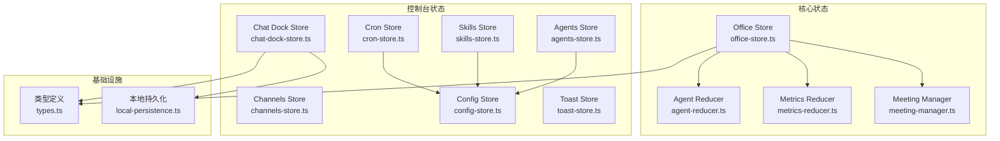
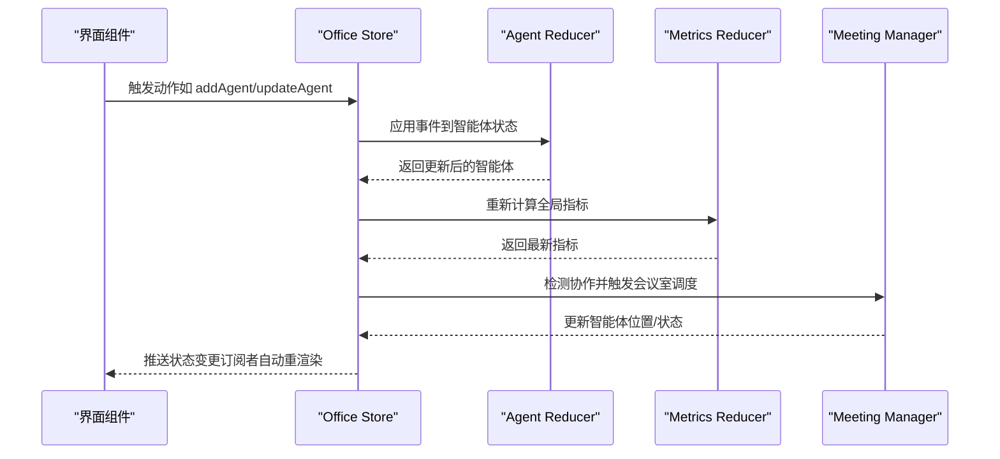
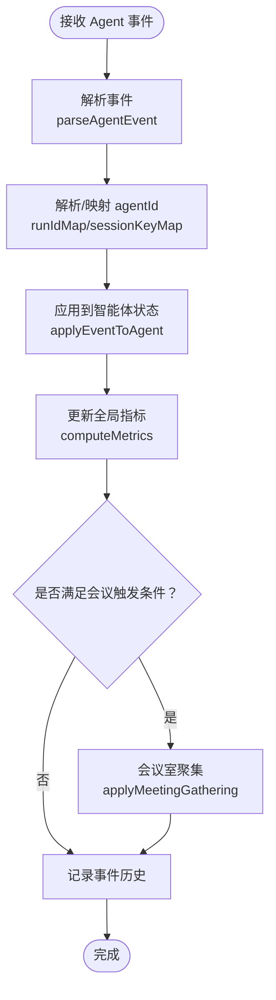
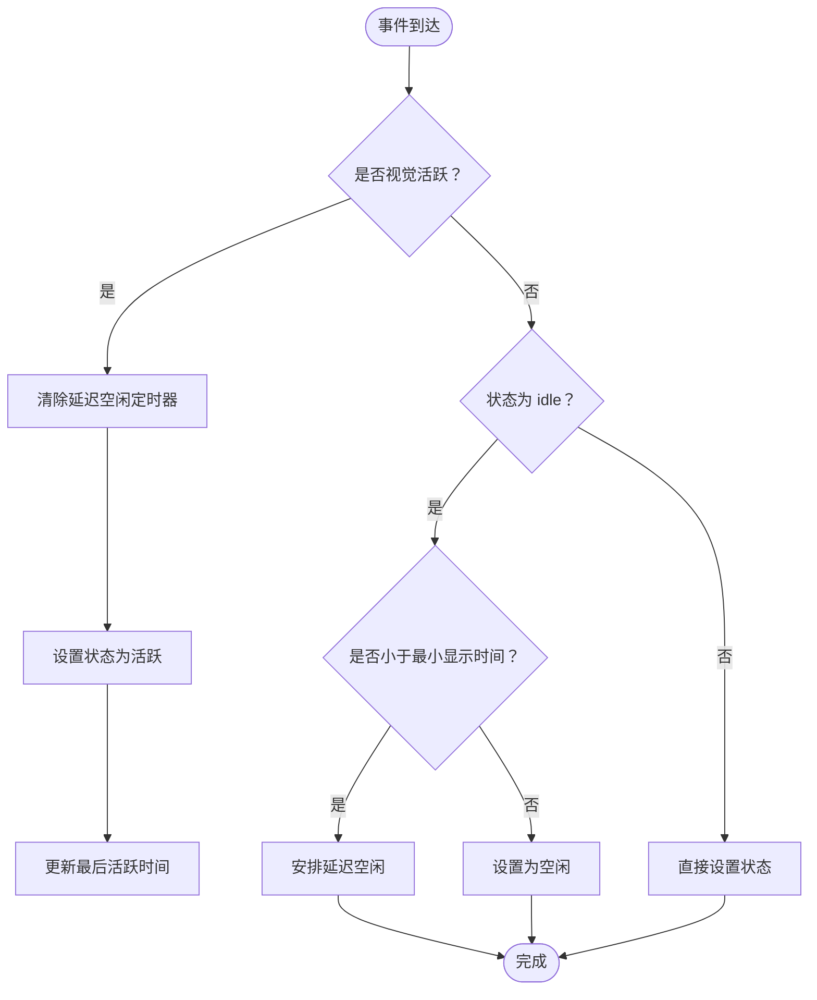
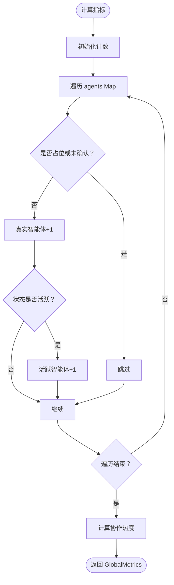
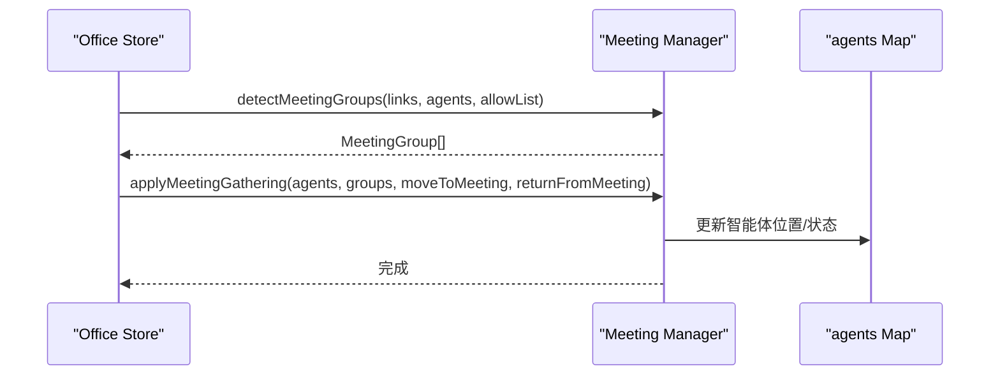
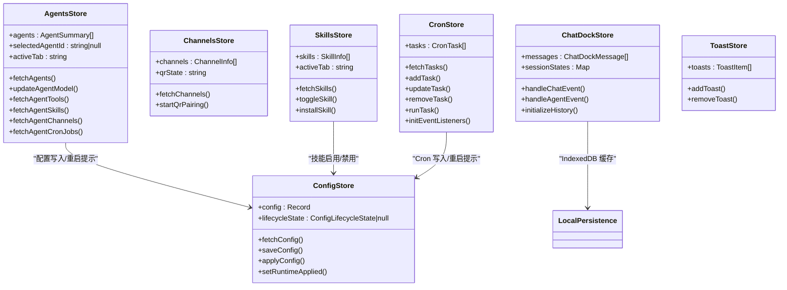
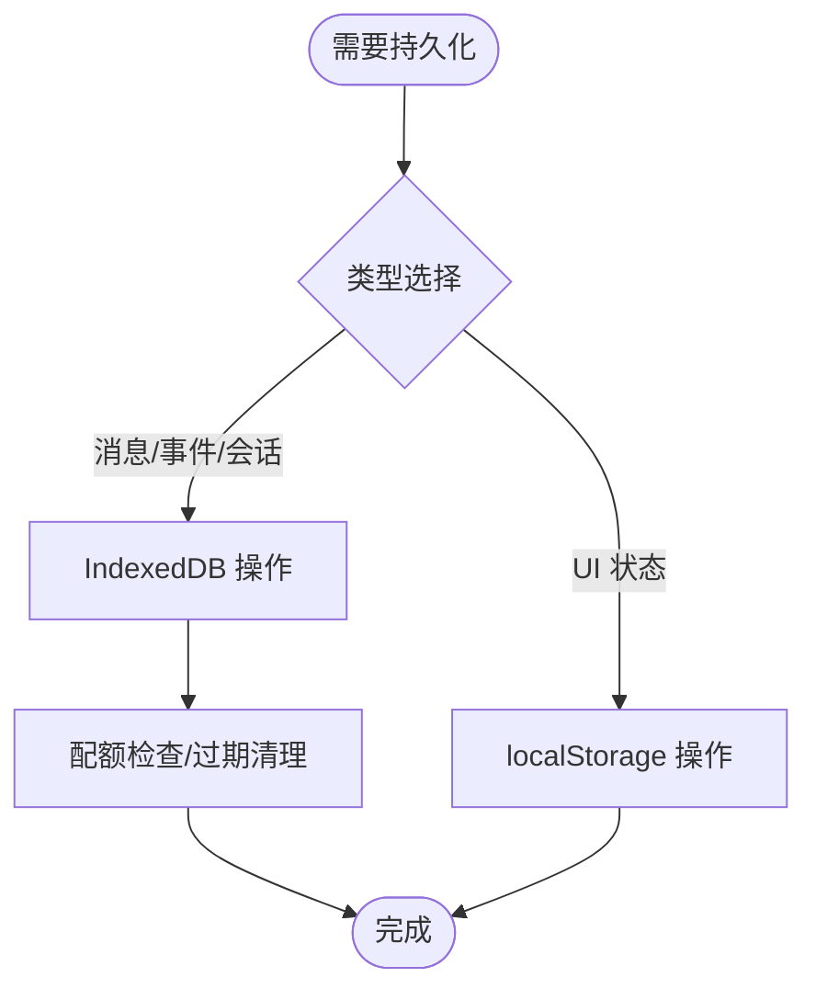
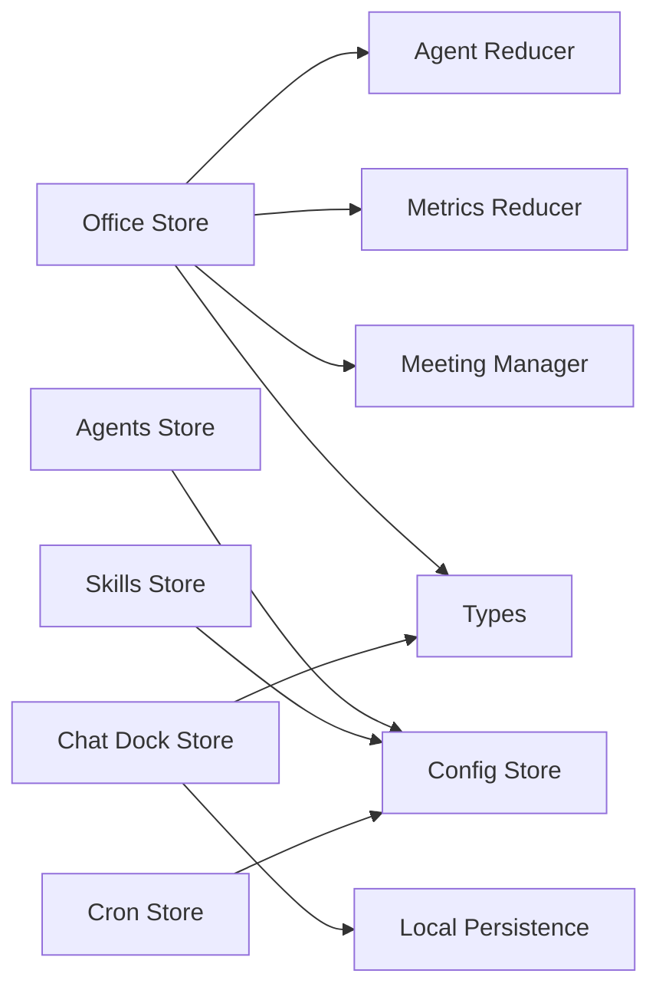

# 状态管理系统

<cite>
**本文档引用的文件**
- [office-store.ts](file://src/store/office-store.ts)
- [agent-reducer.ts](file://src/store/agent-reducer.ts)
- [metrics-reducer.ts](file://src/store/metrics-reducer.ts)
- [meeting-manager.ts](file://src/store/meeting-manager.ts)
- [agents-store.ts](file://src/store/console-stores/agents-store.ts)
- [channels-store.ts](file://src/store/console-stores/channels-store.ts)
- [skills-store.ts](file://src/store/console-stores/skills-store.ts)
- [cron-store.ts](file://src/store/console-stores/cron-store.ts)
- [config-store.ts](file://src/store/console-stores/config-store.ts)
- [chat-dock-store.ts](file://src/store/console-stores/chat-dock-store.ts)
- [toast-store.ts](file://src/store/toast-store.ts)
- [types.ts](file://src/gateway/types.ts)
- [local-persistence.ts](file://src/lib/local-persistence.ts)
- [office-store.test.ts](file://src/store/__tests__/office-store.test.ts)
- [agents-store.test.ts](file://src/store/__tests__/agents-store.test.ts)
</cite>

## 目录
1. [简介](#简介)
2. [项目结构](#项目结构)
3. [核心组件](#核心组件)
4. [架构总览](#架构总览)
5. [详细组件分析](#详细组件分析)
6. [依赖关系分析](#依赖关系分析)
7. [性能考虑](#性能考虑)
8. [故障排除指南](#故障排除指南)
9. [结论](#结论)
10. [附录](#附录)

## 简介
本文件系统性梳理 OpenClaw Office 的状态管理系统，基于 Zustand 5 + Immer 的轻量级架构，围绕 Office Store 的智能体可视化与协作渲染、控制台 Store 系统（agents-store、channels-store、skills-store、cron-store 等）、状态订阅与更新机制、reducer 模式应用（metrics-reducer、agent-reducer）、以及状态持久化策略与性能优化进行深入解析。文档同时提供最佳实践与使用示例，帮助开发者快速理解并扩展状态管理能力。

## 项目结构
状态管理相关代码主要分布在以下目录：
- 核心状态：src/store 下的 office-store.ts、agent-reducer.ts、metrics-reducer.ts、meeting-manager.ts
- 控制台状态：src/store/console-stores 下的 agents-store.ts、channels-store.ts、skills-store.ts、cron-store.ts、config-store.ts、chat-dock-store.ts、toast-store.ts
- 类型定义：src/gateway/types.ts
- 持久化：src/lib/local-persistence.ts
- 测试：src/store/__tests__ 下的 office-store.test.ts、agents-store.test.ts

图表来源
- [office-store.ts:1-800](file://src/store/office-store.ts#L1-L800)
- [agent-reducer.ts:1-103](file://src/store/agent-reducer.ts#L1-L103)
- [metrics-reducer.ts:1-28](file://src/store/metrics-reducer.ts#L1-L28)
- [meeting-manager.ts:1-136](file://src/store/meeting-manager.ts#L1-L136)
- [agents-store.ts:1-642](file://src/store/console-stores/agents-store.ts#L1-L642)
- [channels-store.ts:1-104](file://src/store/console-stores/channels-store.ts#L1-L104)
- [skills-store.ts:1-168](file://src/store/console-stores/skills-store.ts#L1-L168)
- [cron-store.ts:1-125](file://src/store/console-stores/cron-store.ts#L1-L125)
- [config-store.ts:1-420](file://src/store/console-stores/config-store.ts#L1-L420)
- [chat-dock-store.ts:1-800](file://src/store/console-stores/chat-dock-store.ts#L1-L800)
- [toast-store.ts:1-74](file://src/store/toast-store.ts#L1-L74)
- [types.ts:1-402](file://src/gateway/types.ts#L1-L402)
- [local-persistence.ts:1-408](file://src/lib/local-persistence.ts#L1-L408)

章节来源
- [office-store.ts:1-800](file://src/store/office-store.ts#L1-L800)
- [types.ts:1-402](file://src/gateway/types.ts#L1-L402)

## 核心组件
- Office Store：负责 2D 办公室渲染状态、智能体可视化、协作关系维护、移动动画与会议室调度、全局指标计算与事件历史记录。
- Agent Reducer：将 Agent 事件流转换为智能体可视化状态，包括状态机、工具调用计数、语音气泡、延迟空闲等。
- Metrics Reducer：计算全局指标（活跃智能体数、总智能体数、协作热度等）。
- Meeting Manager：检测协作强度，生成会议室分组，分配座位，触发/返回会议室。
- 控制台 Stores：agents-store、channels-store、skills-store、cron-store、config-store、chat-dock-store、toast-store，分别管理控制台页面的数据与交互状态。
- 类型系统：统一定义事件、可视化智能体、协作链接、全局指标等类型。

章节来源
- [office-store.ts:217-760](file://src/store/office-store.ts#L217-L760)
- [agent-reducer.ts:19-67](file://src/store/agent-reducer.ts#L19-L67)
- [metrics-reducer.ts:3-27](file://src/store/metrics-reducer.ts#L3-L27)
- [meeting-manager.ts:32-135](file://src/store/meeting-manager.ts#L32-L135)
- [types.ts:166-370](file://src/gateway/types.ts#L166-L370)

## 架构总览
Zustand 5 + Immer 架构采用中间件增强不可变更新，Office Store 作为核心状态容器，其他 Store 作为功能域状态容器，通过共享类型与工具函数协同工作。

图表来源
- [office-store.ts:245-270](file://src/store/office-store.ts#L245-L270)
- [agent-reducer.ts:19-67](file://src/store/agent-reducer.ts#L19-L67)
- [metrics-reducer.ts:3-27](file://src/store/metrics-reducer.ts#L3-L27)
- [meeting-manager.ts:32-135](file://src/store/meeting-manager.ts#L32-L135)

## 详细组件分析

### Office Store：智能体可视化与协作渲染
- 关键职责
  - 智能体生命周期管理：addAgent、updateAgent、removeAgent、initAgents、syncMainAgents
  - 子智能体管理：addSubAgent、removeSubAgent、retireSubAgent、确认流程（confirmAgent）
  - 移动动画：startMovement、tickMovement、completeMovement、会议室移动 moveToMeeting、returnFromMeeting
  - 协作关系：基于事件解析与助手协作提示构建协作链接，支持手动会议 requestMeeting/dismissMeeting
  - 全局指标：computeMetrics、updateMetrics
  - 事件历史：processAgentEvent、eventHistory 限制与持久化
  - UI 状态：主题、侧边栏、当前页、聊天面板高度等

- 状态结构要点
  - agents: Map<string, VisualAgent>
  - links: CollaborationLink[]
  - globalMetrics: GlobalMetrics
  - runIdMap: Map<string, string>
  - sessionKeyMap: Map<string, string[]>
  - eventHistory: EventHistoryItem[]（上限 200）

- 处理流程（事件到状态）
  - 解析 Agent 事件 -> 应用到对应智能体 -> 更新全局指标 -> 触发移动/会议室逻辑 -> 记录事件历史

图表来源
- [office-store.ts:762-850](file://src/store/office-store.ts#L762-L850)
- [agent-reducer.ts:19-67](file://src/store/agent-reducer.ts#L19-L67)
- [metrics-reducer.ts:3-27](file://src/store/metrics-reducer.ts#L3-L27)
- [meeting-manager.ts:105-135](file://src/store/meeting-manager.ts#L105-L135)

章节来源
- [office-store.ts:217-760](file://src/store/office-store.ts#L217-L760)
- [types.ts:166-370](file://src/gateway/types.ts#L166-L370)

### Agent Reducer：状态转换与可视化
- 职责
  - 将 Agent 事件流转换为智能体可视化状态（状态机、工具调用、语音气泡）
  - 延迟空闲机制：MIN_ACTIVE_DISPLAY_MS 内保持非空闲态，到期后设置为空闲
  - 工具调用计数与历史记录
  - runId 绑定与状态回填

- 关键机制
  - isVisuallyActive 判断
  - deferredIdleTimers 定时器管理
  - lastActiveTimestamps 时间戳缓存

图表来源
- [agent-reducer.ts:19-98](file://src/store/agent-reducer.ts#L19-L98)

章节来源
- [agent-reducer.ts:19-103](file://src/store/agent-reducer.ts#L19-L103)

### Metrics Reducer：全局指标计算
- 输入：agents Map、prevMetrics
- 输出：GlobalMetrics（activeAgents、totalAgents、collaborationHeat 等）
- 规则：忽略未确认/占位智能体；活跃度 = 活跃智能体数/真实智能体数

图表来源
- [metrics-reducer.ts:3-27](file://src/store/metrics-reducer.ts#L3-L27)

章节来源
- [metrics-reducer.ts:3-28](file://src/store/metrics-reducer.ts#L3-L28)

### Meeting Manager：协作分组与会议室调度
- 检测协作分组：detectMeetingGroups（按 sessionKey 聚合，强度阈值与最大并发）
- 分配座位：calculateMeetingSeats（根据表编号分配位置）
- 执行调度：applyMeetingGathering（移动到会议室、保存原位置、最小停留约束）

图表来源
- [meeting-manager.ts:32-135](file://src/store/meeting-manager.ts#L32-L135)
- [office-store.ts:469-502](file://src/store/office-store.ts#L469-L502)

章节来源
- [meeting-manager.ts:32-135](file://src/store/meeting-manager.ts#L32-L135)

### 控制台 Store 系统
- Agents Store（agents-store.ts）
  - 职责：代理列表、模型配置、文件管理、工具/技能/频道/Cron 管理
  - 关键动作：fetchAgents、updateAgentModel、fetchAgentTools、fetchAgentSkills、fetchAgentChannels、fetchAgentCronJobs、add/update/remove/toggleCronJob
  - 依赖：useConfigStore（生命周期状态同步）

- Channels Store（channels-store.ts）
  - 职责：通道状态、QR 登录配对、登出
  - 关键动作：fetchChannels、logoutChannel、startQrPairing、cancelQrPairing

- Skills Store（skills-store.ts）
  - 职责：技能列表、启用/禁用、安装
  - 关键动作：fetchSkills、toggleSkill、installSkill

- Cron Store（cron-store.ts）
  - 职责：Cron 任务管理、运行、事件监听
  - 关键动作：fetchTasks、addTask、updateTask、removeTask、runTask、initEventListeners

- Config Store（config-store.ts）
  - 职责：配置读取/保存/应用、重启状态、生命周期状态
  - 关键动作：fetchConfig、saveConfig、applyConfig、patchConfig、setRuntimeApplied

- Chat Dock Store（chat-dock-store.ts）
  - 职责：会话消息、历史加载、事件处理、队列与流式处理
  - 关键动作：sendMessage、handleChatEvent、handleAgentEvent、initializeHistory/loadHistory
  - 依赖：local-persistence（IndexedDB 缓存）

- Toast Store（toast-store.ts）
  - 职责：通知弹窗管理
  - 关键动作：addToast/removeToast/clearAll

图表来源
- [agents-store.ts:141-642](file://src/store/console-stores/agents-store.ts#L141-L642)
- [channels-store.ts:27-104](file://src/store/console-stores/channels-store.ts#L27-L104)
- [skills-store.ts:84-168](file://src/store/console-stores/skills-store.ts#L84-L168)
- [cron-store.ts:27-125](file://src/store/console-stores/cron-store.ts#L27-L125)
- [config-store.ts:93-420](file://src/store/console-stores/config-store.ts#L93-L420)
- [chat-dock-store.ts:57-107](file://src/store/console-stores/chat-dock-store.ts#L57-L107)
- [toast-store.ts:32-74](file://src/store/toast-store.ts#L32-L74)

章节来源
- [agents-store.ts:141-642](file://src/store/console-stores/agents-store.ts#L141-L642)
- [channels-store.ts:27-104](file://src/store/console-stores/channels-store.ts#L27-L104)
- [skills-store.ts:84-168](file://src/store/console-stores/skills-store.ts#L84-L168)
- [cron-store.ts:27-125](file://src/store/console-stores/cron-store.ts#L27-L125)
- [config-store.ts:93-420](file://src/store/console-stores/config-store.ts#L93-L420)
- [chat-dock-store.ts:57-107](file://src/store/console-stores/chat-dock-store.ts#L57-L107)
- [toast-store.ts:32-74](file://src/store/toast-store.ts#L32-L74)

### 状态订阅与更新机制
- 订阅方式
  - React 组件通过 Zustand 提供的订阅 API 订阅 Store 状态变化，实现细粒度 UI 更新
  - Office Store 使用 Immer 中间件，确保对象不可变更新与高效重渲染
- 异步更新
  - 控制台 Store 通过适配器（adapter）异步拉取/推送数据，成功后更新状态并触发 UI
  - Chat Dock Store 支持事件驱动的增量更新与历史加载
- 事件驱动
  - Office Store 的 processAgentEvent 将实时事件转换为状态变更，联动指标与会议室逻辑

章节来源
- [office-store.ts:217-270](file://src/store/office-store.ts#L217-L270)
- [chat-dock-store.ts:80-97](file://src/store/console-stores/chat-dock-store.ts#L80-L97)

### Reducer 模式应用
- agent-reducer：将 Agent 事件流转换为智能体可视化状态，包含状态机、工具调用、语音气泡、延迟空闲等
- metrics-reducer：纯函数计算全局指标，输入输出明确，便于测试与复用
- meeting-manager：纯函数协作分组与会议室调度，解耦 Office Store 的业务逻辑

章节来源
- [agent-reducer.ts:19-103](file://src/store/agent-reducer.ts#L19-L103)
- [metrics-reducer.ts:3-28](file://src/store/metrics-reducer.ts#L3-L28)
- [meeting-manager.ts:32-135](file://src/store/meeting-manager.ts#L32-L135)

### 状态持久化策略
- 本地持久化（IndexedDB）
  - chat-dock-store：消息、会话、事件历史的 IndexedDB 缓存与清理
  - local-persistence：统一的 IndexedDB 封装，支持配额检查、过期清理、批量写入
- 服务器持久化
  - chat-dock-store：会话信息同步到服务器
- 本地存储
  - Office Store：主题、聊天面板高度等 UI 状态持久化到 localStorage

图表来源
- [chat-dock-store.ts:504-507](file://src/store/console-stores/chat-dock-store.ts#L504-L507)
- [local-persistence.ts:34-86](file://src/lib/local-persistence.ts#L34-L86)
- [office-store.ts:65-84](file://src/store/office-store.ts#L65-L84)

章节来源
- [chat-dock-store.ts:504-507](file://src/store/console-stores/chat-dock-store.ts#L504-L507)
- [local-persistence.ts:34-408](file://src/lib/local-persistence.ts#L34-L408)
- [office-store.ts:65-84](file://src/store/office-store.ts#L65-L84)

## 依赖关系分析
- Office Store 依赖 agent-reducer、metrics-reducer、meeting-manager、types
- 控制台 Stores 依赖 adapter-provider、config-store、i18n、toast-store
- Chat Dock Store 依赖 local-persistence、server-persistence、i18n
- 类型系统贯穿所有模块，保证跨模块一致性

图表来源
- [office-store.ts:1-50](file://src/store/office-store.ts#L1-L50)
- [agents-store.ts:1-25](file://src/store/console-stores/agents-store.ts#L1-L25)
- [chat-dock-store.ts:1-18](file://src/store/console-stores/chat-dock-store.ts#L1-L18)
- [types.ts:1-402](file://src/gateway/types.ts#L1-L402)
- [local-persistence.ts:1-408](file://src/lib/local-persistence.ts#L1-L408)

章节来源
- [office-store.ts:1-50](file://src/store/office-store.ts#L1-L50)
- [agents-store.ts:1-25](file://src/store/console-stores/agents-store.ts#L1-L25)
- [chat-dock-store.ts:1-18](file://src/store/console-stores/chat-dock-store.ts#L1-L18)

## 性能考虑
- 不可变更新与 Immer：减少深拷贝开销，提升状态更新效率
- 事件历史限制：EVENT_HISTORY_LIMIT=200，避免内存膨胀
- 延迟空闲机制：MIN_ACTIVE_DISPLAY_MS 防止频繁闪烁，降低 UI 重绘频率
- 会议室节流：MEETING_GATHERING_THROTTLE_MS=500，避免高频调度
- IndexedDB 配额与清理：QUOTA_THRESHOLD=0.8，定期清理过期数据
- Map/Set 结构：agents 使用 Map，links 使用数组，平衡查找与遍历成本

章节来源
- [office-store.ts:39-59](file://src/store/office-store.ts#L39-L59)
- [agent-reducer.ts:4-5](file://src/store/agent-reducer.ts#L4-L5)
- [local-persistence.ts:28-338](file://src/lib/local-persistence.ts#L28-L338)

## 故障排除指南
- Office Store 事件历史异常增长
  - 检查 EVENT_HISTORY_LIMIT 是否生效，确认事件历史清理逻辑
  - 参考：[office-store.ts:39](file://src/store/office-store.ts#L39)
- 子智能体无法确认/错位
  - 检查 runIdMap/sessionKeyMap 映射是否正确，确认激活/迁移流程
  - 参考：[office-store.ts:762-850](file://src/store/office-store.ts#L762-L850)
- 会议室调度不生效
  - 检查协作强度阈值与允许列表，确认 detectMeetingGroups 结果
  - 参考：[meeting-manager.ts:32-77](file://src/store/meeting-manager.ts#L32-L77)
- 控制台配置写入失败
  - 查看 Config Store 的错误状态与 hash 冲突处理
  - 参考：[config-store.ts:235-278](file://src/store/console-stores/config-store.ts#L235-L278)
- IndexedDB 存储异常
  - 检查配额阈值与清理逻辑，确认事务完成回调
  - 参考：[local-persistence.ts:322-402](file://src/lib/local-persistence.ts#L322-L402)

章节来源
- [office-store.ts:39-850](file://src/store/office-store.ts#L39-L850)
- [meeting-manager.ts:32-77](file://src/store/meeting-manager.ts#L32-L77)
- [config-store.ts:235-278](file://src/store/console-stores/config-store.ts#L235-L278)
- [local-persistence.ts:322-402](file://src/lib/local-persistence.ts#L322-L402)

## 结论
本状态管理系统以 Zustand 5 + Immer 为核心，结合 reducer 模式与纯函数工具，实现了智能体可视化、协作关系与会议室调度的高内聚低耦合设计。控制台 Store 系统覆盖代理、通道、技能、Cron、配置与聊天等关键领域，配合本地与服务器持久化策略，提供了稳定可靠的用户体验。通过严格的事件历史限制、配额检查与节流机制，系统在复杂场景下仍能保持良好性能与可维护性。

## 附录
- 最佳实践
  - 使用 Immer 中间件进行不可变更新，避免深层拷贝
  - 将纯函数逻辑（reducer、工具函数）拆分为独立模块，便于测试与复用
  - 对高频操作（如事件历史、会议室调度）设置节流/限制，防止性能抖动
  - 在 Store 层统一处理错误与生命周期状态，UI 层专注渲染
  - 对关键状态（如主题、聊天面板高度）使用 localStorage 持久化
- 使用示例（路径引用）
  - 初始化智能体：[office-store.ts:706-726](file://src/store/office-store.ts#L706-L726)
  - 处理 Agent 事件：[office-store.ts:762-850](file://src/store/office-store.ts#L762-L850)
  - 更新代理模型配置：[agents-store.ts:403-449](file://src/store/console-stores/agents-store.ts#L403-L449)
  - 技能启用/禁用：[skills-store.ts:112-132](file://src/store/console-stores/skills-store.ts#L112-L132)
  - Cron 任务增删改查：[cron-store.ts:35-87](file://src/store/console-stores/cron-store.ts#L35-L87)
  - 会话历史加载：[chat-dock-store.ts:86-88](file://src/store/console-stores/chat-dock-store.ts#L86-L88)
  - 添加通知：[toast-store.ts:59-74](file://src/store/toast-store.ts#L59-L74)