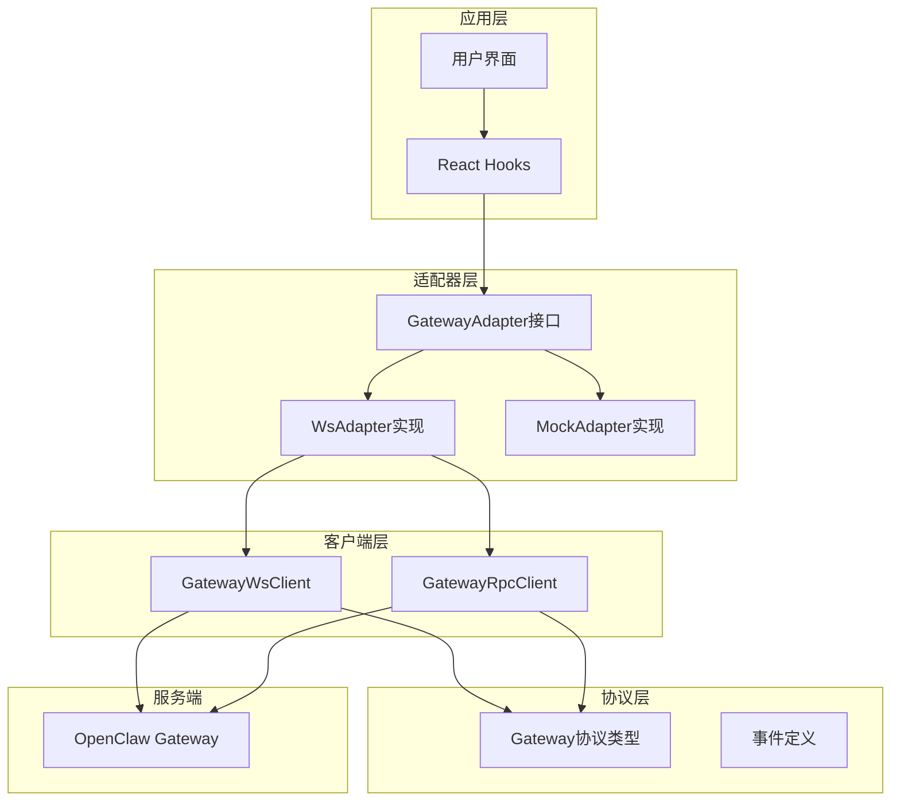
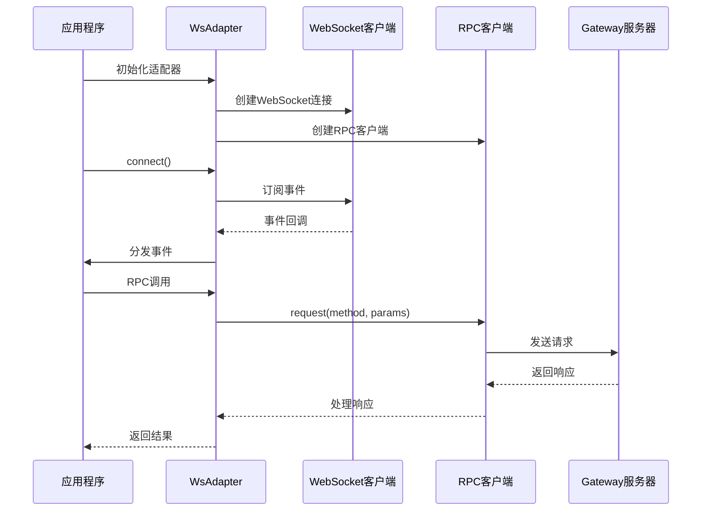
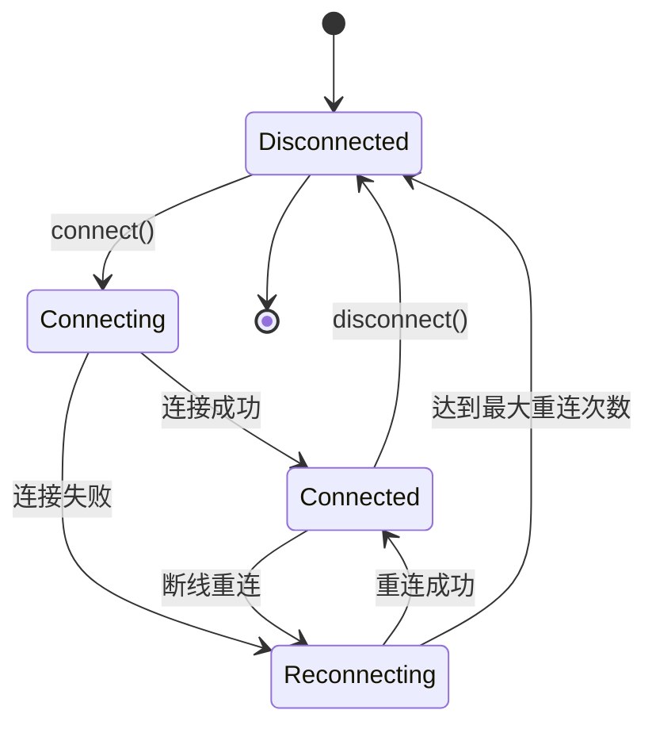
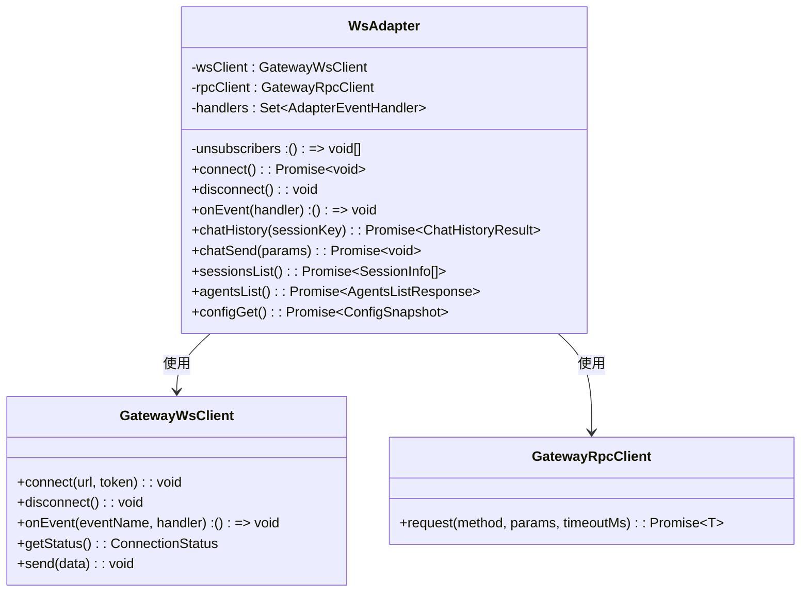
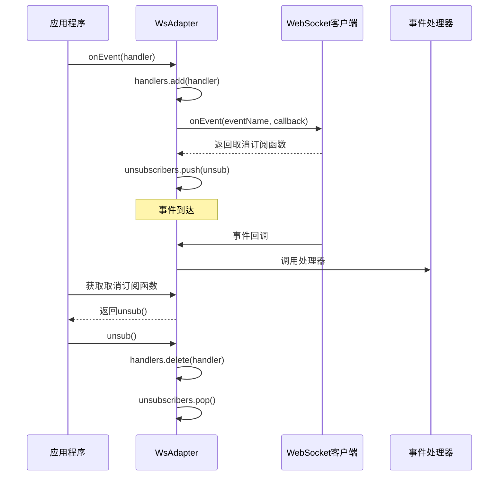
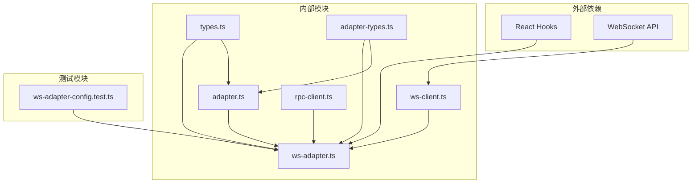

# WebSocket适配器

<cite>
**本文档引用的文件**
- [ws-adapter.ts](file://src/gateway/ws-adapter.ts)
- [adapter.ts](file://src/gateway/adapter.ts)
- [adapter-types.ts](file://src/gateway/adapter-types.ts)
- [types.ts](file://src/gateway/types.ts)
- [ws-client.ts](file://src/gateway/ws-client.ts)
- [rpc-client.ts](file://src/gateway/rpc-client.ts)
- [adapter-provider.ts](file://src/gateway/adapter-provider.ts)
- [useGatewayConnection.ts](file://src/hooks/useGatewayConnection.ts)
- [ws-adapter-config.test.ts](file://src/gateway/__tests__/ws-adapter-config.test.ts)
</cite>

## 目录
1. [简介](#简介)
2. [项目结构](#项目结构)
3. [核心组件](#核心组件)
4. [架构概览](#架构概览)
5. [详细组件分析](#详细组件分析)
6. [依赖关系分析](#依赖关系分析)
7. [性能考虑](#性能考虑)
8. [故障排除指南](#故障排除指南)
9. [结论](#结论)

## 简介

WebSocket适配器（WsAdapter）是OpenClaw Office项目中的核心通信组件，负责封装WebSocket客户端和RPC客户端，为上层应用提供统一的事件处理接口。该适配器实现了GatewayAdapter接口，支持多种事件类型的监听和处理，包括agent、chat、presence、health、heartbeat、cron、shutdown等关键事件。

WsAdapter的主要职责包括：
- 封装WebSocket连接和RPC调用
- 统一事件处理接口
- 管理连接生命周期
- 提供错误处理策略
- 支持事件订阅和取消订阅

## 项目结构

OpenClaw Office的网关通信架构采用分层设计，主要包含以下组件：



**图表来源**
- [ws-adapter.ts:40-83](file://src/gateway/ws-adapter.ts#L40-L83)
- [adapter.ts:46-112](file://src/gateway/adapter.ts#L46-L112)
- [ws-client.ts:22-130](file://src/gateway/ws-client.ts#L22-L130)
- [rpc-client.ts:17-62](file://src/gateway/rpc-client.ts#L17-L62)

**章节来源**
- [ws-adapter.ts:1-509](file://src/gateway/ws-adapter.ts#L1-L509)
- [adapter.ts:1-113](file://src/gateway/adapter.ts#L1-L113)

## 核心组件

### WsAdapter类设计

WsAdapter是适配器模式的具体实现，它实现了GatewayAdapter接口，提供了完整的WebSocket通信功能。

#### 主要特性

1. **事件监听机制**：通过WATCHED_EVENTS常量定义需要监听的事件类型
2. **连接生命周期管理**：支持连接建立、断开和重连
3. **统一事件处理接口**：提供onEvent方法进行事件订阅
4. **RPC客户端封装**：通过GatewayRpcClient处理所有RPC请求
5. **错误处理策略**：内置超时和重试机制

#### 关键属性

- `handlers`: 存储事件处理器的集合
- `unsubscribers`: 存储取消订阅函数的数组
- `wsClient`: WebSocket客户端实例
- `rpcClient`: RPC客户端实例

**章节来源**
- [ws-adapter.ts:40-83](file://src/gateway/ws-adapter.ts#L40-L83)

## 架构概览

WsAdapter采用适配器模式，将底层的WebSocket和RPC通信抽象为统一的接口：



**图表来源**
- [ws-adapter.ts:59-83](file://src/gateway/ws-adapter.ts#L59-L83)
- [ws-client.ts:60-130](file://src/gateway/ws-client.ts#L60-L130)
- [rpc-client.ts:20-61](file://src/gateway/rpc-client.ts#L20-L61)

## 详细组件分析

### WATCHED_EVENTS常量详解

WsAdapter定义了七个核心事件类型，这些事件构成了系统的实时通信基础：

```mermaid
classDiagram
class WsAdapter {
+WATCHED_EVENTS : string[]
+connect() : Promise~void~
+disconnect() : void
+onEvent(handler) : () => void
}
class WatchedEvents {
<<enumeration>>
"agent"
"chat"
"presence"
"health"
"heartbeat"
"cron"
"shutdown"
}
WsAdapter --> WatchedEvents : 监听
```

**图表来源**
- [ws-adapter.ts:49-57](file://src/gateway/ws-adapter.ts#L49-L57)

#### 事件类型处理逻辑

1. **agent事件**：处理代理人的生命周期、工具调用、思维过程等
2. **chat事件**：处理聊天消息的流式传输
3. **presence事件**：处理代理人的在线状态
4. **health事件**：处理系统健康状态
5. **heartbeat事件**：处理心跳包，维持连接活跃
6. **cron事件**：处理定时任务相关事件
7. **shutdown事件**：处理服务器关闭通知

**章节来源**
- [ws-adapter.ts:49-68](file://src/gateway/ws-adapter.ts#L49-L68)

### 事件监听机制

WsAdapter通过connect()方法建立事件监听：

```mermaid
flowchart TD
Start([connect()调用]) --> Loop[遍历WATCHED_EVENTS]
Loop --> Subscribe[订阅事件]
Subscribe --> Handler[创建事件处理器]
Handler --> Dispatch[分发给所有处理器]
Dispatch --> Next{还有事件?}
Next --> |是| Subscribe
Next --> |否| Complete[连接完成]
Handler --> Unsubscribe[存储取消订阅函数]
Unsubscribe --> Complete
```

**图表来源**
- [ws-adapter.ts:59-68](file://src/gateway/ws-adapter.ts#L59-L68)

**章节来源**
- [ws-adapter.ts:59-83](file://src/gateway/ws-adapter.ts#L59-L83)

### 连接生命周期管理

WsAdapter实现了完整的连接生命周期管理：



**图表来源**
- [ws-client.ts:26, 297](file://src/gateway/ws-client.ts#L26,L297)

**章节来源**
- [ws-adapter.ts:70-76](file://src/gateway/ws-adapter.ts#L70-L76)
- [ws-client.ts:68-77](file://src/gateway/ws-client.ts#L68-L77)

### 错误处理策略

WsAdapter采用多层次的错误处理策略：

1. **连接错误处理**：通过状态变更通知和重连机制
2. **RPC调用错误**：通过RpcError异常类型处理
3. **超时处理**：默认10秒超时，可自定义超时时间
4. **事件处理错误**：通过unsubscribers数组管理清理

**章节来源**
- [rpc-client.ts:7-15](file://src/gateway/rpc-client.ts#L7-L15)
- [rpc-client.ts:25-61](file://src/gateway/rpc-client.ts#L25-L61)

### 适配器封装机制

WsAdapter同时封装了WebSocket客户端和RPC客户端：



**图表来源**
- [ws-adapter.ts:44-47](file://src/gateway/ws-adapter.ts#L44-L47)
- [ws-client.ts:22-130](file://src/gateway/ws-client.ts#L22-L130)
- [rpc-client.ts:17-62](file://src/gateway/rpc-client.ts#L17-L62)

**章节来源**
- [ws-adapter.ts:1-38](file://src/gateway/ws-adapter.ts#L1-L38)

### 事件订阅和取消订阅机制

WsAdapter通过unsubscribers数组管理事件订阅：



**图表来源**
- [ws-adapter.ts:78-83](file://src/gateway/ws-adapter.ts#L78-L83)
- [ws-client.ts:79-87](file://src/gateway/ws-client.ts#L79-L87)

**章节来源**
- [ws-adapter.ts:42, 78-83](file://src/gateway/ws-adapter.ts#L42,L78-L83)

### API使用示例

#### 基本连接流程

```typescript
// 初始化适配器
const ws = new GatewayWsClient();
const rpc = new GatewayRpcClient(ws);
await initAdapter("ws", { wsClient: ws, rpcClient: rpc });

// 订阅事件
const unsubscribe = adapter.onEvent((event, payload) => {
  console.log(`收到事件: ${event}`, payload);
});

// 发送聊天消息
await adapter.chatSend({
  text: "Hello World",
  sessionKey: "session-123"
});

// 获取聊天历史
const history = await adapter.chatHistory("session-123");

// 断开连接
unsubscribe();
await adapter.disconnect();
```

#### 连接生命周期管理

```typescript
// 连接建立
await adapter.connect();

// 监听连接状态变化
ws.onStatusChange((status, error) => {
  console.log(`连接状态: ${status}`, error);
});

// 断开连接
await adapter.disconnect();
```

**章节来源**
- [adapter-provider.ts:50-86](file://src/gateway/adapter-provider.ts#L50-L86)
- [useGatewayConnection.ts:36-151](file://src/hooks/useGatewayConnection.ts#L36-L151)

## 依赖关系分析

WsAdapter的依赖关系体现了清晰的分层架构：



**图表来源**
- [ws-adapter.ts:1-38](file://src/gateway/ws-adapter.ts#L1-L38)
- [adapter.ts:4-36](file://src/gateway/adapter.ts#L4-L36)
- [ws-client.ts:1-11](file://src/gateway/ws-client.ts#L1-L11)
- [rpc-client.ts:1-3](file://src/gateway/rpc-client.ts#L1-L3)

**章节来源**
- [ws-adapter.ts:1-509](file://src/gateway/ws-adapter.ts#L1-L509)
- [adapter.ts:1-113](file://src/gateway/adapter.ts#L1-L113)

## 性能考虑

### 连接优化

1. **指数退避重连**：最大重连尝试20次，延迟上限30秒
2. **抖动随机性**：每次重连增加1秒随机抖动，避免雪崩效应
3. **连接状态缓存**：通过快照和服务器信息缓存减少重复查询

### 事件处理优化

1. **事件批量处理**：通过EventThrottle实现事件批处理
2. **内存管理**：及时清理事件处理器和取消订阅函数
3. **错误隔离**：单个事件处理错误不影响其他事件

### RPC调用优化

1. **超时控制**：默认10秒超时，可自定义
2. **请求去重**：基于UUID的请求ID管理
3. **错误恢复**：自动重试和错误传播

## 故障排除指南

### 常见问题及解决方案

#### 连接问题

**问题**：无法建立WebSocket连接
- 检查URL和token配置
- 验证网络连接状态
- 查看服务器日志

**问题**：连接频繁断开
- 检查防火墙设置
- 验证服务器负载情况
- 调整重连参数

#### 事件处理问题

**问题**：事件未正确接收
- 确认事件名称是否在WATCHED_EVENTS中
- 检查事件处理器是否正确注册
- 验证事件格式是否正确

#### RPC调用问题

**问题**：RPC请求超时
- 增加超时时间
- 检查服务器响应时间
- 验证网络延迟

**章节来源**
- [ws-client.ts:270-288](file://src/gateway/ws-client.ts#L270-L288)
- [rpc-client.ts:50-52](file://src/gateway/rpc-client.ts#L50-L52)

## 结论

WsAdapter作为OpenClaw Office的核心通信组件，通过适配器模式成功地将复杂的WebSocket和RPC通信抽象为统一的接口。其设计特点包括：

1. **清晰的架构分离**：事件监听、连接管理和RPC调用职责明确
2. **完善的生命周期管理**：从连接建立到断开的完整生命周期
3. **灵活的事件处理**：支持动态订阅和取消订阅
4. **健壮的错误处理**：多层错误处理和恢复机制
5. **良好的性能表现**：优化的连接策略和事件处理机制

该适配器为上层应用提供了稳定可靠的通信基础，支持实时事件处理和RPC调用，是整个OpenClaw Office系统的重要基础设施。