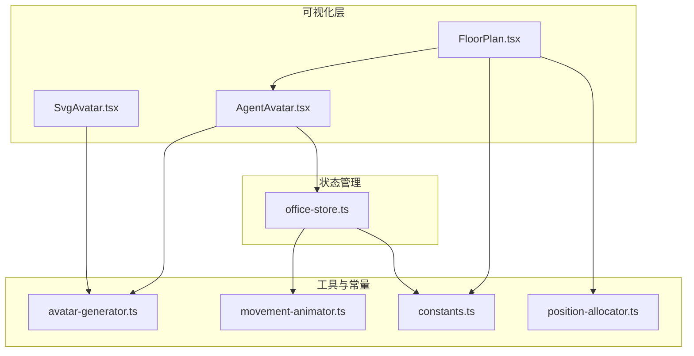
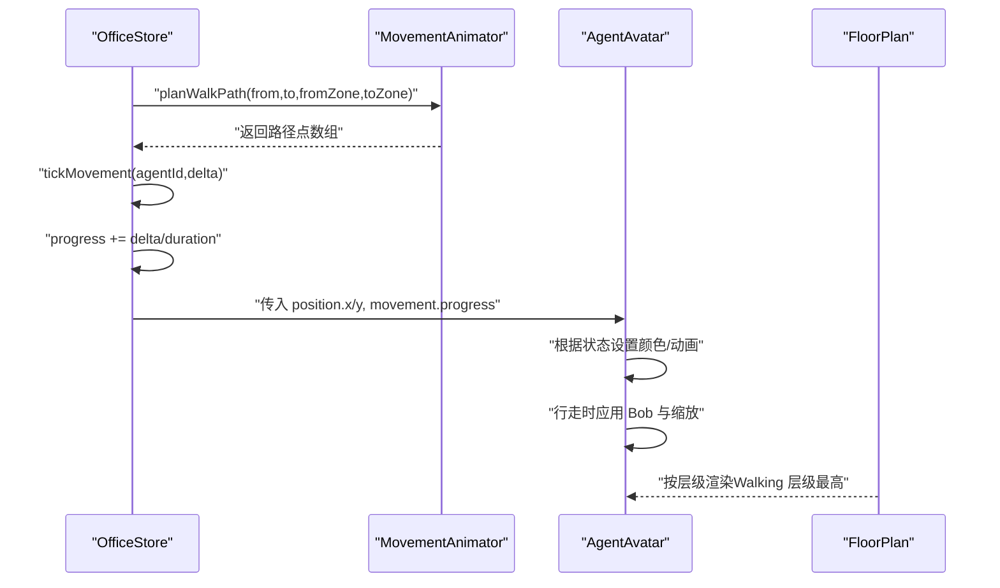
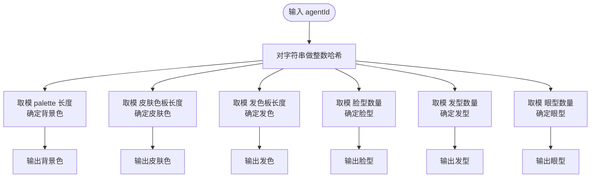
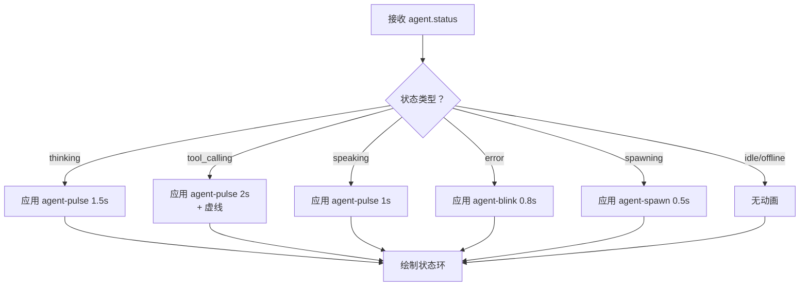
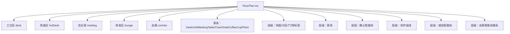
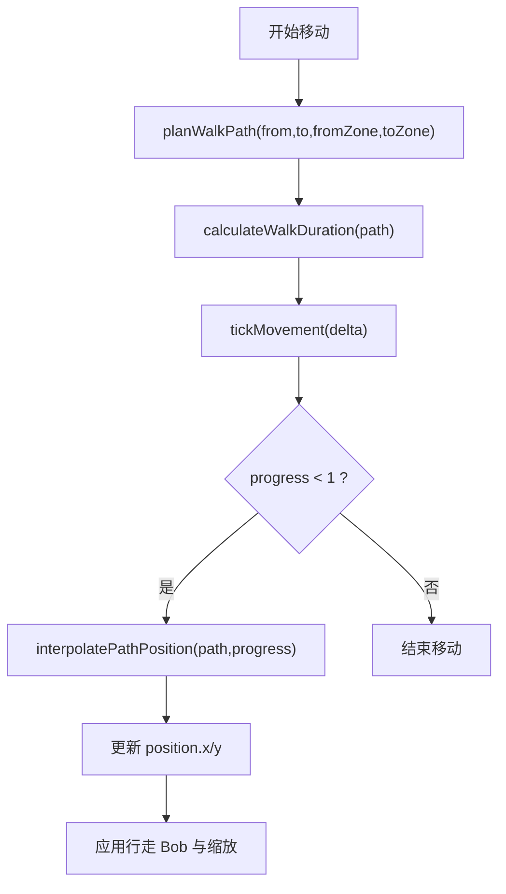
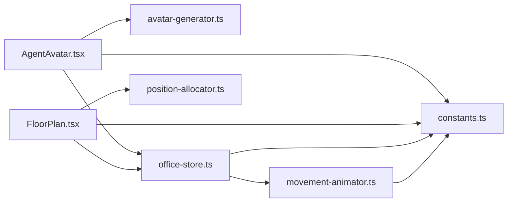

# 智能体可视化系统

<cite>
**本文引用的文件**
- [src/lib/avatar-generator.ts](file://src/lib/avatar-generator.ts)
- [src/components/office-2d/AgentAvatar.tsx](file://src/components/office-2d/AgentAvatar.tsx)
- [src/components/office-2d/FloorPlan.tsx](file://src/components/office-2d/FloorPlan.tsx)
- [src/lib/movement-animator.ts](file://src/lib/movement-animator.ts)
- [src/lib/constants.ts](file://src/lib/constants.ts)
- [src/lib/position-allocator.ts](file://src/lib/position-allocator.ts)
- [src/store/office-store.ts](file://src/store/office-store.ts)
- [src/components/shared/SvgAvatar.tsx](file://src/components/shared/SvgAvatar.tsx)
</cite>

## 目录
1. [简介](#简介)
2. [项目结构](#项目结构)
3. [核心组件](#核心组件)
4. [架构总览](#架构总览)
5. [详细组件分析](#详细组件分析)
6. [依赖分析](#依赖分析)
7. [性能考虑](#性能考虑)
8. [故障排查指南](#故障排查指南)
9. [结论](#结论)
10. [附录](#附录)

## 简介
本文件为智能体可视化系统的全面技术文档，聚焦以下目标：
- 基于 agentId 的确定性 SVG 头像生成算法：颜色哈希、形状组合与个性化特征
- 智能体状态动画系统：空闲、工作中、发言中、工具调用中、错误状态等的视觉表现与动画效果
- 区域显示逻辑：工位区、热座区、休息区、会议室、走廊等区域的定位与层级关系
- 移动动画：从一个位置到另一个位置的平滑过渡效果
- UI 细节：头像尺寸调整、状态指示器、名称标签等

## 项目结构
该系统采用前端 React + TypeScript 构建，核心可视化位于 office-2d 组件与 lib 工具模块之间，配合 store 状态管理完成移动与状态驱动。

图表来源
- [src/components/office-2d/FloorPlan.tsx:108-278](file://src/components/office-2d/FloorPlan.tsx#L108-L278)
- [src/components/office-2d/AgentAvatar.tsx:15-255](file://src/components/office-2d/AgentAvatar.tsx#L15-L255)
- [src/components/shared/SvgAvatar.tsx:96-127](file://src/components/shared/SvgAvatar.tsx#L96-L127)
- [src/lib/avatar-generator.ts:38-89](file://src/lib/avatar-generator.ts#L38-L89)
- [src/lib/movement-animator.ts:85-163](file://src/lib/movement-animator.ts#L85-L163)
- [src/lib/constants.ts:1-141](file://src/lib/constants.ts#L1-L141)
- [src/lib/position-allocator.ts:51-82](file://src/lib/position-allocator.ts#L51-L82)
- [src/store/office-store.ts:528-542](file://src/store/office-store.ts#L528-L542)

章节来源
- [src/components/office-2d/FloorPlan.tsx:108-278](file://src/components/office-2d/FloorPlan.tsx#L108-L278)
- [src/lib/constants.ts:1-141](file://src/lib/constants.ts#L1-L141)

## 核心组件
- 头像生成器：提供确定性颜色与 SVG 面部/发型/眼睛样式
- AgentAvatar：渲染单个智能体，含状态环、波光、名称标签、工具名标签、思考/说话指示器等
- FloorPlan：组织楼层平面，按区域渲染家具与智能体，控制层级顺序
- MovementAnimator：路径规划、插值与步行动画时长计算
- Constants：统一尺寸、颜色、区域定义与状态映射
- PositionAllocator：工位/热座/会议室/休息区的布局与锚点分配
- OfficeStore：移动 tick、状态变更与事件处理

章节来源
- [src/lib/avatar-generator.ts:38-89](file://src/lib/avatar-generator.ts#L38-L89)
- [src/components/office-2d/AgentAvatar.tsx:15-255](file://src/components/office-2d/AgentAvatar.tsx#L15-L255)
- [src/components/office-2d/FloorPlan.tsx:108-278](file://src/components/office-2d/FloorPlan.tsx#L108-L278)
- [src/lib/movement-animator.ts:85-163](file://src/lib/movement-animator.ts#L85-L163)
- [src/lib/constants.ts:68-130](file://src/lib/constants.ts#L68-L130)
- [src/lib/position-allocator.ts:51-82](file://src/lib/position-allocator.ts#L51-L82)
- [src/store/office-store.ts:528-542](file://src/store/office-store.ts#L528-L542)

## 架构总览
系统以“状态驱动 + 路径插值”的方式实现平滑移动与状态动画。OfficeStore 负责推进移动进度与状态更新；AgentAvatar 基于当前状态与移动进度执行视觉动画；FloorPlan 控制区域与层级；avatar-generator 提供确定性外观；movement-animator 提供路径与时间参数。

图表来源
- [src/store/office-store.ts:528-542](file://src/store/office-store.ts#L528-L542)
- [src/lib/movement-animator.ts:85-163](file://src/lib/movement-animator.ts#L85-L163)
- [src/components/office-2d/AgentAvatar.tsx:46-95](file://src/components/office-2d/AgentAvatar.tsx#L46-L95)
- [src/components/office-2d/FloorPlan.tsx:269-272](file://src/components/office-2d/FloorPlan.tsx#L269-L272)

## 详细组件分析

### 基于 agentId 的确定性 SVG 头像生成
- 颜色哈希：对 agentId 做整数哈希，使用 palette 与皮肤/头发色板映射背景色与文本色，保证同一 agentId 永远得到相同颜色
- 个性化特征：根据哈希选择脸型、发型、眼型、衬衫色，确保每个 agentId 的外观稳定且多样
- 文本与尺寸：首字母大写作为初始字符，支持暗色主题下的高对比文本色

图表来源
- [src/lib/avatar-generator.ts:16-23](file://src/lib/avatar-generator.ts#L16-L23)
- [src/lib/avatar-generator.ts:38-89](file://src/lib/avatar-generator.ts#L38-L89)

章节来源
- [src/lib/avatar-generator.ts:38-89](file://src/lib/avatar-generator.ts#L38-L89)
- [src/components/shared/SvgAvatar.tsx:96-127](file://src/components/shared/SvgAvatar.tsx#L96-L127)

### 智能体状态动画系统
- 状态到颜色映射：STATUS_COLORS 将状态映射为颜色，如空闲、思考、工具调用、发言、创建、错误、离线
- 状态环动画：根据状态应用不同的 CSS 动画或虚线样式，行走或占位时禁用状态环动画
- 思考指示器：三小点脉冲动画，位于头像顶部右侧
- 发言指示器：聊天气泡图标，带半径与透明度交替的动画
- 错误状态：红色感叹号徽章
- 工具调用：在头像下方显示当前工具名称标签
- 名称标签：支持模糊截断与背景毛玻璃效果，暗色主题下有不同配色

图表来源
- [src/components/office-2d/AgentAvatar.tsx:290-305](file://src/components/office-2d/AgentAvatar.tsx#L290-L305)
- [src/lib/constants.ts:68-86](file://src/lib/constants.ts#L68-L86)

章节来源
- [src/components/office-2d/AgentAvatar.tsx:117-184](file://src/components/office-2d/AgentAvatar.tsx#L117-L184)
- [src/lib/constants.ts:68-86](file://src/lib/constants.ts#L68-L86)

### 区域显示逻辑与层级关系
- 区域定义：工位区、热座区、会议室、休息区、走廊，均在常量中定义坐标与尺寸
- 楼层渲染：FloorPlan 按层级绘制建筑外壳、走廊地砖、区域地面、内墙、门洞、区域标签
- 家具布置：工位区按 DeskUnit 计算网格；热座区按网格布局；会议室按多桌与座位分配；休息区布置沙发、咖啡杯、植物、前台等
- 智能体层级：休息区与走廊中的智能体先于会议区与热座区渲染，行走中的智能体在最顶层

图表来源
- [src/components/office-2d/FloorPlan.tsx:140-278](file://src/components/office-2d/FloorPlan.tsx#L140-L278)
- [src/lib/constants.ts:23-40](file://src/lib/constants.ts#L23-L40)
- [src/lib/position-allocator.ts:131-159](file://src/lib/position-allocator.ts#L131-L159)

章节来源
- [src/components/office-2d/FloorPlan.tsx:108-278](file://src/components/office-2d/FloorPlan.tsx#L108-L278)
- [src/lib/constants.ts:23-40](file://src/lib/constants.ts#L23-L40)

### 移动动画与路径规划
- 路径规划：planWalkPath 基于起止区域与门点，生成从起点到终点的路径（可能经过走廊中心）
- 插值与时长：interpolatePathPosition 按距离比例插值；calculateWalkDuration 以速度与最小持续时间保障体验
- 移动推进：OfficeStore.tickMovement 推进进度，结合 requestAnimationFrame 在 AgentAvatar 中应用位移与行走动画

图表来源
- [src/lib/movement-animator.ts:85-163](file://src/lib/movement-animator.ts#L85-L163)
- [src/store/office-store.ts:528-542](file://src/store/office-store.ts#L528-L542)
- [src/components/office-2d/AgentAvatar.tsx:46-95](file://src/components/office-2d/AgentAvatar.tsx#L46-L95)

章节来源
- [src/lib/movement-animator.ts:85-163](file://src/lib/movement-animator.ts#L85-L163)
- [src/store/office-store.ts:528-542](file://src/store/office-store.ts#L528-L542)
- [src/components/office-2d/AgentAvatar.tsx:46-95](file://src/components/office-2d/AgentAvatar.tsx#L46-L95)

### UI 细节：尺寸、状态指示器与名称标签
- 头像尺寸：AVATAR.radii 控制普通与选中状态的半径，以及描边宽度与名称标签最大字符数
- 状态环：根据状态应用不同动画，行走与占位时改为虚线或禁用动画
- 名称标签：支持模糊截断、背景毛玻璃、暗色主题下的边框与阴影
- 工具标签：工具调用时在头像下方显示工具名，带圆角与背景色
- 占位与未确认：占位与未确认智能体透明度降低，颜色为灰色

章节来源
- [src/lib/constants.ts:124-130](file://src/lib/constants.ts#L124-L130)
- [src/components/office-2d/AgentAvatar.tsx:117-217](file://src/components/office-2d/AgentAvatar.tsx#L117-L217)

## 依赖分析
- AgentAvatar 依赖 avatar-generator 生成外观数据，依赖 constants 获取尺寸与颜色，依赖 office-store 获取移动与状态
- FloorPlan 依赖 constants 定义区域与颜色，依赖 position-allocator 计算工位/热座布局，依赖 office-store 获取智能体列表
- MovementAnimator 依赖 constants 的区域与走廊入口，提供路径与插值函数
- OfficeStore 依赖 movement-animator 进行路径推进，依赖 constants 进行颜色与区域判断

图表来源
- [src/components/office-2d/AgentAvatar.tsx:3-6](file://src/components/office-2d/AgentAvatar.tsx#L3-L6)
- [src/components/office-2d/FloorPlan.tsx:1-18](file://src/components/office-2d/FloorPlan.tsx#L1-L18)
- [src/lib/movement-animator.ts:1-1](file://src/lib/movement-animator.ts#L1-L1)
- [src/store/office-store.ts:30-36](file://src/store/office-store.ts#L30-L36)

章节来源
- [src/components/office-2d/AgentAvatar.tsx:3-6](file://src/components/office-2d/AgentAvatar.tsx#L3-L6)
- [src/components/office-2d/FloorPlan.tsx:1-18](file://src/components/office-2d/FloorPlan.tsx#L1-L18)
- [src/lib/movement-animator.ts:1-1](file://src/lib/movement-animator.ts#L1-L1)
- [src/store/office-store.ts:30-36](file://src/store/office-store.ts#L30-L36)

## 性能考虑
- 确定性哈希：avatar-generator 与 position-allocator 使用整数哈希，避免重复计算，提升稳定性
- requestAnimationFrame：AgentAvatar 的行走动画仅在移动时启动，减少不必要的重绘
- 路径插值：MovementAnimator 按距离比例插值，避免匀速但不等距的视觉偏差
- 层级渲染：FloorPlan 明确层级，避免过度重排与闪烁
- 最小持续时间：移动动画设置最小持续时间，保证动画可感知且不抖动

## 故障排查指南
- 头像颜色异常：检查 agentId 是否为空或变化频繁；确认 hashString 与 palette 取模逻辑
- 状态环不显示：确认 agent.status 是否为有效状态；检查 isWalking/isPlaceholder 条件是否禁用了动画
- 移动卡顿：检查 tickMovement 的 delta 是否过大；确认 requestAnimationFrame 循环是否被清理
- 名称标签截断：调整 AVATAR.nameLabelMaxChars；检查外层容器宽度
- 工具标签不显示：确认 agent.status 为 tool_calling 且存在 currentTool

章节来源
- [src/lib/avatar-generator.ts:16-23](file://src/lib/avatar-generator.ts#L16-L23)
- [src/components/office-2d/AgentAvatar.tsx:290-305](file://src/components/office-2d/AgentAvatar.tsx#L290-L305)
- [src/store/office-store.ts:528-542](file://src/store/office-store.ts#L528-L542)
- [src/lib/constants.ts:124-130](file://src/lib/constants.ts#L124-L130)

## 结论
该系统通过确定性哈希与模块化组件实现了稳定的智能体外观与流畅的移动/状态动画。区域与层级设计清晰，便于扩展至更多场景。建议后续可引入缓存与更细粒度的状态过渡，进一步优化复杂场景下的性能与交互体验。

## 附录
- 关键常量与尺寸：见 constants.ts 中的 AVATAR、ZONES、STATUS_COLORS 等
- 布局算法：见 position-allocator.ts 中的网格与锚点分配
- 路径与插值：见 movement-animator.ts 中的路径规划与插值函数