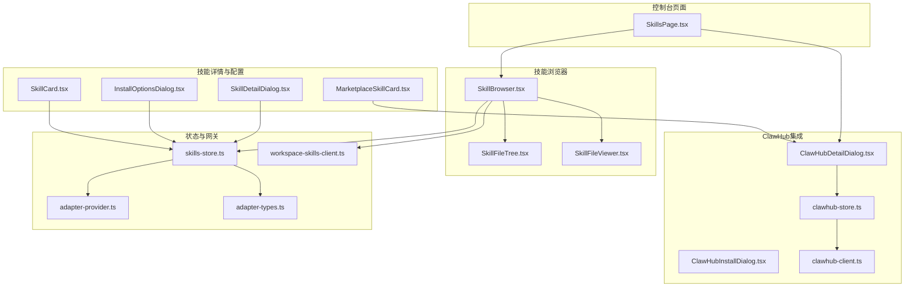
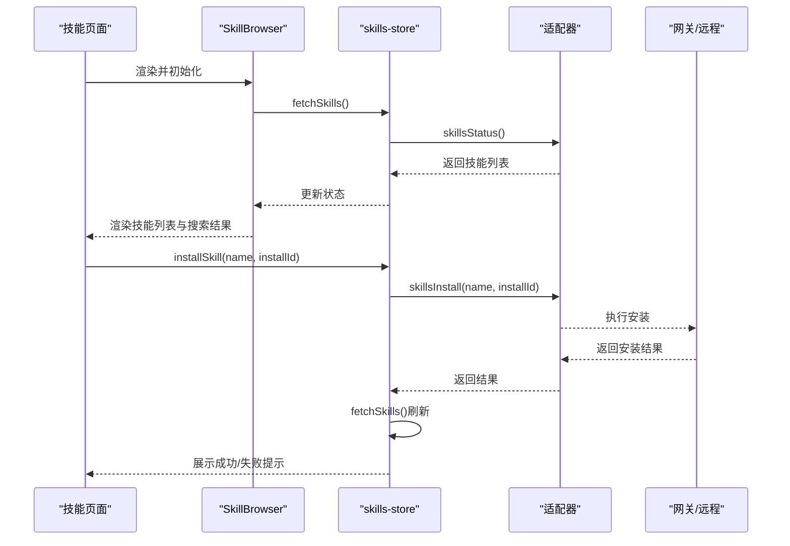
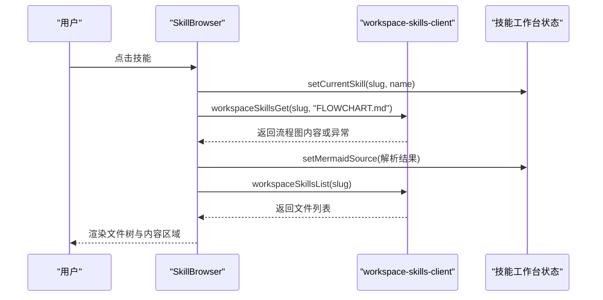
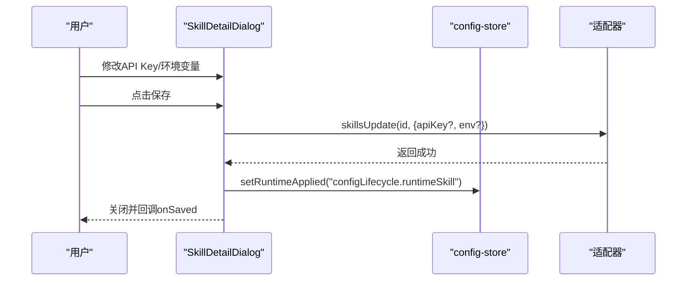
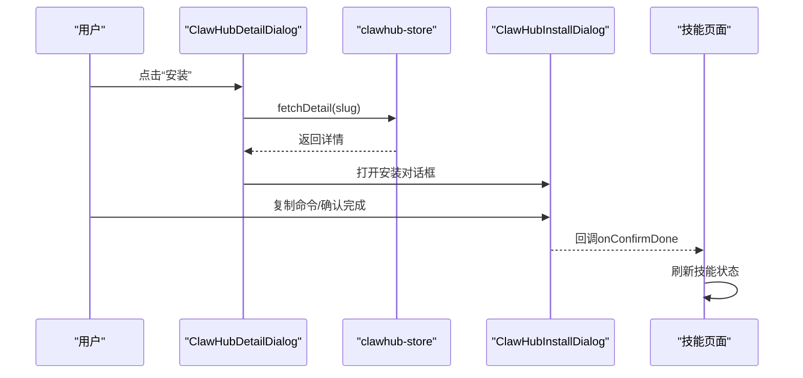
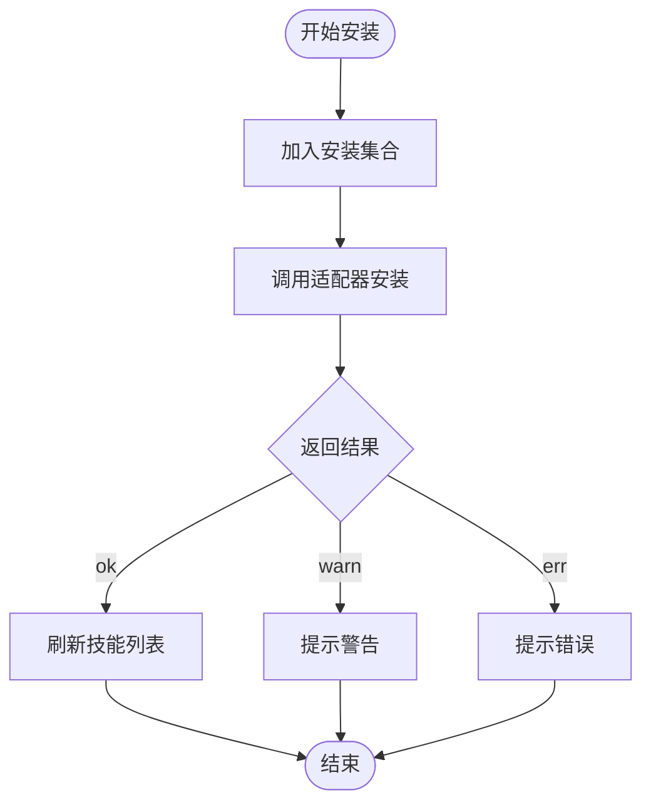
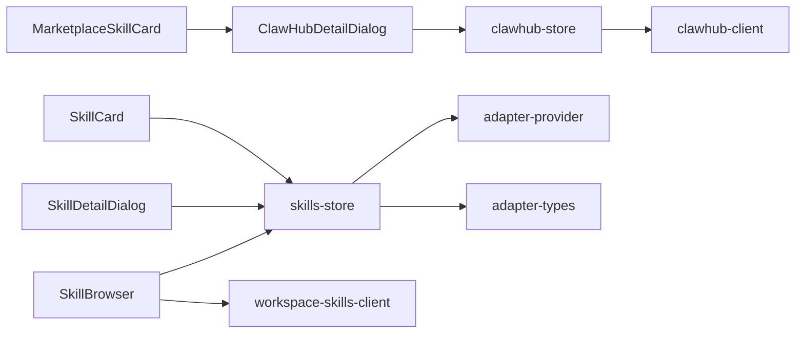

# Skills技能管理

<cite>
**本文引用的文件**
- [SkillBrowser.tsx](file://src/components/console/skills/SkillBrowser.tsx)
- [ClawHubInstallDialog.tsx](file://src/components/console/skills/ClawHubInstallDialog.tsx)
- [SkillDetailDialog.tsx](file://src/components/console/skills/SkillDetailDialog.tsx)
- [ClawHubDetailDialog.tsx](file://src/components/console/skills/ClawHubDetailDialog.tsx)
- [InstallOptionsDialog.tsx](file://src/components/console/skills/InstallOptionsDialog.tsx)
- [SkillCard.tsx](file://src/components/console/skills/SkillCard.tsx)
- [MarketplaceSkillCard.tsx](file://src/components/console/skills/MarketplaceSkillCard.tsx)
- [skills-store.ts](file://src/store/console-stores/skills-store.ts)
- [clawhub-store.ts](file://src/store/console-stores/clawhub-store.ts)
- [workspace-skills-client.ts](file://src/gateway/workspace-skills-client.ts)
- [clawhub-client.ts](file://src/gateway/clawhub-client.ts)
- [adapter-types.ts](file://src/gateway/adapter-types.ts)
- [adapter-provider.ts](file://src/gateway/adapter-provider.ts)
- [SkillsPage.tsx](file://src/pages/SkillsPage.tsx)
</cite>

## 目录
1. [简介](#简介)
2. [项目结构](#项目结构)
3. [核心组件](#核心组件)
4. [架构总览](#架构总览)
5. [详细组件分析](#详细组件分析)
6. [依赖关系分析](#依赖关系分析)
7. [性能考虑](#性能考虑)
8. [故障排除指南](#故障排除指南)
9. [结论](#结论)
10. [附录](#附录)

## 简介
本文件面向Skills技能管理功能，系统性阐述技能市场浏览、安装选项配置、技能详情展示、ClawHub集成、安装/卸载流程、依赖关系管理与版本控制机制，并提供技能管理界面实现、安装流程逻辑、状态同步机制的代码级参考路径。同时给出扩展安装选项、自定义技能分类、批量管理能力的实现建议。

## 项目结构
Skills相关功能主要分布在控制台页面的“技能”模块中，前端采用React组件+Zustand状态管理，后端通过适配器与网关交互，支持本地工作区技能与ClawHub技能生态的统一管理。

**图表来源**
- [SkillsPage.tsx](file://src/pages/SkillsPage.tsx)
- [SkillBrowser.tsx](file://src/components/console/skills/SkillBrowser.tsx)
- [SkillDetailDialog.tsx](file://src/components/console/skills/SkillDetailDialog.tsx)
- [InstallOptionsDialog.tsx](file://src/components/console/skills/InstallOptionsDialog.tsx)
- [SkillCard.tsx](file://src/components/console/skills/SkillCard.tsx)
- [MarketplaceSkillCard.tsx](file://src/components/console/skills/MarketplaceSkillCard.tsx)
- [ClawHubDetailDialog.tsx](file://src/components/console/skills/ClawHubDetailDialog.tsx)
- [ClawHubInstallDialog.tsx](file://src/components/console/skills/ClawHubInstallDialog.tsx)
- [skills-store.ts](file://src/store/console-stores/skills-store.ts)
- [clawhub-store.ts](file://src/store/console-stores/clawhub-store.ts)
- [workspace-skills-client.ts](file://src/gateway/workspace-skills-client.ts)
- [clawhub-client.ts](file://src/gateway/clawhub-client.ts)
- [adapter-provider.ts](file://src/gateway/adapter-provider.ts)
- [adapter-types.ts](file://src/gateway/adapter-types.ts)

**章节来源**
- [SkillsPage.tsx](file://src/pages/SkillsPage.tsx)
- [SkillBrowser.tsx](file://src/components/console/skills/SkillBrowser.tsx)
- [SkillDetailDialog.tsx](file://src/components/console/skills/SkillDetailDialog.tsx)
- [InstallOptionsDialog.tsx](file://src/components/console/skills/InstallOptionsDialog.tsx)
- [SkillCard.tsx](file://src/components/console/skills/SkillCard.tsx)
- [MarketplaceSkillCard.tsx](file://src/components/console/skills/MarketplaceSkillCard.tsx)
- [ClawHubDetailDialog.tsx](file://src/components/console/skills/ClawHubDetailDialog.tsx)
- [ClawHubInstallDialog.tsx](file://src/components/console/skills/ClawHubInstallDialog.tsx)
- [skills-store.ts](file://src/store/console-stores/skills-store.ts)
- [clawhub-store.ts](file://src/store/console-stores/clawhub-store.ts)
- [workspace-skills-client.ts](file://src/gateway/workspace-skills-client.ts)
- [clawhub-client.ts](file://src/gateway/clawhub-client.ts)
- [adapter-provider.ts](file://src/gateway/adapter-provider.ts)
- [adapter-types.ts](file://src/gateway/adapter-types.ts)

## 核心组件
- 技能浏览器：提供工作区技能列表、搜索过滤、文件树与内容查看、编辑入口与流程图生成功能。
- 技能详情对话框：展示技能信息、版本、作者、依赖检查、配置项（API Key、环境变量）与启用/禁用切换。
- 安装选项对话框：在多安装源或变体场景下选择具体安装ID。
- 技能卡片：统一展示技能状态、来源、版本、缺失依赖提示与操作按钮。
- ClawHub详情与安装：展示ClawHub技能详情、下载量/星数、版本变更日志、一键安装命令与确认流程。
- 状态存储：技能状态、安装进度、筛选条件；ClawHub搜索/探索/详情缓存与离线模式。

**章节来源**
- [SkillBrowser.tsx](file://src/components/console/skills/SkillBrowser.tsx)
- [SkillDetailDialog.tsx](file://src/components/console/skills/SkillDetailDialog.tsx)
- [InstallOptionsDialog.tsx](file://src/components/console/skills/InstallOptionsDialog.tsx)
- [SkillCard.tsx](file://src/components/console/skills/SkillCard.tsx)
- [MarketplaceSkillCard.tsx](file://src/components/console/skills/MarketplaceSkillCard.tsx)
- [ClawHubDetailDialog.tsx](file://src/components/console/skills/ClawHubDetailDialog.tsx)
- [ClawHubInstallDialog.tsx](file://src/components/console/skills/ClawHubInstallDialog.tsx)
- [skills-store.ts](file://src/store/console-stores/skills-store.ts)
- [clawhub-store.ts](file://src/store/console-stores/clawhub-store.ts)

## 架构总览
Skills功能以“页面容器 + 组件层 + 状态层 + 网关层”分层设计，组件负责UI与交互，状态层协调技能与ClawHub数据，网关层对接适配器与远程服务。

**图表来源**
- [skills-store.ts](file://src/store/console-stores/skills-store.ts)
- [adapter-provider.ts](file://src/gateway/adapter-provider.ts)
- [adapter-types.ts](file://src/gateway/adapter-types.ts)

## 详细组件分析

### 技能浏览器（SkillBrowser）
职责与特性
- 列表与搜索：按名称/描述/slug过滤工作区技能，区分内置与市场来源。
- 文件浏览：加载技能目录与文件内容，识别并渲染流程图（FLOWCHART.md）。
- 编辑与生成：进入工作台编辑模式，触发自动消息生成流程图。
- 状态管理：与技能工作台状态联动，设置当前技能、Mermaid源码与待发送消息。

关键流程（选择技能）

**图表来源**
- [SkillBrowser.tsx](file://src/components/console/skills/SkillBrowser.tsx)
- [workspace-skills-client.ts](file://src/gateway/workspace-skills-client.ts)

**章节来源**
- [SkillBrowser.tsx](file://src/components/console/skills/SkillBrowser.tsx)

### 技能详情对话框（SkillDetailDialog）
职责与特性
- 信息页：展示技能基本信息、来源、版本、作者、主页链接、依赖需求与缺失项。
- 配置页：支持API Key输入与显示切换、动态增删改环境变量、配置检查项可视化。
- 启用/禁用：通过适配器更新技能开关，触发运行时配置应用通知。

关键流程（保存配置）

**图表来源**
- [SkillDetailDialog.tsx](file://src/components/console/skills/SkillDetailDialog.tsx)
- [adapter-provider.ts](file://src/gateway/adapter-provider.ts)

**章节来源**
- [SkillDetailDialog.tsx](file://src/components/console/skills/SkillDetailDialog.tsx)

### 安装选项对话框（InstallOptionsDialog）
职责与特性
- 在存在多种安装源或变体时，提供可选安装ID供用户选择。
- 与技能商店协作，传递所选安装ID给安装流程。

**章节来源**
- [InstallOptionsDialog.tsx](file://src/components/console/skills/InstallOptionsDialog.tsx)

### 技能卡片（SkillCard）与市场卡片（MarketplaceSkillCard）
职责与特性
- 统一展示技能状态、来源（内置/市场）、版本、图标与描述。
- 缺失依赖提示与操作按钮（配置、安装、启用/禁用）。
- 市场卡片额外提供“已安装/安装中”状态与“查看详情/安装”按钮。

**章节来源**
- [SkillCard.tsx](file://src/components/console/skills/SkillCard.tsx)
- [MarketplaceSkillCard.tsx](file://src/components/console/skills/MarketplaceSkillCard.tsx)

### ClawHub详情与安装（ClawHubDetailDialog、ClawHubInstallDialog）
职责与特性
- 详情页：展示技能摘要、作者头像/昵称、下载量/星数、最新版本与变更日志。
- 安装页：展示安全提示、安装命令、复制按钮、确认完成安装。
- 与ClawHub状态存储联动，支持离线模式与错误处理。

关键流程（ClawHub安装）

**图表来源**
- [ClawHubDetailDialog.tsx](file://src/components/console/skills/ClawHubDetailDialog.tsx)
- [ClawHubInstallDialog.tsx](file://src/components/console/skills/ClawHubInstallDialog.tsx)
- [clawhub-store.ts](file://src/store/console-stores/clawhub-store.ts)

**章节来源**
- [ClawHubDetailDialog.tsx](file://src/components/console/skills/ClawHubDetailDialog.tsx)
- [ClawHubInstallDialog.tsx](file://src/components/console/skills/ClawHubInstallDialog.tsx)
- [clawhub-store.ts](file://src/store/console-stores/clawhub-store.ts)

### 技能状态与安装流程（skills-store）
职责与特性
- 技能状态：加载、排序、过滤、启用/禁用切换、安装进度跟踪。
- 安装流程：发起安装请求、汇总stdout/stderr/warnings、更新技能列表、提示成功/失败。
- 运行时配置：安装/配置变更后通知运行时应用。

关键流程（安装）

**图表来源**
- [skills-store.ts](file://src/store/console-stores/skills-store.ts)
- [adapter-provider.ts](file://src/gateway/adapter-provider.ts)

**章节来源**
- [skills-store.ts](file://src/store/console-stores/skills-store.ts)

### ClawHub状态与搜索（clawhub-store）
职责与特性
- 搜索：防抖延迟查询，支持错误与离线模式标记。
- 探索：分页加载，维护游标。
- 详情：按slug拉取技能详情，清理时清空缓存。

**章节来源**
- [clawhub-store.ts](file://src/store/console-stores/clawhub-store.ts)

## 依赖关系分析
- 组件到状态：技能浏览器、详情对话框、卡片组件均依赖skills-store；ClawHub详情依赖clawhub-store。
- 状态到网关：skills-store通过适配器调用skills接口；clawhub-store调用clawhub-client。
- 工作区技能：SkillBrowser使用workspace-skills-client读取技能文件与流程图。
- 类型与适配器：adapter-types定义技能类型，adapter-provider提供适配器实例。

**图表来源**
- [SkillBrowser.tsx](file://src/components/console/skills/SkillBrowser.tsx)
- [SkillDetailDialog.tsx](file://src/components/console/skills/SkillDetailDialog.tsx)
- [SkillCard.tsx](file://src/components/console/skills/SkillCard.tsx)
- [MarketplaceSkillCard.tsx](file://src/components/console/skills/MarketplaceSkillCard.tsx)
- [ClawHubDetailDialog.tsx](file://src/components/console/skills/ClawHubDetailDialog.tsx)
- [skills-store.ts](file://src/store/console-stores/skills-store.ts)
- [clawhub-store.ts](file://src/store/console-stores/clawhub-store.ts)
- [workspace-skills-client.ts](file://src/gateway/workspace-skills-client.ts)
- [clawhub-client.ts](file://src/gateway/clawhub-client.ts)
- [adapter-provider.ts](file://src/gateway/adapter-provider.ts)
- [adapter-types.ts](file://src/gateway/adapter-types.ts)

**章节来源**
- [skills-store.ts](file://src/store/console-stores/skills-store.ts)
- [clawhub-store.ts](file://src/store/console-stores/clawhub-store.ts)
- [adapter-provider.ts](file://src/gateway/adapter-provider.ts)
- [adapter-types.ts](file://src/gateway/adapter-types.ts)
- [workspace-skills-client.ts](file://src/gateway/workspace-skills-client.ts)
- [clawhub-client.ts](file://src/gateway/clawhub-client.ts)

## 性能考虑
- 搜索防抖：ClawHub搜索使用300ms防抖，减少网络请求频率。
- 安装进度：安装集合去重与状态更新，避免重复安装与闪烁。
- 文件加载：仅在选择技能后加载文件列表与内容，降低首屏压力。
- 状态合并：安装成功后统一刷新技能列表，减少多次渲染。

[本节为通用指导，无需特定文件来源]

## 故障排除指南
- 安装失败：检查安装结果中的标准输出/错误输出与警告，结合toast提示定位问题。
- 离线模式：ClawHub搜索/探索在网络错误时进入离线模式，可稍后重试。
- 详情未加载：ClawHub详情加载失败会显示“未找到”，确认slug正确与网络可用。
- 配置未生效：保存配置后需等待运行时应用，可通过状态提示确认。

**章节来源**
- [skills-store.ts](file://src/store/console-stores/skills-store.ts)
- [clawhub-store.ts](file://src/store/console-stores/clawhub-store.ts)
- [ClawHubDetailDialog.tsx](file://src/components/console/skills/ClawHubDetailDialog.tsx)

## 结论
Skills技能管理通过清晰的组件分层与状态管理，实现了从技能浏览、安装、配置到ClawHub生态的完整闭环。安装流程具备完善的错误与警告反馈，状态同步确保运行时一致性。扩展点包括安装选项、分类过滤与批量管理，均可基于现有状态与组件进行增量开发。

[本节为总结，无需特定文件来源]

## 附录

### 实现要点与最佳实践
- 扩展安装选项：在安装前弹出InstallOptionsDialog，将用户选择的installId传入skills-install流程。
- 自定义技能分类：在skills-store中增加过滤字段（如category），在组件层暴露筛选控件并与状态联动。
- 批量管理：在技能列表上提供全选/反选与批量启用/禁用/安装，注意对核心技能的保护与不可修改状态。
- 版本控制：在详情页展示最新版本与变更日志，安装时选择对应installId；对已安装版本提供升级入口。
- 依赖关系：在详情页展示缺失依赖（二进制/环境变量），引导用户补齐后再启用。

[本节为概念性建议，无需特定文件来源]