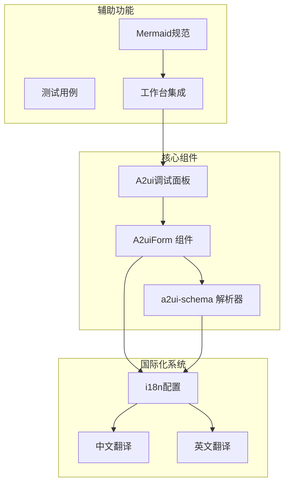
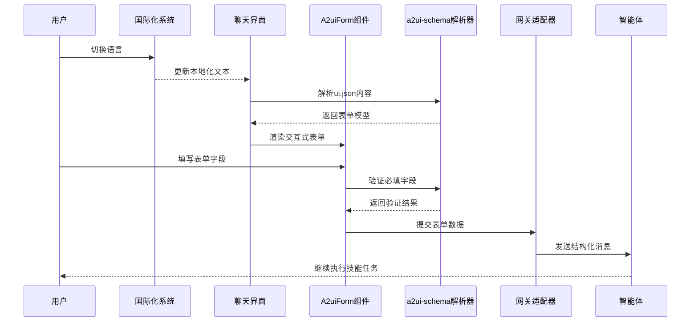
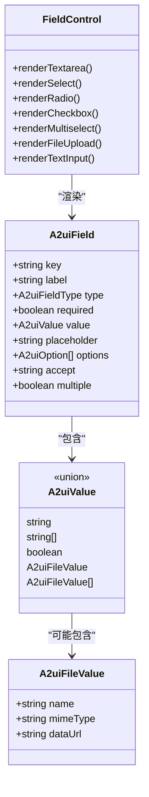
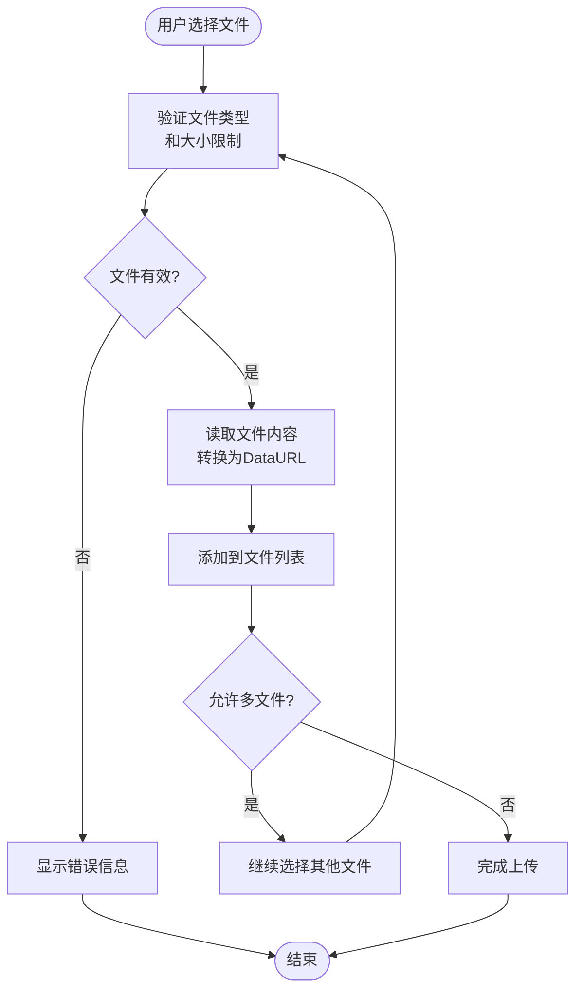
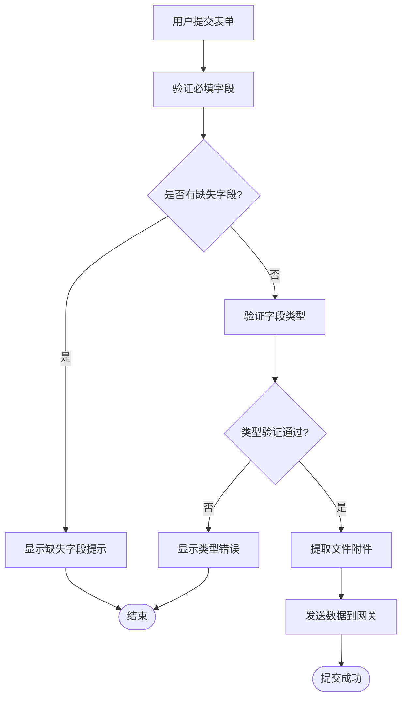
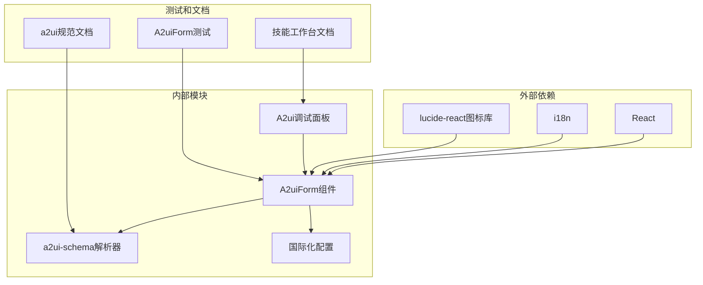

# A2UI输入表单系统

<cite>
**本文档引用的文件**
- [A2uiForm.tsx](file://src/components/chat/A2uiForm.tsx)
- [a2ui-schema.ts](file://src/lib/a2ui-schema.ts)
- [a2ui-input-spec.md](file://bin/skills/skill-workbench-mermaid-guard/references/a2ui-input-spec.md)
- [A2uiForm.test.tsx](file://src/components/chat/A2uiForm.test.tsx)
- [chat.json](file://src/i18n/locales/zh/chat.json)
- [chat.json](file://src/i18n/locales/en/chat.json)
- [index.ts](file://src/i18n/index.ts)
- [A2uiDebugPanel.tsx](file://src/components/console/skills/A2uiDebugPanel.tsx)
- [SKILL-WORKBENCH.md](file://SKILL-WORKBENCH.md)
</cite>

## 更新摘要
**变更内容**
- 更新国际化支持系统，完善中英文本地化
- 增强A2UI表单的多语言文本支持
- 优化文件上传和表单提交的国际化提示
- 完善多语言环境下的用户体验

## 目录
1. [简介](#简介)
2. [项目结构](#项目结构)
3. [核心组件](#核心组件)
4. [架构概览](#架构概览)
5. [详细组件分析](#详细组件分析)
6. [依赖关系分析](#依赖关系分析)
7. [性能考虑](#性能考虑)
8. [故障排除指南](#故障排除指南)
9. [结论](#结论)

## 简介

A2UI输入表单系统是OpenClaw-Office项目中的关键组件，用于在聊天界面中提供结构化的用户输入表单。该系统实现了Agent-to-UI（A2UI）的概念，将"首次触发Skill时缺失的关键信息"或"Skill执行过程中的HITL（Human-in-the-loop）确认/补充"以结构化表单形式呈现给用户，替代传统的纯自然语言追问方式。

该系统支持多种表单控件类型，包括文本输入、下拉选择、单选按钮、复选框、多选框和文件上传等，并提供了完整的验证机制和国际化支持。系统采用声明式Schema设计，确保表单数据的一致性和可预测性。

**更新** 国际化支持得到显著增强，现在提供完整的中英文本地化体验，包括表单提示、错误消息、按钮文本等所有用户界面元素。

## 项目结构

A2UI输入表单系统主要分布在以下几个核心模块中：

**图表来源**
- [A2uiForm.tsx:1-393](file://src/components/chat/A2uiForm.tsx#L1-L393)
- [a2ui-schema.ts:1-321](file://src/lib/a2ui-schema.ts#L1-L321)
- [index.ts:1-59](file://src/i18n/index.ts#L1-L59)

**章节来源**
- [A2uiForm.tsx:1-393](file://src/components/chat/A2uiForm.tsx#L1-L393)
- [a2ui-schema.ts:1-321](file://src/lib/a2ui-schema.ts#L1-L321)
- [index.ts:1-59](file://src/i18n/index.ts#L1-L59)

## 核心组件

### A2uiForm 主组件

A2uiForm是整个系统的核心React组件，负责渲染和管理表单状态。它支持只读模式、表单提交回调和文本输入回退功能。

**主要特性：**
- 支持8种不同的表单控件类型
- 实时必填字段验证
- 文件上传处理
- 国际化支持
- 只读模式渲染

**更新** 国际化支持得到全面增强，所有用户界面文本都支持中英文切换，包括表单标题、描述、占位符、按钮文本等。

**章节来源**
- [A2uiForm.tsx:298-393](file://src/components/chat/A2uiForm.tsx#L298-L393)

### A2UI Schema 解析器

a2ui-schema模块提供了完整的表单Schema定义和解析功能，确保表单数据的一致性和可靠性。

**核心功能：**
- 表单Schema定义和验证
- JSON解析和规范化
- 值验证和类型检查
- 文件附件提取
- 提交消息构建

**章节来源**
- [a2ui-schema.ts:16-78](file://src/lib/a2ui-schema.ts#L16-L78)
- [a2ui-schema.ts:169-199](file://src/lib/a2ui-schema.ts#L169-L199)

### A2ui调试面板

A2uiDebugPanel是技能工作台中的调试组件，提供A2UI表单的可视化编辑和测试功能。

**主要功能：**
- 实时预览A2UI表单
- 一键生成表单
- 表单提交调试
- 重新生成和加载功能

**章节来源**
- [A2uiDebugPanel.tsx:47-102](file://src/components/console/skills/A2uiDebugPanel.tsx#L47-L102)

## 架构概览

A2UI输入表单系统采用分层架构设计，确保各组件职责清晰、耦合度低：

**图表来源**
- [index.ts:22-56](file://src/i18n/index.ts#L22-L56)
- [A2uiForm.tsx:319-328](file://src/components/chat/A2uiForm.tsx#L319-L328)
- [a2ui-schema.ts:254-284](file://src/lib/a2ui-schema.ts#L254-L284)

## 详细组件分析

### 表单控件系统

系统支持8种不同类型的表单控件，每种控件都有专门的渲染逻辑和验证规则：

**图表来源**
- [a2ui-schema.ts:46-78](file://src/lib/a2ui-schema.ts#L46-L78)
- [A2uiForm.tsx:53-189](file://src/components/chat/A2uiForm.tsx#L53-L189)

#### 文件上传控件

文件上传功能是A2UI系统的重要组成部分，支持单文件和多文件上传，具有完整的文件处理和验证机制：

**图表来源**
- [A2uiForm.tsx:191-296](file://src/components/chat/A2uiForm.tsx#L191-L296)
- [a2ui-schema.ts:291-320](file://src/lib/a2ui-schema.ts#L291-L320)

**章节来源**
- [A2uiForm.tsx:165-296](file://src/components/chat/A2uiForm.tsx#L165-L296)
- [a2ui-schema.ts:39-44](file://src/lib/a2ui-schema.ts#L39-L44)

### 表单验证机制

系统实现了多层次的表单验证机制，确保数据的完整性和一致性：

**图表来源**
- [a2ui-schema.ts:216-223](file://src/lib/a2ui-schema.ts#L216-L223)
- [A2uiForm.tsx:319-328](file://src/components/chat/A2uiForm.tsx#L319-L328)

**章节来源**
- [a2ui-schema.ts:201-223](file://src/lib/a2ui-schema.ts#L201-L223)
- [A2uiForm.tsx:319-328](file://src/components/chat/A2uiForm.tsx#L319-L328)

### 国际化支持

**更新** 国际化支持系统得到全面升级，现在提供完整的中英文本地化体验：

系统提供了完整的国际化支持，目前支持中文和英文两种语言：

**主要国际化键值：**
- `a2ui.submit`: 提交按钮文本
- `a2ui.requiredHint`: 必填字段提示
- `a2ui.useText`: 文本输入回退按钮
- `a2ui.uploadFile`: 文件上传按钮
- `a2ui.removeFile`: 移除文件按钮
- `a2ui.submittedNotice`: 提交成功提示
- `a2ui.selectPlaceholder`: 选择框占位符
- `a2ui.requiredMark`: 必填标记

**国际化配置：**
- 支持语言检测：自动检测用户浏览器语言偏好
- 本地存储：记住用户选择的语言设置
- 回退机制：默认使用中文，不支持的语言回退到中文
- 命名空间：专门的chat命名空间用于表单相关文本

**章节来源**
- [chat.json:7-21](file://src/i18n/locales/zh/chat.json#L7-L21)
- [chat.json:7-21](file://src/i18n/locales/en/chat.json#L7-L21)
- [index.ts:17-56](file://src/i18n/index.ts#L17-L56)

## 依赖关系分析

A2UI输入表单系统与其他组件的依赖关系如下：

**图表来源**
- [A2uiForm.tsx:1-12](file://src/components/chat/A2uiForm.tsx#L1-L12)
- [index.ts:1-59](file://src/i18n/index.ts#L1-L59)

**章节来源**
- [A2uiForm.tsx:1-12](file://src/components/chat/A2uiForm.tsx#L1-L12)
- [index.ts:1-59](file://src/i18n/index.ts#L1-L59)

## 性能考虑

### 渲染优化

系统采用了多种性能优化策略：

1. **React.memo优化**: A2uiForm组件使用memo包装，避免不必要的重新渲染
2. **状态管理**: 使用useState和useMemo合理管理组件状态
3. **条件渲染**: 根据表单状态动态渲染不同的UI元素

### 内存管理

1. **文件处理**: 文件上传采用DataURL格式，便于传输但需要注意内存使用
2. **状态清理**: 组件卸载时自动清理文件上传状态
3. **验证缓存**: 缺失字段验证结果进行缓存，避免重复计算

### 网络优化

1. **懒加载**: 技能引用检测和ui.json加载采用异步方式
2. **错误处理**: 网络请求失败时提供优雅降级
3. **超时控制**: 设置合理的请求超时时间

## 故障排除指南

### 常见问题和解决方案

**问题1: 表单无法提交**
- 检查必填字段是否已填写
- 确认字段类型是否正确
- 查看控制台是否有JavaScript错误

**问题2: 文件上传失败**
- 检查文件类型是否在accept属性中允许
- 确认文件大小是否超过限制
- 验证浏览器是否支持FileReader API

**问题3: 国际化文本显示异常**
- 检查i18n配置是否正确
- 确认翻译键值是否存在
- 验证语言切换逻辑

**更新** 国际化相关问题排查：
- 检查本地存储的语言设置
- 验证翻译文件的完整性
- 确认命名空间配置正确

**章节来源**
- [A2uiForm.test.tsx:24-44](file://src/components/chat/A2uiForm.test.tsx#L24-L44)

### 调试技巧

1. **开发者工具**: 使用React DevTools检查组件状态
2. **日志记录**: 在关键函数中添加console.log输出
3. **单元测试**: 运行现有的测试用例验证功能正常

**章节来源**
- [A2uiForm.test.tsx:1-52](file://src/components/chat/A2uiForm.test.tsx#L1-L52)

## 结论

A2UI输入表单系统是一个设计精良、功能完整的组件，它有效地解决了传统聊天界面中信息收集的痛点。通过结构化的表单设计、完善的验证机制和良好的用户体验，该系统为OpenClaw-Office项目提供了强大的交互能力。

**更新** 最新版本在国际化支持方面有了重大改进，现在提供完整的中英文本地化体验，确保全球用户都能获得优质的使用体验。

系统的主要优势包括：
- **标准化的Schema设计**: 确保表单数据的一致性和可预测性
- **丰富的控件类型**: 满足各种复杂的输入需求
- **完整的生命周期管理**: 从创建到提交的全流程支持
- **优秀的用户体验**: 直观的界面设计和及时的反馈机制
- **良好的可维护性**: 清晰的代码结构和完善的测试覆盖
- **全面的国际化支持**: 完整的中英文本地化体验

未来可以考虑的改进方向：
- 增加更多的表单控件类型
- 优化移动端的用户体验
- 添加表单模板功能
- 增强表单的动态性支持
- 扩展更多语言支持