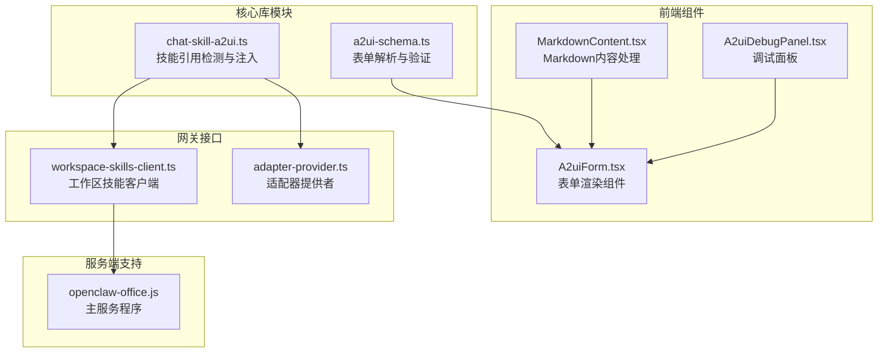
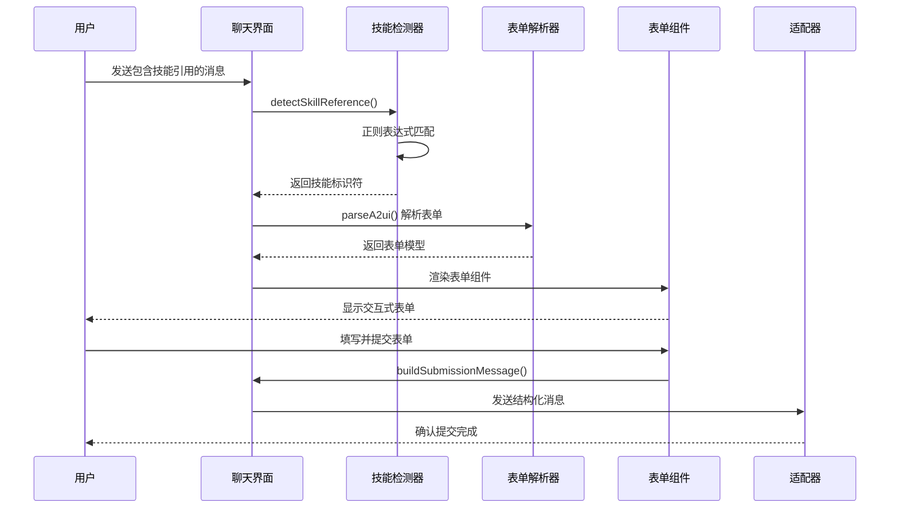
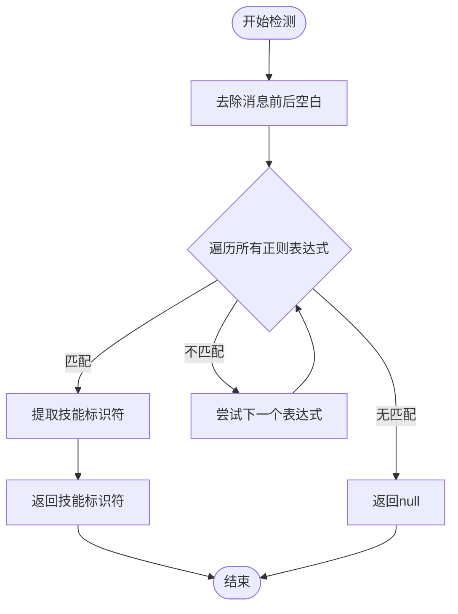
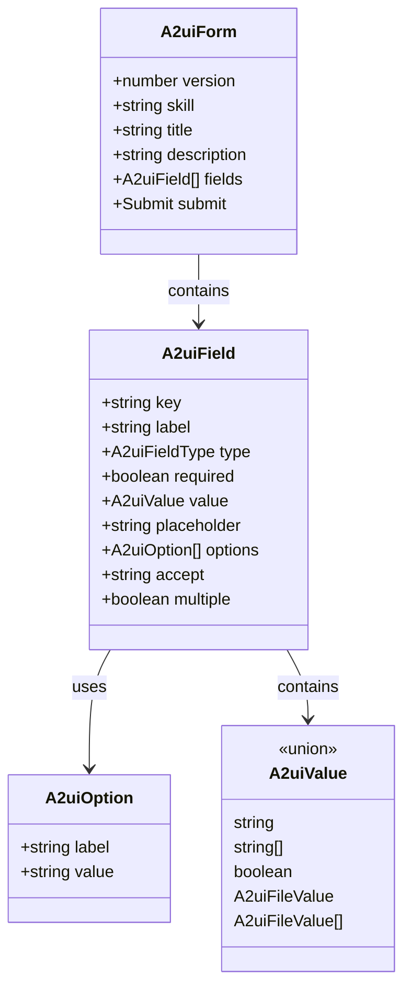
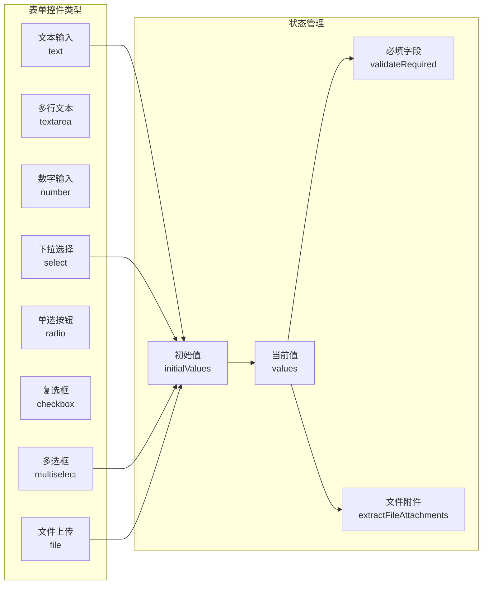
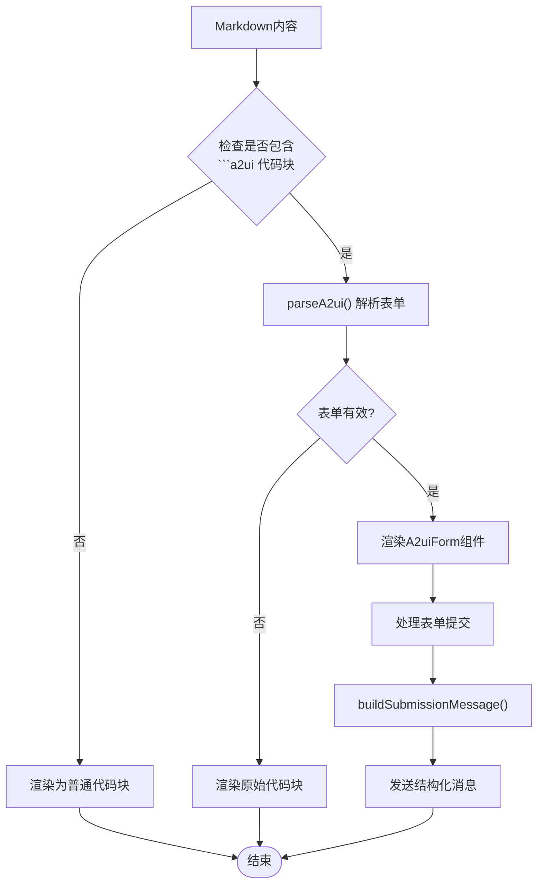
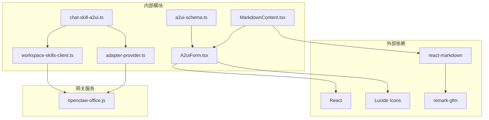

# chat-skill-a2ui模块

<cite>
**本文档引用的文件**
- [chat-skill-a2ui.ts](file://src/lib/chat-skill-a2ui.ts)
- [a2ui-schema.ts](file://src/lib/a2ui-schema.ts)
- [A2uiForm.tsx](file://src/components/chat/A2uiForm.tsx)
- [MarkdownContent.tsx](file://src/components/chat/MarkdownContent.tsx)
- [workspace-skills-client.ts](file://src/gateway/workspace-skills-client.ts)
- [adapter-provider.ts](file://src/gateway/adapter-provider.ts)
- [openclaw-office.js](file://bin/openclaw-office.js)
- [A2uiDebugPanel.tsx](file://src/components/console/skills/A2uiDebugPanel.tsx)
- [useChatStreamingText.ts](file://src/hooks/useChatStreamingText.ts)
- [A2uiForm.test.tsx](file://src/components/chat/A2uiForm.test.tsx)
- [a2ui-input-spec.md](file://bin/skills/skill-workbench-mermaid-guard/references/a2ui-input-spec.md)
</cite>

## 目录
1. [简介](#简介)
2. [项目结构](#项目结构)
3. [核心组件](#核心组件)
4. [架构概览](#架构概览)
5. [详细组件分析](#详细组件分析)
6. [依赖关系分析](#依赖关系分析)
7. [性能考虑](#性能考虑)
8. [故障排除指南](#故障排除指南)
9. [结论](#结论)

## 简介

chat-skill-a2ui模块是OpenClaw Office项目中的一个关键组件，负责在聊天会话中集成技能(Agent Skill)的A2UI(Actor-to-User Interface)表单系统。该模块实现了智能的技能引用检测、动态表单注入和实时表单渲染功能，为用户提供了一种标准化的交互方式来与AI代理进行结构化对话。

该模块的核心价值在于：
- **自动化技能表单注入**：当用户提及特定技能时，自动检测并注入相应的表单
- **标准化交互协议**：统一的A2UI表单格式，确保跨技能的一致体验
- **实时表单渲染**：支持运行时动态生成的表单，无需预写文件
- **双向数据流**：从表单收集到的数据可以无缝传递给AI代理

## 项目结构

chat-skill-a2ui模块主要分布在以下目录结构中：

**图表来源**
- [chat-skill-a2ui.ts:1-117](file://src/lib/chat-skill-a2ui.ts#L1-L117)
- [a2ui-schema.ts:1-321](file://src/lib/a2ui-schema.ts#L1-L321)
- [A2uiForm.tsx:1-393](file://src/components/chat/A2uiForm.tsx#L1-L393)

**章节来源**
- [chat-skill-a2ui.ts:1-117](file://src/lib/chat-skill-a2ui.ts#L1-L117)
- [a2ui-schema.ts:1-321](file://src/lib/a2ui-schema.ts#L1-L321)
- [A2uiForm.tsx:1-393](file://src/components/chat/A2uiForm.tsx#L1-L393)

## 核心组件

### 技能引用检测器

技能引用检测器负责识别用户消息中的技能引用模式，并提取技能标识符。支持多种语言和格式的技能引用语法。

### A2UI表单解析器

A2UI表单解析器提供了完整的表单Schema定义、解析和验证功能，支持8种不同的字段类型和复杂的表单结构。

### 表单渲染组件

表单渲染组件负责将解析后的表单数据转换为用户友好的界面控件，支持单行文本、多行文本、数字、下拉选择、单选按钮、复选框、多选框和文件上传等多种控件类型。

**章节来源**
- [chat-skill-a2ui.ts:37-46](file://src/lib/chat-skill-a2ui.ts#L37-L46)
- [a2ui-schema.ts:16-78](file://src/lib/a2ui-schema.ts#L16-L78)
- [A2uiForm.tsx:14-22](file://src/components/chat/A2uiForm.tsx#L14-L22)

## 架构概览

chat-skill-a2ui模块采用分层架构设计，各层职责明确，耦合度低：

**图表来源**
- [chat-skill-a2ui.ts:96-116](file://src/lib/chat-skill-a2ui.ts#L96-L116)
- [a2ui-schema.ts:169-199](file://src/lib/a2ui-schema.ts#L169-L199)
- [A2uiForm.tsx:319-328](file://src/components/chat/A2uiForm.tsx#L319-L328)

该架构实现了以下关键特性：
- **异步处理**：技能检测和表单加载都是异步操作
- **错误恢复**：注入失败不会影响整体聊天流程
- **类型安全**：完整的TypeScript类型定义确保编译时检查
- **可扩展性**：支持新的字段类型和表单控件

## 详细组件分析

### 技能引用检测器

技能引用检测器实现了多语言、多格式的技能引用识别功能：

**图表来源**
- [chat-skill-a2ui.ts:37-46](file://src/lib/chat-skill-a2ui.ts#L37-L46)

支持的技能引用格式包括：
- 中文："使用Skill data-analyst"、"技能 data-analyst"、"使用技能 data-analyst"
- 英文："Use Skill data-analyst"、"/skill data-analyst"
- 统一格式：支持大小写不敏感的匹配

**章节来源**
- [chat-skill-a2ui.ts:27-31](file://src/lib/chat-skill-a2ui.ts#L27-L31)

### A2UI表单解析器

A2UI表单解析器提供了完整的Schema定义和解析功能：

**图表来源**
- [a2ui-schema.ts:71-78](file://src/lib/a2ui-schema.ts#L71-L78)
- [a2ui-schema.ts:54-69](file://src/lib/a2ui-schema.ts#L54-L69)
- [a2ui-schema.ts:49-52](file://src/lib/a2ui-schema.ts#L49-L52)

**章节来源**
- [a2ui-schema.ts:16-78](file://src/lib/a2ui-schema.ts#L16-L78)

### 表单渲染组件

表单渲染组件实现了响应式的表单控件系统：

**图表来源**
- [A2uiForm.tsx:26-42](file://src/components/chat/A2uiForm.tsx#L26-L42)
- [A2uiForm.tsx:319-328](file://src/components/chat/A2uiForm.tsx#L319-L328)

**章节来源**
- [A2uiForm.tsx:53-189](file://src/components/chat/A2uiForm.tsx#L53-L189)

### Markdown内容处理器

Markdown内容处理器负责识别和处理包含A2UI表单的代码块：

**图表来源**
- [MarkdownContent.tsx](file://src/components/chat/MarkdownContent.tsx#L38-L74)
- [MarkdownContent.tsx](file://src/components/chat/MarkdownContent.tsx#L180-L187)

**章节来源**
- [MarkdownContent.tsx](file://src/components/chat/MarkdownContent.tsx#L38-L74)

## 依赖关系分析

chat-skill-a2ui模块的依赖关系清晰且层次分明：

**图表来源**
- [chat-skill-a2ui.ts:11-12](file://src/lib/chat-skill-a2ui.ts#L11-L12)
- [A2uiForm.tsx:1-12](file://src/components/chat/A2uiForm.tsx#L1-L12)
- [MarkdownContent.tsx:1-10](file://src/components/chat/MarkdownContent.tsx#L1-L10)

**章节来源**
- [workspace-skills-client.ts:1-20](file://src/gateway/workspace-skills-client.ts#L1-L20)
- [adapter-provider.ts:1-6](file://src/gateway/adapter-provider.ts#L1-L6)

## 性能考虑

### 异步加载优化

模块采用了多层异步处理机制来优化性能：

1. **延迟加载**：A2UI表单组件使用React.lazy实现按需加载
2. **缓存策略**：工作区技能文件采用文件系统缓存
3. **错误隔离**：表单注入失败不影响聊天主流程
4. **内存管理**：及时清理文件读取器和事件监听器

### 渲染优化

- **虚拟滚动**：大量消息时使用虚拟滚动技术
- **组件记忆化**：使用React.memo避免不必要的重渲染
- **Suspense边界**：合理使用Suspense提升用户体验
- **状态最小化**：只在必要时更新组件状态

### 网络优化

- **请求去重**：相同技能的多次请求会被合并
- **超时控制**：工作区技能请求设置合理的超时时间
- **降级策略**：网络异常时提供友好的降级体验

## 故障排除指南

### 常见问题及解决方案

#### 技能引用未被识别

**症状**：用户输入技能引用但表单未出现

**排查步骤**：
1. 检查技能引用格式是否正确
2. 验证技能标识符是否存在
3. 确认ui.json文件是否存在于工作区

**解决方法**：
- 使用标准格式："使用Skill data-analyst"
- 确保技能slug正确无误
- 检查工作区技能目录结构

#### 表单解析失败

**症状**：A2UI表单无法正确渲染

**排查步骤**：
1. 验证JSON格式是否正确
2. 检查fields数组是否为空
3. 确认字段类型是否在支持范围内

**解决方法**：
- 使用JSON验证工具检查格式
- 确保至少有一个字段
- 移除不支持的字段类型

#### 文件上传问题

**症状**：文件上传功能异常

**排查步骤**：
1. 检查浏览器兼容性
2. 验证文件类型过滤设置
3. 确认文件大小限制

**解决方法**：
- 更新到最新浏览器版本
- 检查accept属性设置
- 调整文件大小限制

**章节来源**
- [A2uiForm.test.tsx:17-51](file://src/components/chat/A2uiForm.test.tsx#L17-L51)

### 调试技巧

1. **启用开发模式**：使用VITE_MOCK环境变量进行测试
2. **查看控制台日志**：监控网络请求和错误信息
3. **使用调试面板**：通过A2uiDebugPanel预览表单效果
4. **检查工作区状态**：验证技能文件的完整性

## 结论

chat-skill-a2ui模块成功实现了OpenClaw Office中技能表单系统的标准化和自动化。该模块具有以下显著优势：

### 技术优势
- **模块化设计**：清晰的职责分离和依赖管理
- **类型安全**：完整的TypeScript类型定义
- **可扩展性**：支持新的字段类型和表单控件
- **性能优化**：多层异步处理和缓存策略

### 用户体验优势
- **多语言支持**：支持中英文技能引用语法
- **实时反馈**：即时的表单验证和错误提示
- **一致体验**：跨技能的统一交互模式
- **无障碍访问**：完善的键盘导航和屏幕阅读器支持

### 开发维护优势
- **测试覆盖**：完整的单元测试和集成测试
- **文档完善**：详细的API文档和使用指南
- **错误处理**：健壮的错误恢复机制
- **版本兼容**：向前兼容的Schema设计

该模块为OpenClaw Office项目提供了一个强大而灵活的技能表单系统，为未来的功能扩展奠定了坚实的基础。通过持续的优化和改进，该模块将继续提升用户与AI代理之间的交互质量和效率。