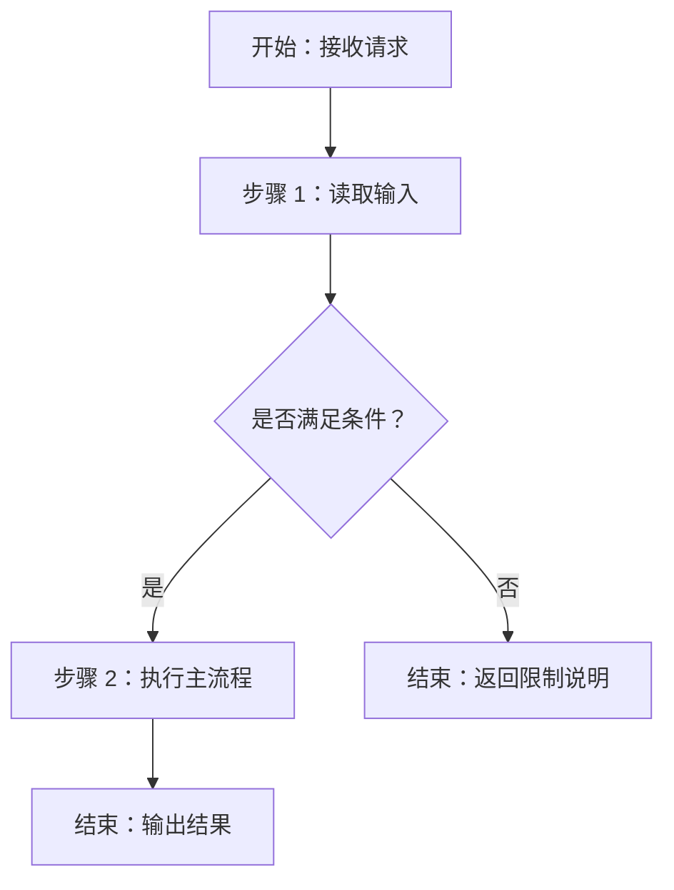

# Mermaid Normalization Checklist

本清单用于在 Skills 工作台中生成或修复 FLOWCHART.md 前做最后一道人工语法收敛。

## 一、结构规范

- 只允许一个 Mermaid 代码块
- 第一行固定是 flowchart TD
- 只画总览流程，不拆分第二张、第三张辅助图
- 保持从开始到结束的一条主干，再补关键判断和异常路径

## 二、节点命名规范

- 节点 ID：仅 ASCII 字母、数字、下划线
- 节点文本：允许中文，但必须放进双引号
- 推荐模式：
  - START["开始：接收请求"]
  - STEP_1["步骤 1：读取 SKILL.md"]
  - DECIDE_1{"FLOWCHART.md 是否存在？"}
  - END_OK["结束：返回流程图"]

## 三、常见危险写法与修正

错误：A[阶段 1：结构感知 perceive_structure]
正确：A["阶段 1：结构感知 perceive_structure"]

错误：B{是否继续执行?}
正确：B{"是否继续执行？"}

错误：C[读取 SKILL.md
并分析流程]
正确：C["读取 SKILL.md 并分析流程"]

错误：EDGE -->|读取 SKILL.md / FLOWCHART.md 并判断是否可复用| NEXT
正确：把长边标签改成节点：
EDGE --> STEP_READ["读取 SKILL.md / FLOWCHART.md"]
STEP_READ --> DECIDE_REUSE{"是否可复用？"}

## 四、边标签规范

- 只保留短标签：是、否、成功、失败、存在、不存在、通过、不通过
- 任何长句、带标点、带斜杠的边标签都应改写为节点

## 五、写入 FLOWCHART.md 前确认

1. 是否只有一个 Mermaid 代码块？
2. 是否所有中文与特殊符号标签都用了双引号？
3. 是否所有换行都使用  ？
4. 是否所有节点 ID 唯一且可读？
5. 是否已经把辅助图信息折叠回一个总览流程图？

## 六、推荐最小模板

